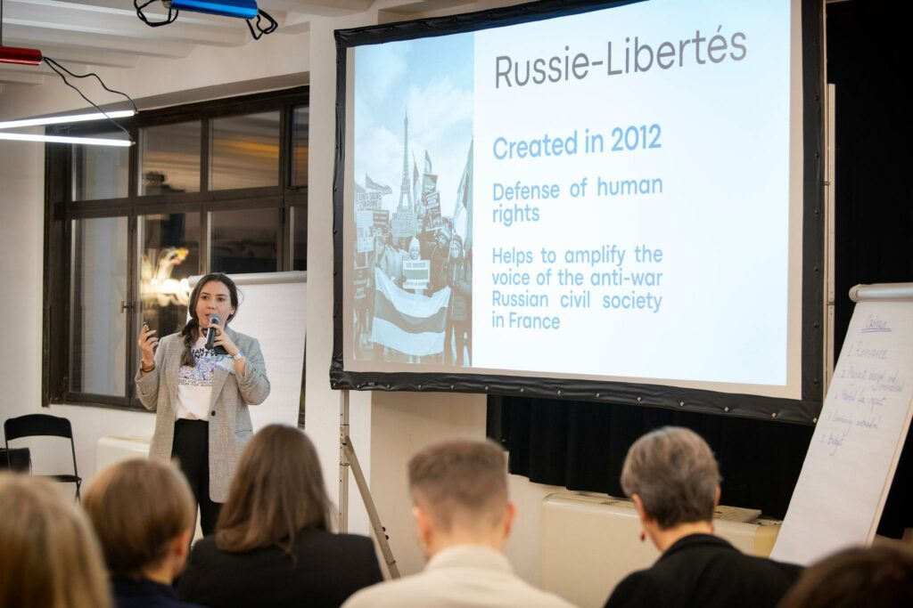
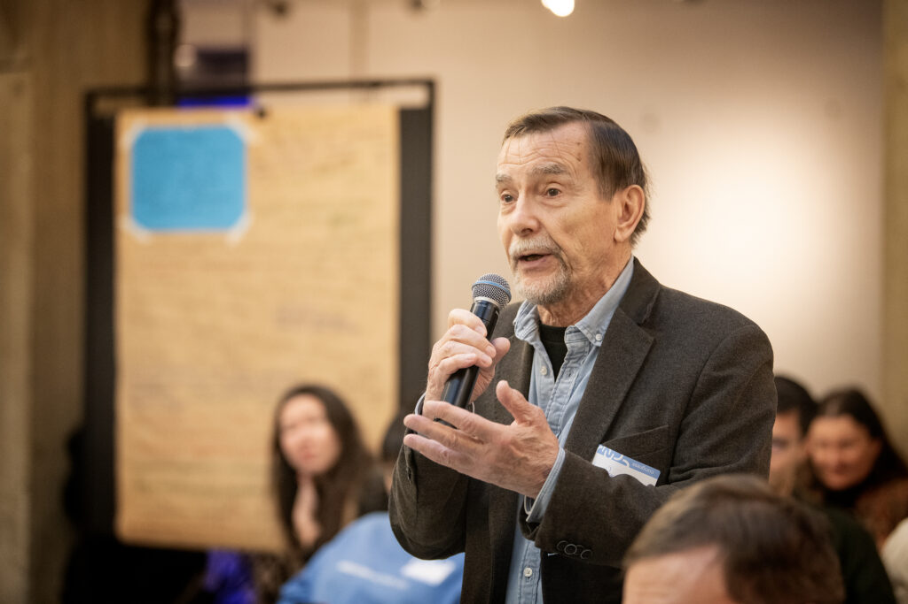
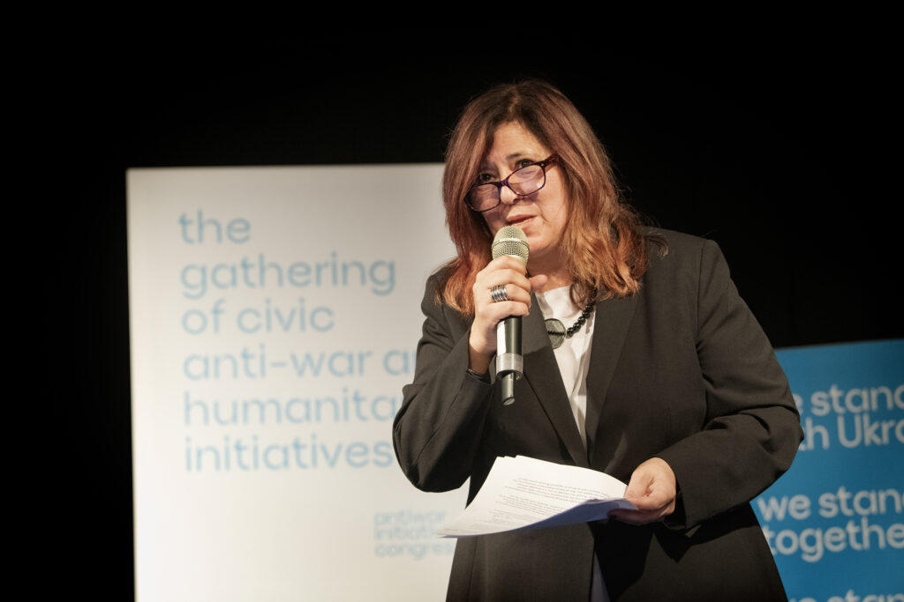
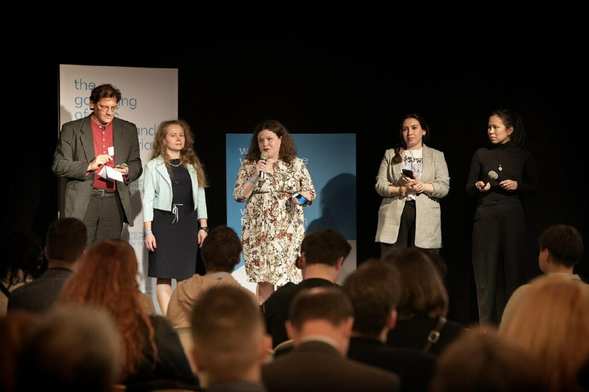
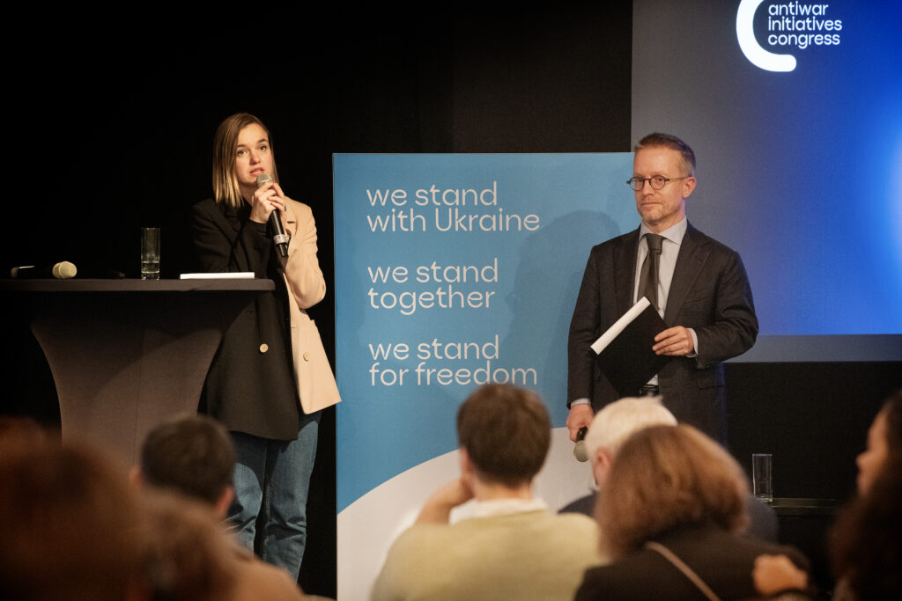
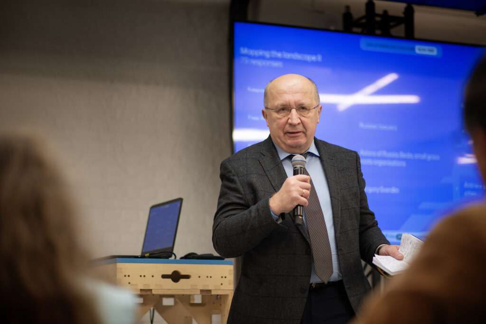
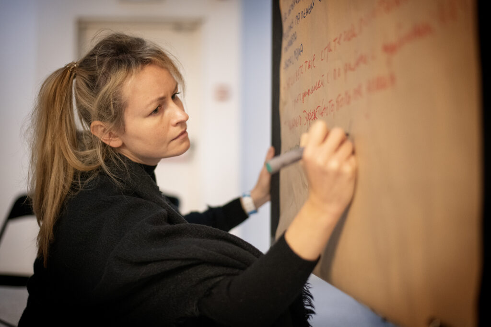
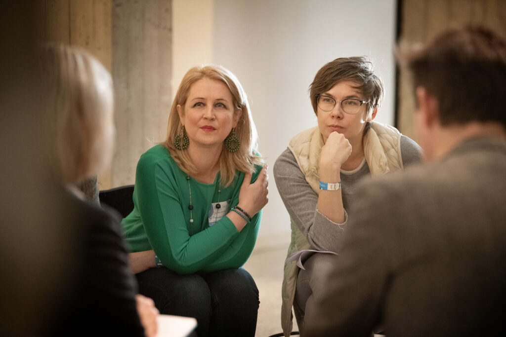
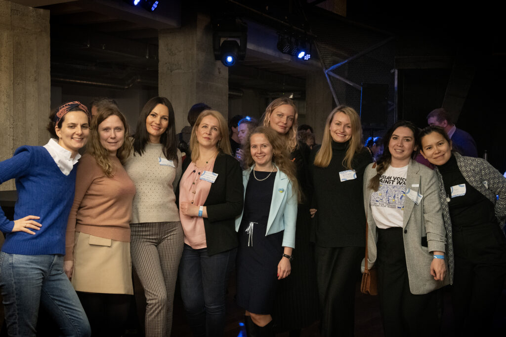

**Le 28 novembre Russie-Libertés a pris part au Congrès des initiatives citoyennes qui s’est tenu dans la plus grande discrétion à Bruxelles.** L'événement a été orchestré par la coalition d'initiatives russes antiguerre, nommée [Platforma](https://platforma.international/) , dont Russie-Libertés fait partie.

L'événement a rassemblé plusieurs centaines de militants russes, tous unis dans leur opposition à la guerre en Ukraine et au régime de Vladimir Poutine. **Plus de 300 de ces organisations ont été recensées** , jouant un rôle crucial dans diverses initiatives : apporter de l'aide aux Ukrainiens, lutter contre la propagande, soutenir les Russes fuyant les répressions, et fournir une aide juridique à ceux qui refusent la mobilisation forcée. Pour plus d'informations sur ces organisations et leurs actions, le [Wilson Center](https://www.wilsoncenter.org/publication/kennan-cable-no-84-survey-russian-grassroots-anti-war-resistance?fbclid=IwAR0w-DLjTmkL9FqNJCVwBQltgRCfH3xLXxtLTBsQBx9RoxFopAQPjlZSb_8) a publié une étude détaillée accessible [ici](https://www.wilsoncenter.org/publication/kennan-cable-no-84-survey-russian-grassroots-anti-war-resistance?fbclid=IwAR0w-DLjTmkL9FqNJCVwBQltgRCfH3xLXxtLTBsQBx9RoxFopAQPjlZSb_8)

Par ailleurs, le journal [Le Monde](https://www.lemonde.fr/international/article/2023/11/30/contre-poutine-et-contre-la-guerre-des-reseaux-d-activistes-russes-organisent-la-resistance_6203097_3210.html?lmd_medium=al&lmd_campaign=envoye-par-appli&lmd_creation=ios&lmd_source=default&fbclid=IwAR0XgSxBV0cXkywNE06liVPZrcFJbTNfhyKXOEvVFbqbzF4rTgmlRexxHBw) a consacré un article à ce congrès, mettant en lumière les mouvements de la société civile russe et le combat courageux de certains activistes. Cet article offre un aperçu éclairant des efforts déployés par ces militants pour s'opposer à la guerre et au régime poutinien. Pour en savoir plus sur ces histoires inspirantes et les défis auxquels ces activistes sont confrontés, consultez l'article du Monde [ici](https://www.lemonde.fr/international/article/2023/11/30/contre-poutine-et-contre-la-guerre-des-reseaux-d-activistes-russes-organisent-la-resistance_6203097_3210.html?lmd_medium=al&lmd_campaign=envoye-par-appli&lmd_creation=ios&lmd_source=default&fbclid=IwAR0XgSxBV0cXkywNE06liVPZrcFJbTNfhyKXOEvVFbqbzF4rTgmlRexxHBw)

Ce congrès a non seulement mis en lumière la résistance civile russe contre la guerre en Ukraine, mais a également servi de rappel puissant que, malgré les difficultés et les risques, il existe une opposition russe luttant pour la paix et la justice.

```


```


---
- 

- 

- 

- 

- 

- 

- 

- 

- 

---
