[Russie-Libertés](https://russie-libertes.us21.list-manage.com/track/click?u=87e02574ae5b641fa5496fde1&id=81b4302818&e=f4411bb68b) , ensemble avec [Free Russia Foundation](https://russie-libertes.us21.list-manage.com/track/click?u=87e02574ae5b641fa5496fde1&id=0ab69774e3&e=f4411bb68b) et l'association [Institut Sakharov](https://russie-libertes.us21.list-manage.com/track/click?u=87e02574ae5b641fa5496fde1&id=b0630c3904&e=f4411bb68b) , a ouvert ce 28 février 2024 un accélérateur pour les initiatives civiques et anti-guerre des Russes et russophones exilés à Paris qui partagent les valeurs de la démocratie et de la liberté.

L’Espace Libertés | Reforum Space est un lieu de soutien unique pour les activistes, journalistes, défenseurs des droits de l'homme, mais aussi les acteurs du domaine scientifique et culturel exilés : une plateforme qui montre les visages de la vraie Russie.

Le centre fonctionnera en coworking et fournira une aide juridique, psychologique, des cours de français et des formations.

Les résidents travailleront pour se soutenir mutuellement, créer des projets, écrire des lettres aux prisonniers politiques, développer des initiatives humanitaires, des campagnes communes, des groupes de réflexion et construire ensemble la Russie du futur.

Pour les journalistes, un studio professionnel, subventionné par [Reporters Sans Frontière](https://russie-libertes.us21.list-manage.com/track/click?u=87e02574ae5b641fa5496fde1&id=4b6f708d7a&e=f4411bb68b) , sera mis à disposition dans cet espace de 185 m² au cœur de la capitale française.

 L’Espace Libertés | Reforum Space s’ajoute au réseau [Reforum Space](https://russie-libertes.us21.list-manage.com/track/click?u=87e02574ae5b641fa5496fde1&id=2b0f4aebbb&e=f4411bb68b) , déjà présent dans cinq villes européennes (Berlin, Vilnius, Tallinn, Tbilissi et Budva), qui a hébergé des centaines de projets et des milliers d'exilés russes. Ces centres ont accueilli plus de 900 événements, réunions, discussions ouvertes, soirées à thème, conférences, formations, expositions.

Pour toute question relative à l’Espace Libertés | Reforum Space, écrire à espaceL@russie-libertes.org

Instagram : https://www.instagram.com/espace.libertes/

Telegram : https://t.me/EspaceLibertes_ReforumSpace

Rejoignez notre Espace Libertés !

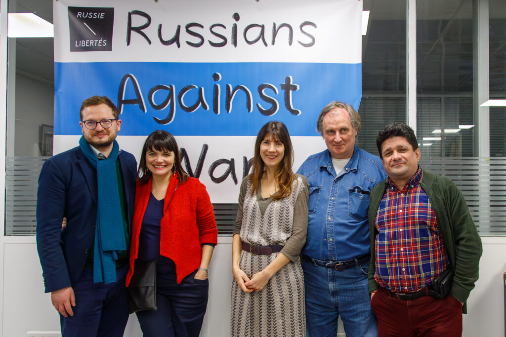

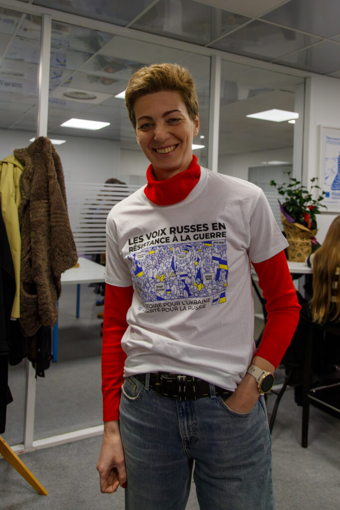

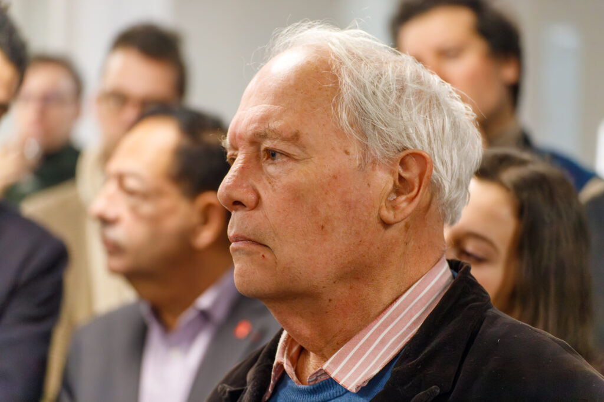

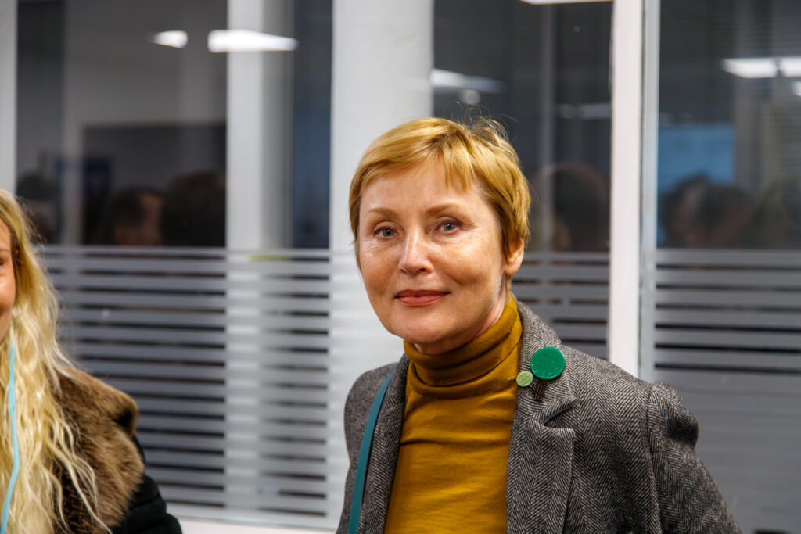

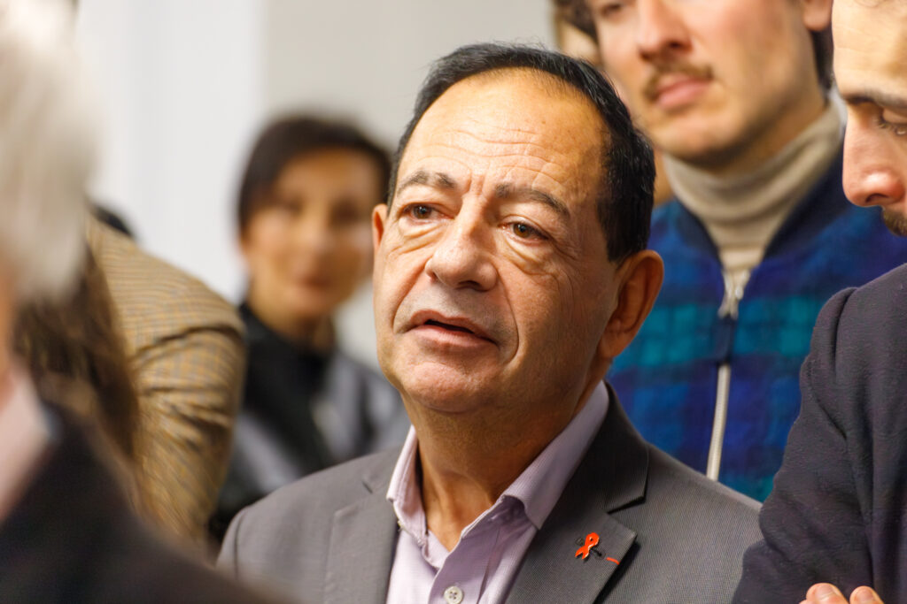

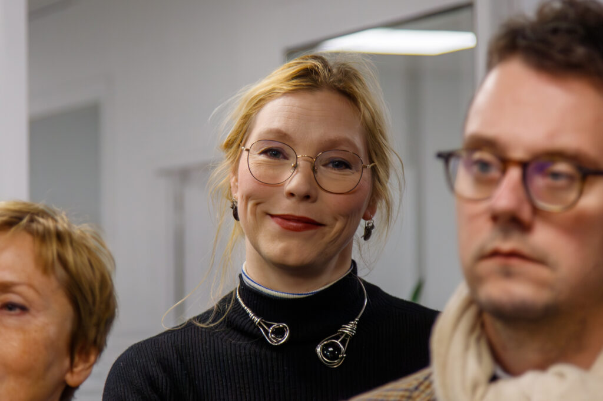

---
- 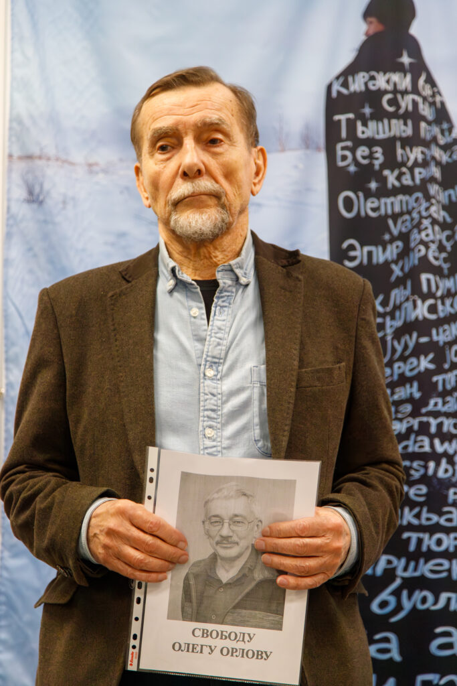

- 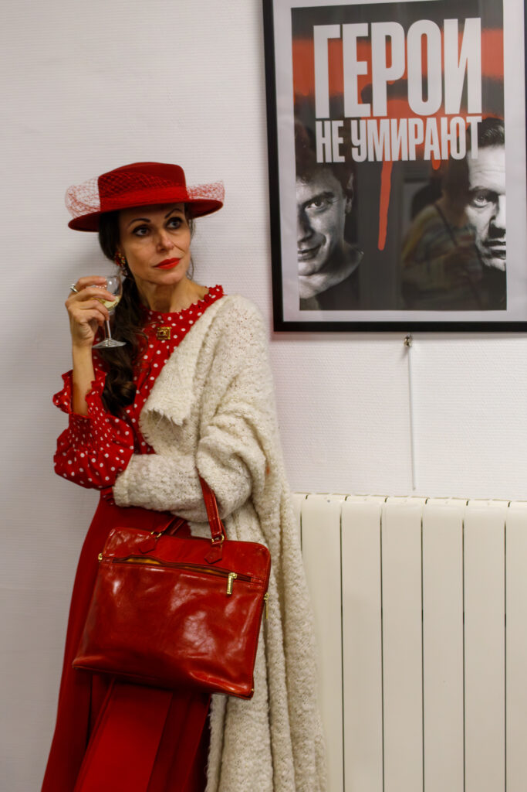

---

---
- 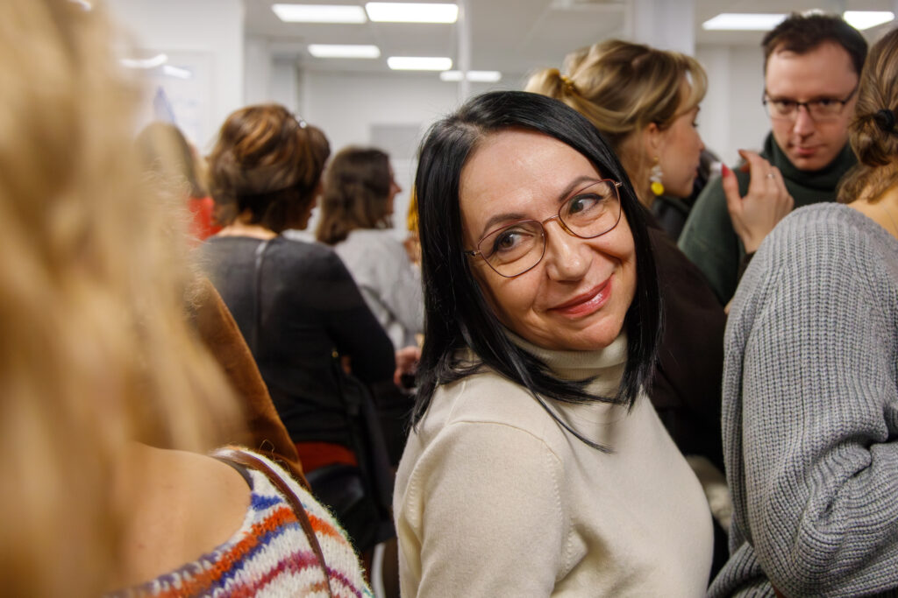

- 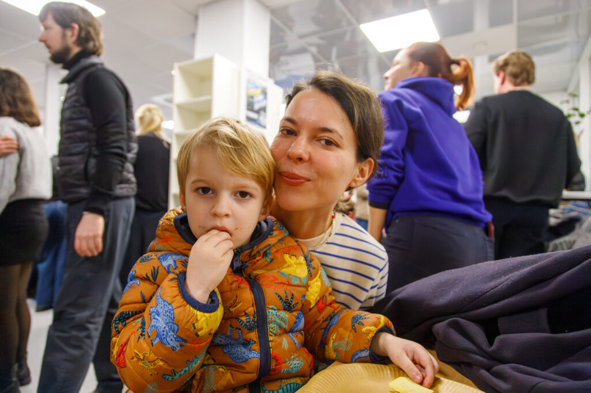

- 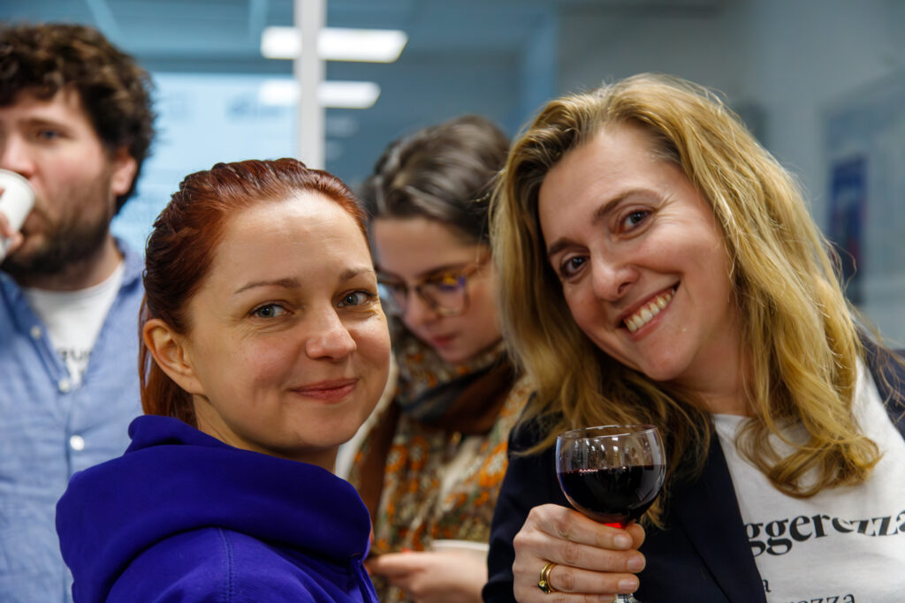

- 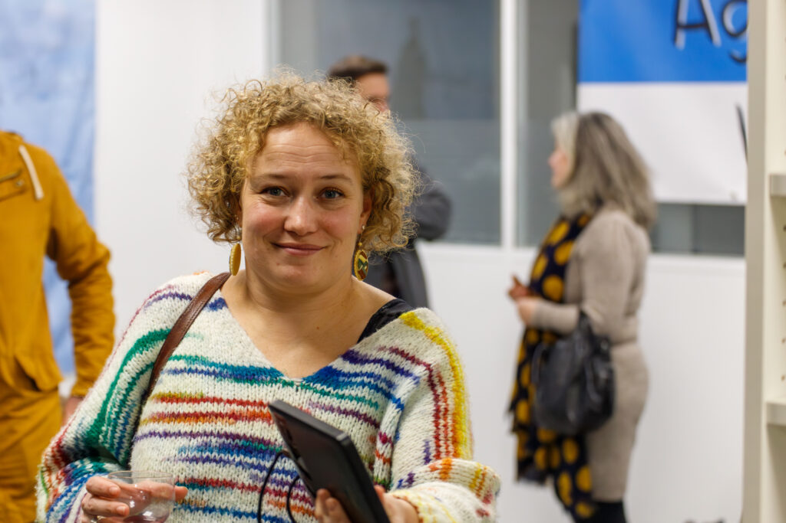

---

---
- 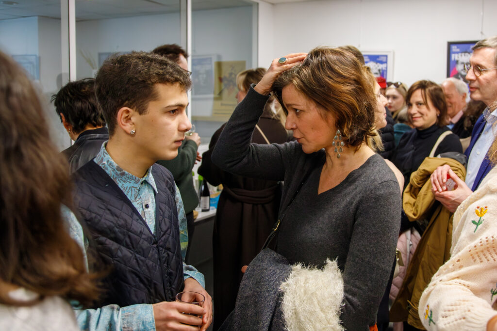

- 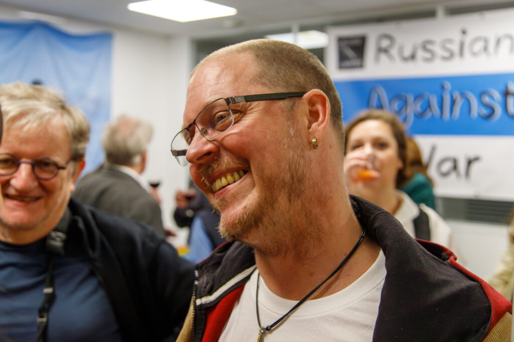

---

