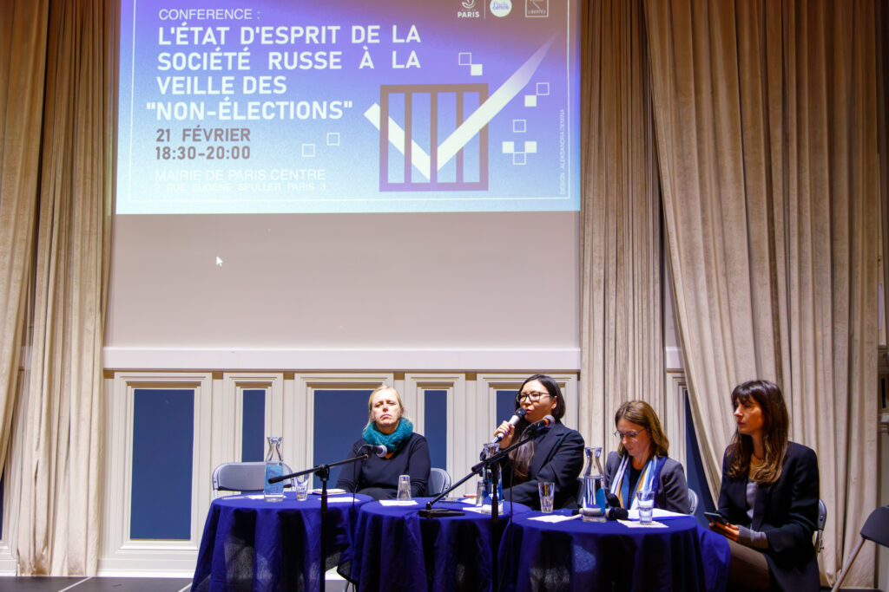
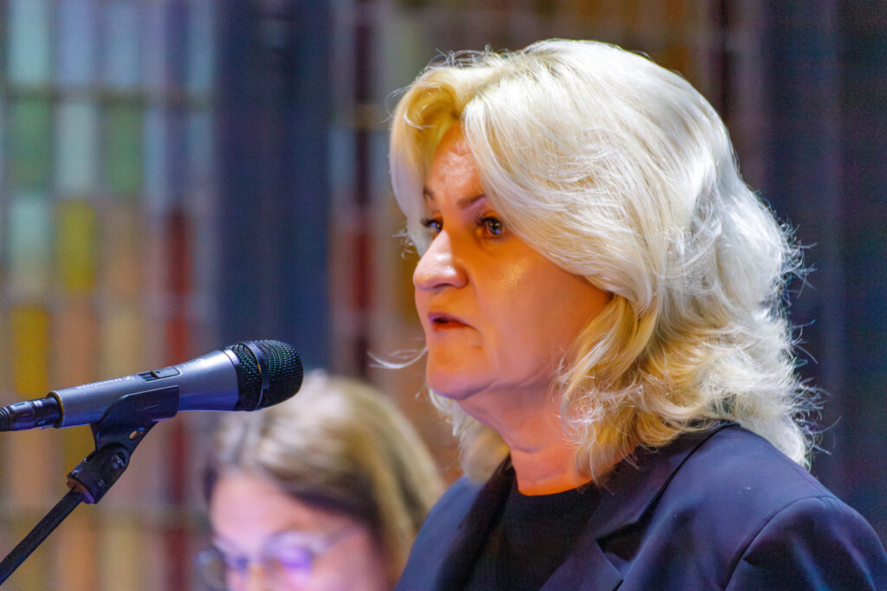
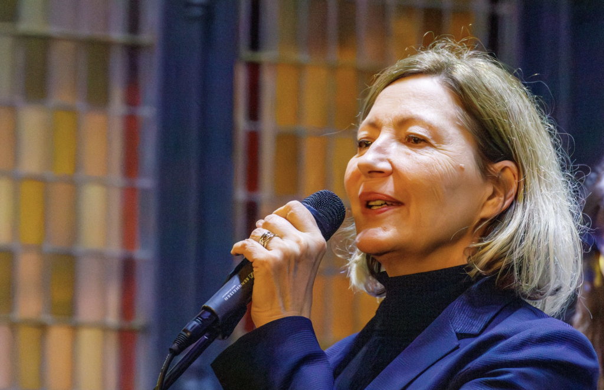
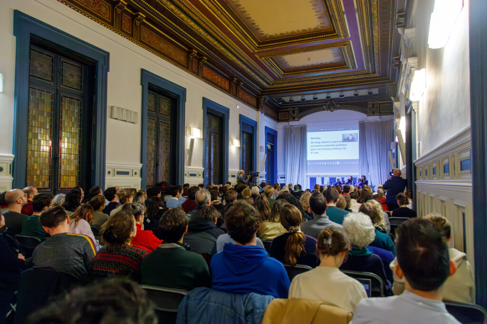
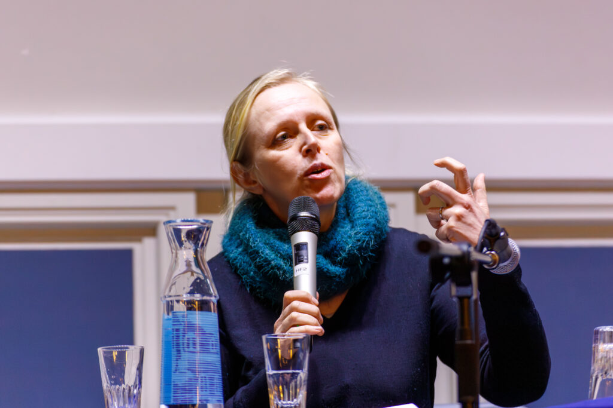
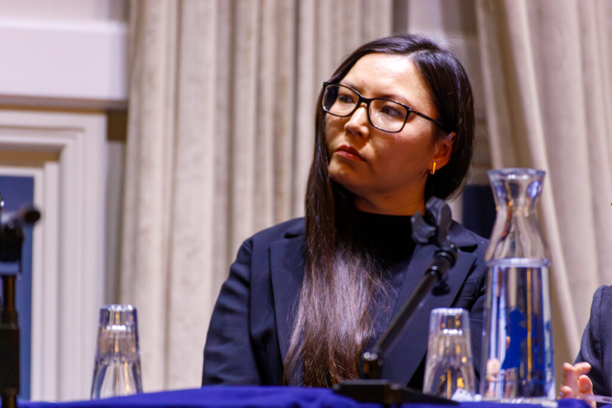
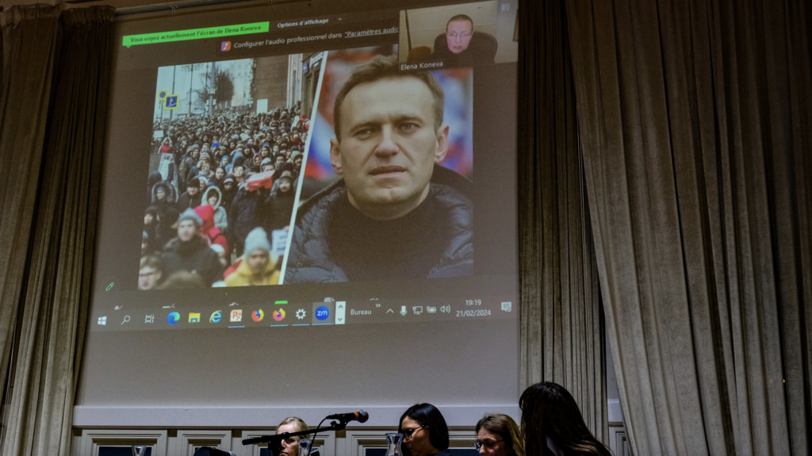

Le 21 février, une conférence majeure intitulée **"L'ÉTAT D'ESPRIT DE LA SOCIÉTÉ RUSSE À LA VEILLE DES "NON-ÉLECTIONS"** s'est tenue à Paris, réunissant des experts et des activistes pour discuter des défis politiques et sociaux en Russie. Organisée dans le cadre de la campagne **"Non à Poutine et au poutinisme"** , cette rencontre a offert une plateforme cruciale pour analyser la situation complexe dans le pays et mener une réflexion sur la société russe.

Nous sommes fiers d'avoir accueilli dans le cadre de cet événement l'avocate d'Alexeï Navalny, **Olga Mikhaïlova** , qui a prononcé un discours poignant. Sa présence a ajouté une dimension importante à nos discussions, soulignant l'importance de la défense des droits de l'homme et de la lutte contre l'oppression en Russie.

> __**"La Russie sera libre, heureuse, magnifique et, surtout, paisible – c’est ce qu’Alexeï Navalny a toujours dit. Et Alexeï disait toujours la vérité."**__
>  
> __**-**__ **Olga Mikhaïlova**

**Natalia Pouzyreff** , députée de l’Assemblée nationale, s’est également exprimée à l’ouverture de la conférence pour souligner son soutien à l'opposition russe et sa solidarité avec le mouvement anti-guerre russe.

> __**« Nous allons donner des coups de boutoir au régime de Poutine ».**__
>  
> **Nathalia Pouzyref**

---

La partie principale de la conférence a été consacrée aux interventions de trois conférencières invitées, qui ont abordé différents problèmes de la Russie contemporaine dans le contexte de la période “pré-électorale” avec un focus sur les candidats anti-guerre, la perception par les Russes de l'agression militaire contre l'Ukraine et de l'assassinat récent d' **Alexeï Navalny** .

> __**« La société russe en ce moment est comme une cocotte-minute sans soupape – on ne laisse pas la vapeur sortir – le mécontentement grandissant reste sous le couvercle. Les conséquences ne sont pas visibles maintenant mais cela va avoir un gros impact dans l’avenir ».**__
>  
> **Anna Colin-Lebedev**

**Anna Colin-Lebedev** , spécialiste des sociétés post-soviétiques à l'université Paris Nanterre, a partagé ses recherches sur les conflits armés, les combattants, la protestation et l'action collective en Russie. Elle souligne l'importance de comprendre les spécificités culturelles, historiques et politiques de chaque pays dans l'analyse des mouvements sociaux. Sa vision enrichit le débat et encourage une compréhension approfondie des événements dans la région.

> __**« Alexeï Navalny a fait un grand travail sur lui-même. Nous devons respecter la mémoire de cet homme, car Navalny était un vrai patriote de son pays. Cependant, on ne doit pas s’attendre à ce que quelqu’un sauve la Russie – c’est à nous de faire de la Russie une réelle fédération démocratique ».**__
>  
> **Aleksandra Garmazhapova**

**Aleksandra Garmazhapova** , journaliste et fondatrice de la fondation **"Bouriatie Libre"** ,  a souligné que la Bouriatie a subi une mobilisation à grande échelle de sa population qui habitant dans des conditions d’extrême pauvreté y ont vu une possibilité de couvrir leurs dettes.  Son discours a mis en lumière l'importance de reconnaître les voix et les expériences des minorités ethniques dans ce contexte, soulignant l'urgence d'une fédéralisation réelle de la Russie.

[__**Voir la présentation**__](https://mcusercontent.com/87e02574ae5b641fa5496fde1/files/2ffb3e9f-9d70-abfa-4586-91720791f573/Presentation1.pdf)

> __**« Le phénomène du candidat anti-guerre : en seulement 3 semaines de campagne de Boris Nadejdine, pour la première fois en un an, le nombre de personnes prêtes à soutenir le retrait des troupes a augmenté ».**__
>  
> **Elena Koneva**

**Elena Koneva** , experte en recherches sociologiques et fondatrice de l'agence **ExtremeScan** a présenté les résultats de ses recherches sociologiques menées pendant la période “pré-électorale” en Russie. L'étude menée par Elena Koneva a révélé les attitudes des citoyens russes à l'égard du nouveau candidat anti-guerre Boris Nadezhdine, ainsi que de l'opposition dans son ensemble.

[__**Voir l’étude**__](https://mcusercontent.com/87e02574ae5b641fa5496fde1/files/62889274-6fe6-a68f-72a2-800b03f297af/Elena_Koneva.Presentation_FR_.pdf)

**Nous remercions tous les participants d'avoir assisté à la conférence !**
