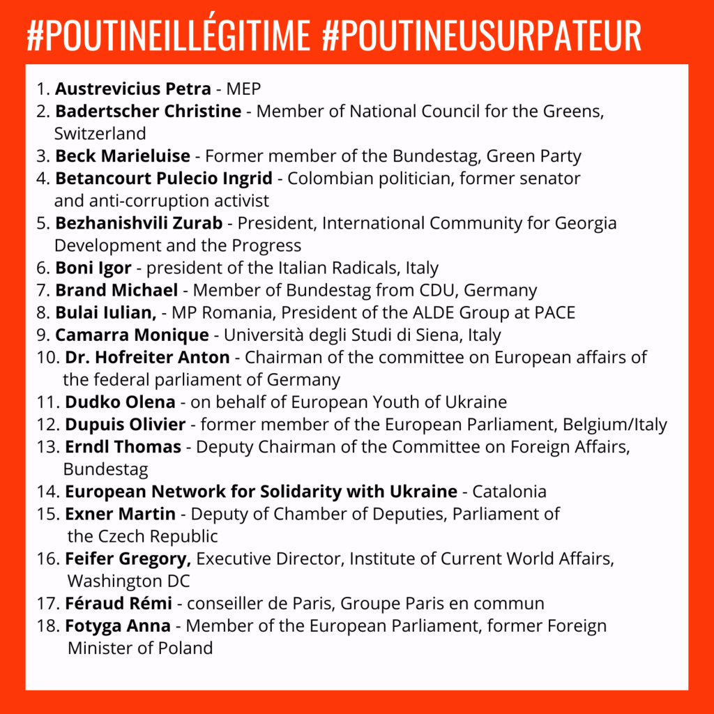
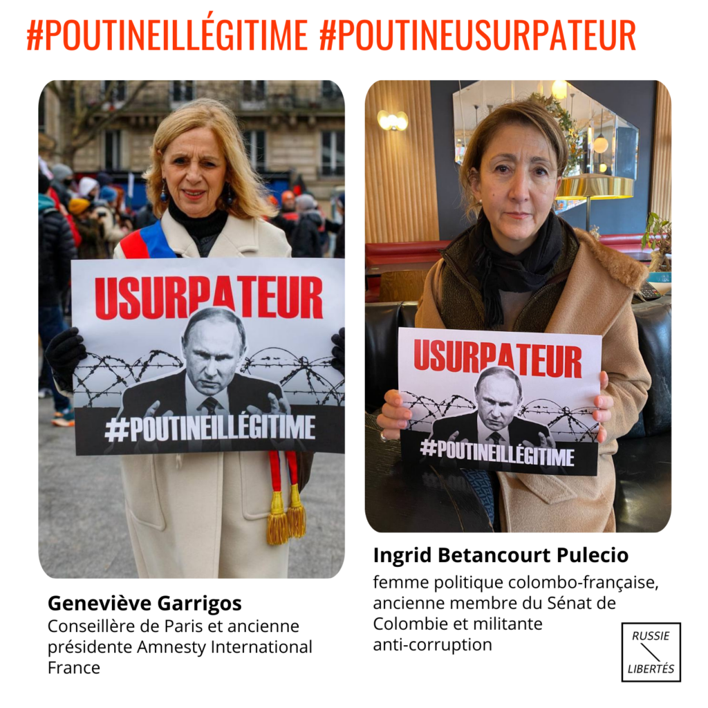
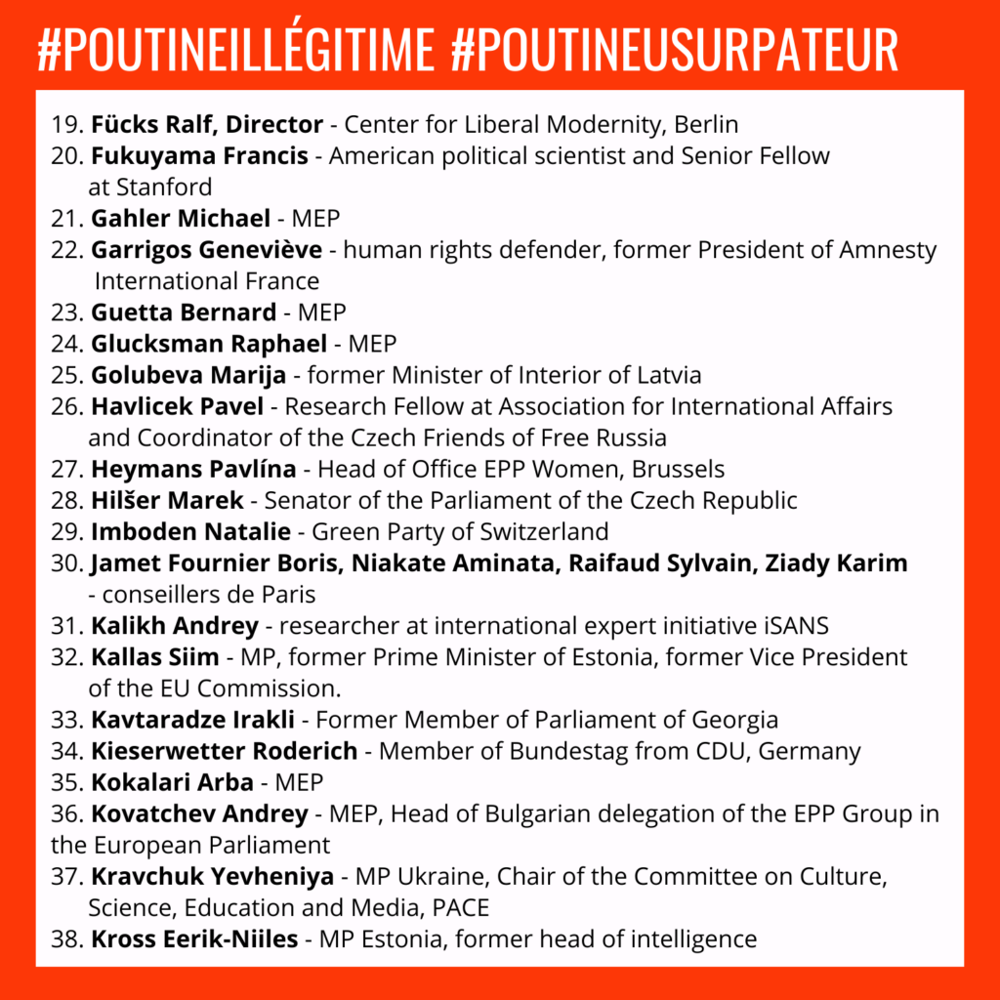
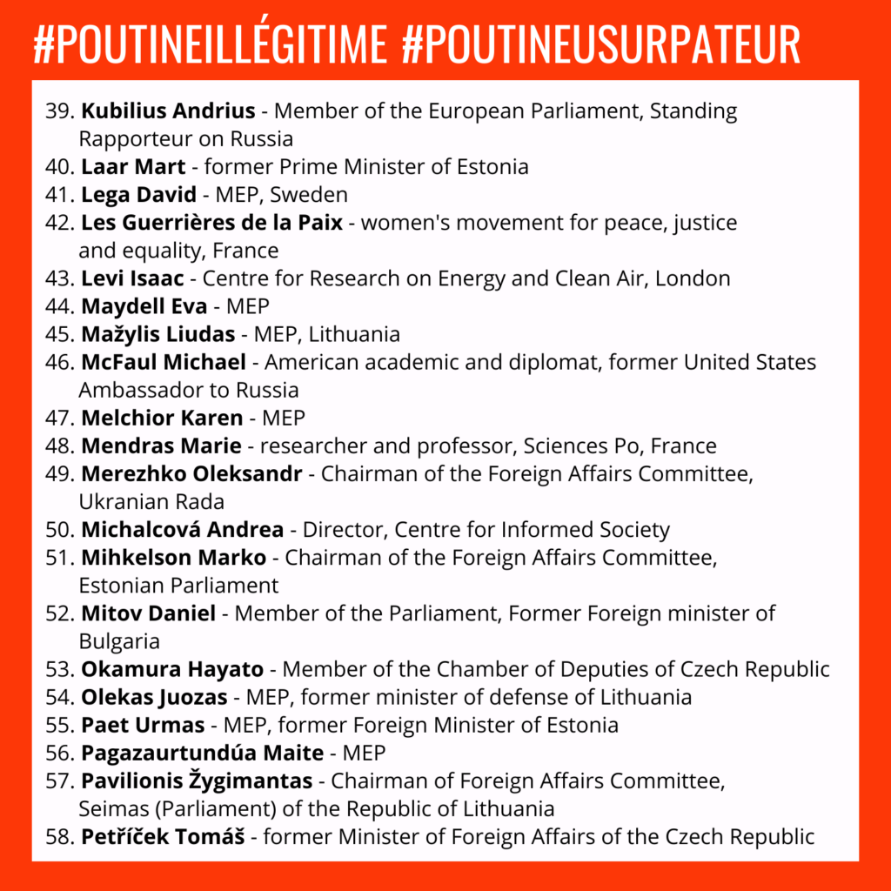
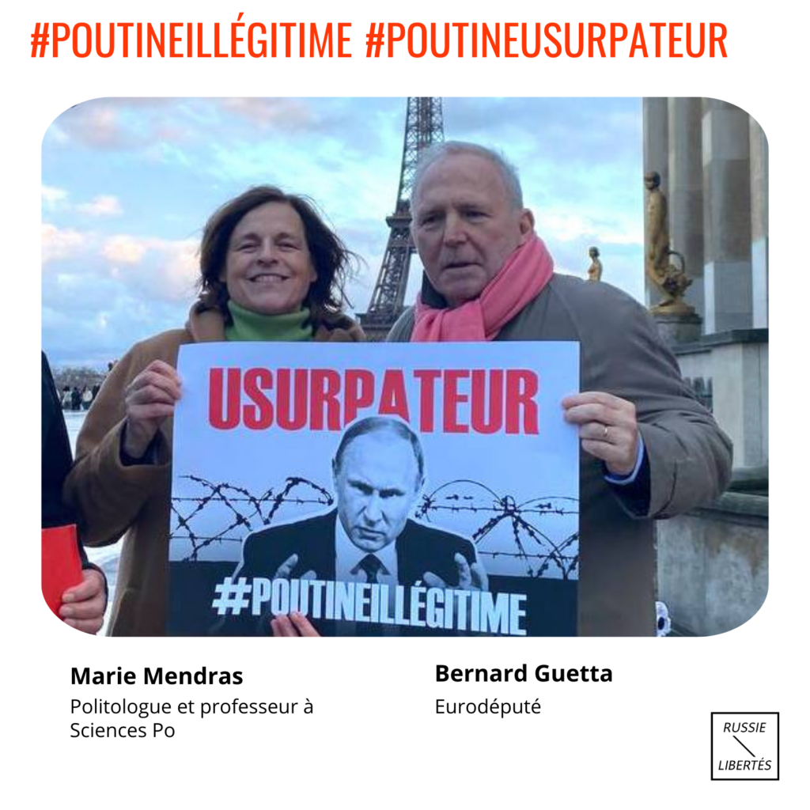
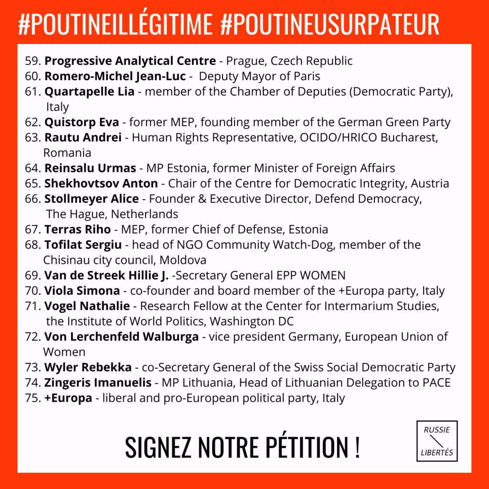
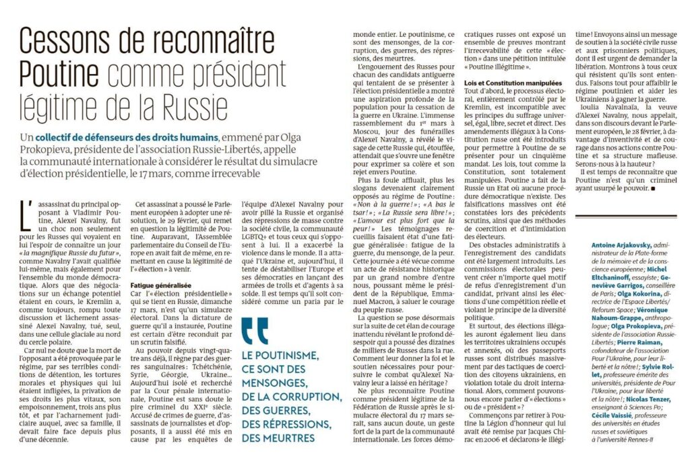

De nombreuses personnalités publiques et politiques ont signé une pétition lancée par les forces démocratiques russes appelant la communauté internationale à déclarer Poutine illégitime après le simulacre électoral qui aura lieu en Russie le 17 mars.

Parmi les signataires sont **Bernard Guetta** et **Raphaël Glucksmann** , eurodéputés ; **Marie Mendras** , professeur à Sciences Po ; **Geneviève Garrigos** , conseillère de Paris ; **Jean-Luc Romero-Michel** , maire adjoint de Paris ; **Ingrid Betancourt Pulecio** , femme politique franco-colombienne ; **Natalia Pouzyreff** , députée de l'Assemblée Nationale; **Anne Genetet** , députée de l'Assemblée Nationale ; **Constance Le Grip** , deputée de l'Assemblée nationale ; **Frédéric Petit** , député de l'Assemblée Nationale ; **Francis Fukuyama** , politologue américain ; **Michael McFaul** , ancien ambassadeur des États-Unis en Russie et beaucoup d’autres.

Après l’assassinat d’Alexeï Navalny par Poutine, le Parlement européen a adopté une [résolution](https://www.europarl.europa.eu/doceo/document/TA-9-2024-0118_FR.html) qui remet également en question la légitimité de Poutine à la tête de la Russie et condamne fermement ce crime atroce.

 Suivez leur exemple est signez notre pétition « [Campagne : Poutine illégitime - Russie-Libertés](https://change.org/illegitimate_fr) »

La pétition « Poutine illégitime » fait partie de la campagne internationale de Russes en résistance intitulée « Non à Poutine et au poutinisme » qui réunit des milliers de citoyens dans le monde entier.

Poutine doit être arrêté maintenant !

---
- 

- 

- 

- 

- 

- 

---

## "Cessons de reconnaître Poutine comme président légitime de la Russie", tribune dans le journal Le Monde

Signée par Olga Prokopieva, Présidente de Russie-Libertés ; Sylvie Rollet, Professeure émérite des universités, présidente de Pour l'Ukraine, pour leur liberté et la nôtre! ; Geneviève Garrigos, Conseillère de Paris ; Olga Kokorina, Directrice de l’Espace Libertés l Reforum Space ; Véronique Nahoum-Grappe, Anthropologue française ; Nicolas Tenzer, Enseignant à Sciences Po, senior fellow au Center for European Policy Analysis (CEPA) ; Pierre Raiman, Co-fondateur de Pour l'Ukraine, pour leur liberté et la nôtre ! ; Cécile Vaissié, Professeure des universités en études russes et soviétiques ; Antoine Arjakovsky, Administrateur de la Plateforme de la mémoire et de la conscience européenne ; Michel Eltchaninoff, essayiste

[https://www.lemonde.fr/idees/article/2024/03/15/il-est-temps-que-poutine-soit-considere-comme-un-paria-par-le-monde-entier_6222155_3232.html](https://www.lemonde.fr/idees/article/2024/03/15/il-est-temps-que-poutine-soit-considere-comme-un-paria-par-le-monde-entier_6222155_3232.html)

