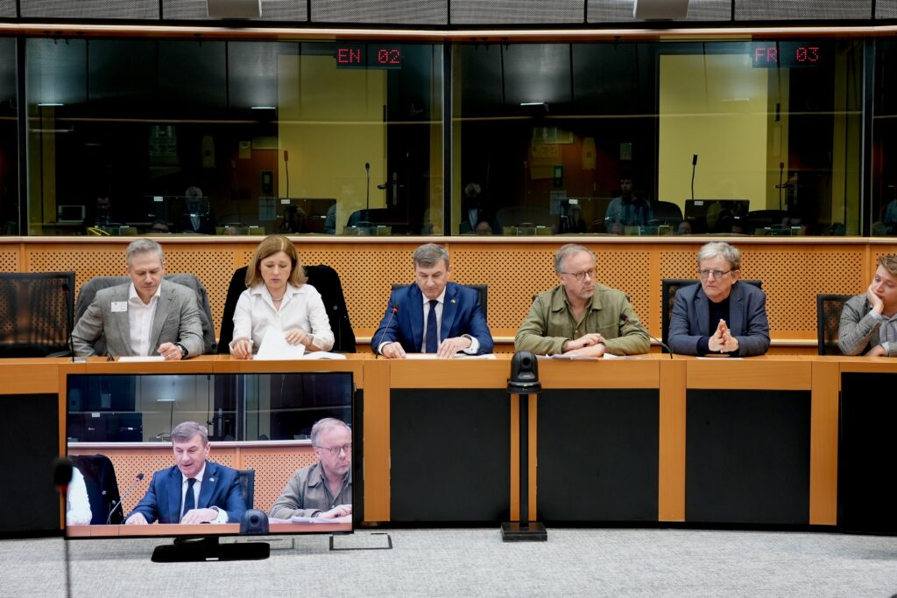
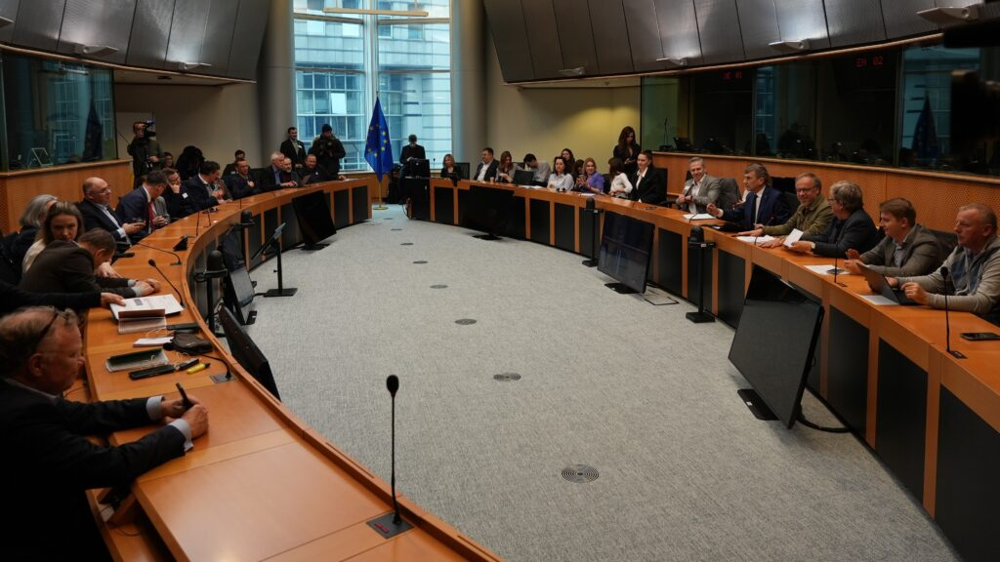
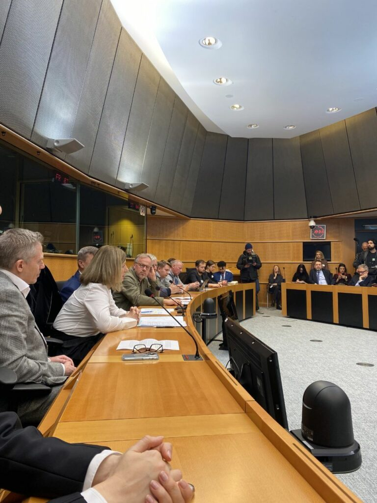
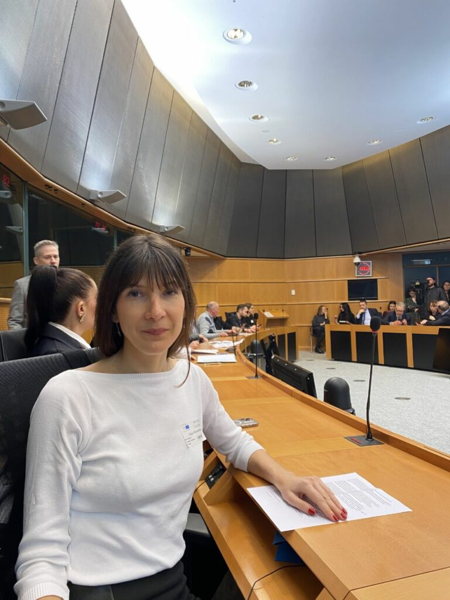
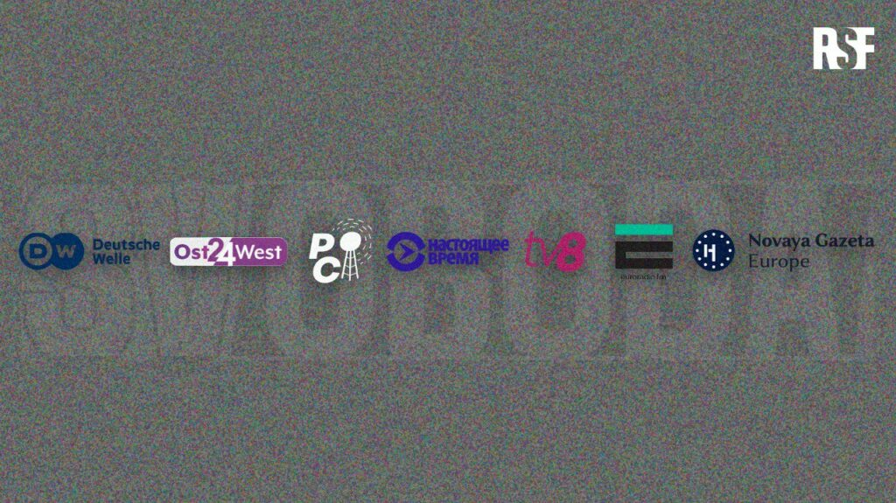

Le projet a été officiellement lancé cette semaine au Parlement européen de Bruxelles lors d’une conférence organisée par Reporters sans frontières à l'invitation d'Andrus Ansip, eurodéputé et avec la participation de Vera Jourova, vice-présidente de la Commission Européenne.

Svoboda est un bouquet satellitaire lancé par RSF sur l'idée du Comité Denis Diderot pour contrer la propagande massive et destructrice du Kremlin.

Membre du Comité éthique du projet, Russie-Libertés est honoré de contribuer à la lutte contre la désinformation et les fake news utilisés sans relâche par le régime poutinien pour manipuler les citoyens russes : « le Kremlin dépense des milliards d'euros pour endoctriner les Russes sur ce qu'il faut penser, comment vivre, qui tuer, qui aimer ou ne pas aimer » a affirmé dans son discours Olga Prokopieva, présidente de Russie-Libertés.

Composé de 25 chaînes radio et télé indépendantes, Svoboda apportera une information fiable et vérifiée à 4,5 millions de foyers russes.

[Conférence dans son intégralité](https://youtu.be/EE7NTvj56WM?si=pQMkP0uf1_LhvkO)

[Discours d'Olga Prokopieva](https://www.youtube.com/watch?v=vw0ojTblO1o) , présidente de Russie-Libertés

Présentation du projet [SVOBODA](https://youtu.be/GrFsj4qvJgI)

Instructions de [connexion au bouquet satellitaire](https://rsf.org/en/svoboda-satellite)

Rejoignez notre lutte contre la propagande poutinienne !

---
- 

- 

---

---
- 

- 

---

<video playsinline muted loop controls src="images/2024_03_RSF-SVOBODA_FR.mp4"></video>