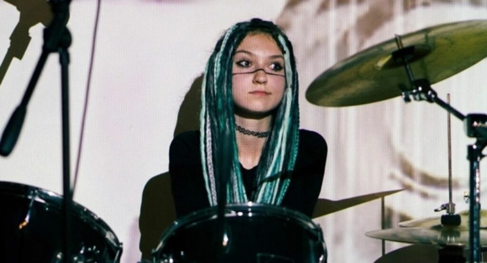
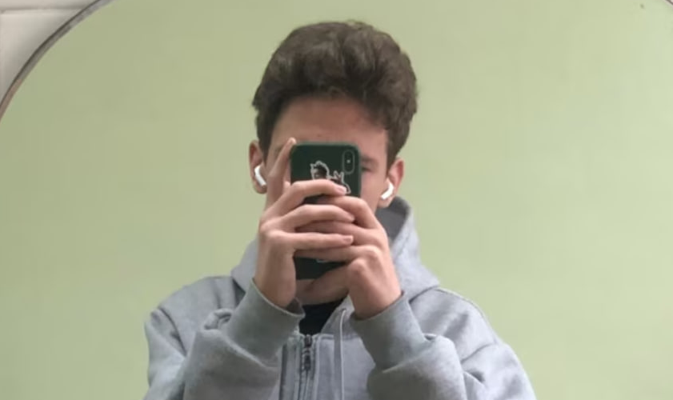
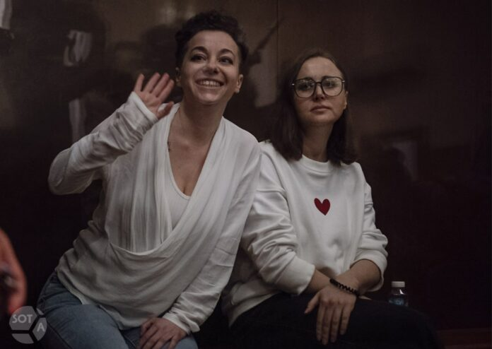
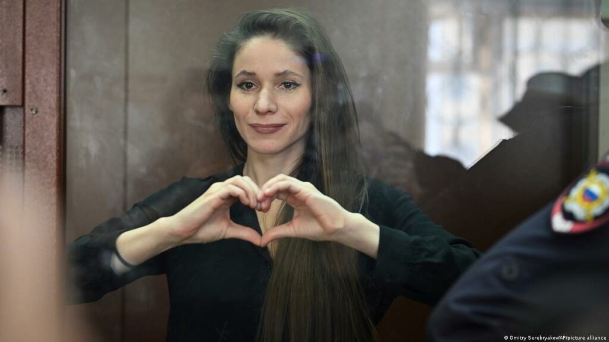

Le 22 mars 2024, un terrible attentat du Crocus City Hall à Krasnogorsk près de Moscou a été organisé par l’État islamique.

Le service fédéral de sécurité russe (FSB) dont est issu Poutine et qui a été financé à outrance par des fonds budgétaires pendant les 25 dernières années, n’a pas été capable d’empêcher cet acte de terrorisme atroce.

Pourtant, le service de renseignement russe se montre très performant pour arrêter tous ceux qui déplaisent à Poutine et les poursuivre pour « terrorisme et extrémisme » pour de simples paroles ou actes anti-guerre.

Selon l'enquête du projet RE:Russia, en 2022, le nombre de personnes reconnues coupables de « terrorisme » en Russie a augmenté de 40 fois par rapport à la moyenne des années qui ont précédé le retour de Poutine au Kremlin en 2012.

L’accusation la plus utilisée est « l’apologie du terrorisme » ou « l’appel au terrorisme », et les raisons de persécutions sont souvent de simples publications sur les réseaux sociaux. Ainsi, cette lutte fictive contre le terrorisme est devenue un instrument de répression en Russie.

Lioubov Lizounova, l'adolescente de 17 ans de la ville de Tchita, a été arrêtée le 31 octobre 2022 pour son graffiti « À bas le régime ». Elle a été accusée de « l’appel au terrorisme » et a été placée en détention provisoire en avril 2024. Lioubov risque de passer son bac et toute sa jeunesse en prison.

Egor Balazeïkine, l’adolescent de 17 ans, a été condamné à six ans de prison pour « tentative d'acte terroriste » suite à deux jets de cocktails Molotov infructueux dans un bureau d'enrôlement militaire fermé. Selon Egor, par cette action il protestait contre la guerre criminelle de Poutine. Depuis l’enfance, Egor est atteint d'une hépatite auto-immune, néanmoins le tribunal l’a envoyé derrière les barreaux.

Selon le journal Novaïa Gazeta Europe, aujourd'hui, 52 mineurs figurent sur la liste de « terroristes et extrémistes » de Russie dont le plus jeune a 14 ans. Le nombre de « terroristes et extrémistes » mineurs en Russie a été multiplié par 3,5 fois au cours des dix dernières années. En 2024, 17 enfants ont été mis sur cette liste.

Valéry Zaïtsev, le plus jeune « terroriste » selon le régime poutinien. Le 17 octobre 2023, les forces de sécurité ont emmené l'adolescent directement de l’hôpital où il suivait un traitement de la tuberculose. L’arrestation a été motivée par une vidéo sur laquelle Valéry jette des cocktails Molotov sur le mur d'un bâtiment abandonné, ce qui a été qualifié comme une « formation aux activités terroristes ».

La metteuse en scène Evguénia Berkovitch et l'autrice Svetlana Petriïtchouk risquent 7 ans de prison pour « l’apologie du terrorisme » pour une pièce Finist est un vaillant faucon, racontant l'histoire de Russes recrutées sur Internet par des islamistes en Syrie, mise en scène en 2020. Le 4 mai 2023, Evguénia et Svetlana ont été arrêtées et mises en détention provisoire. Le 15 avril 2024, elles ont été ajoutées à la liste de « terroristes et extrémistes ».

669 citoyens russes ont été déclarés « terroristes » et « extrémistes » courant les trois premiers mois de 2024. Il s’agit d’un record par rapport à des périodes similaires des années précédentes, selon Novaïa Gazeta Europe.

La liste contient les noms des personnes accusées de préparation des actes terroristes, mais également celles qui ont été reconnues coupables de « l’apologie du terrorisme », « l’appel au terrorisme », « discréditation de l’armée russe » et appartenant au « mouvement LGBTQ ».

Le 1er mars 2024, le Ministère de la Justice russe a inscrit l’organisation imaginaire du « mouvement international LGBTQ » au registre des organisations extrémistes. Une semaine plus tard, la première affaire pénale pour « l’extrémisme LGBTQ » a été ouverte.

À Orenbourg, trois personnes ont été placées en détention provisoire pour « l'organisation d'une communauté extrémiste » et « la propagande des relations sexuelles non traditionnelles ». Il s’agit du propriétaire du club gay Pose, son directeur et son administratrice. Le club a été déclaré une branche de l’organisation (inexistante) du « mouvement international LGBTQ » jugée « extrémiste » en Russie.

La Fondation anti-corruption, une ONG créée par Alexeï Navalny pour lutter contre la corruption du gouvernement russe, a été désignée comme « organisation extrémiste » en juin 2021 par la justice russe.

Alexeï Navalny a été accusé d’extrémisme et n’a pas été radié de la liste de « terroristes et extrémistes » même après son assassinat.

Les Russes qui ont fait un don à la fondation de Navalny, ont partagé ses publications ou son logo, sont persécutés en Russie.

Une des dernières affaires est celle de la journaliste russe Antonina Favorskaïa qui a couvert le procès de Navalny et qui a été arrêtée pour « extrémisme ». Pendant son procès, l’huissier a interdit à Antonina de montrer un cœur avec ses mains, car il l’a jugé comme un symbole de l’extrémisme.

Nous exigeons la libération immédiate de tous les prisonniers politiques de Russie !

Poutine doit être arrêté maintenant.
