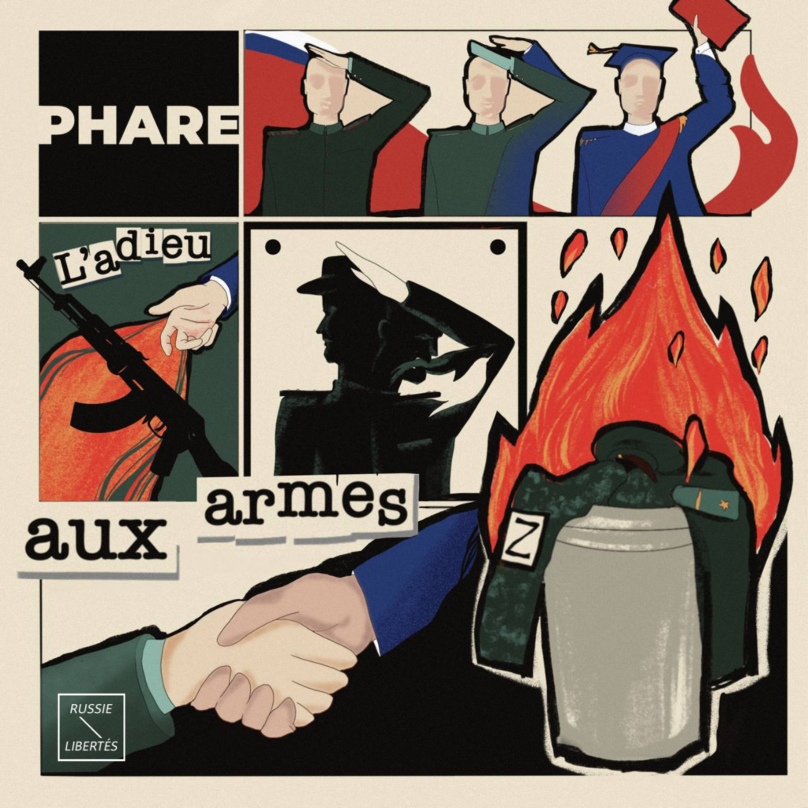
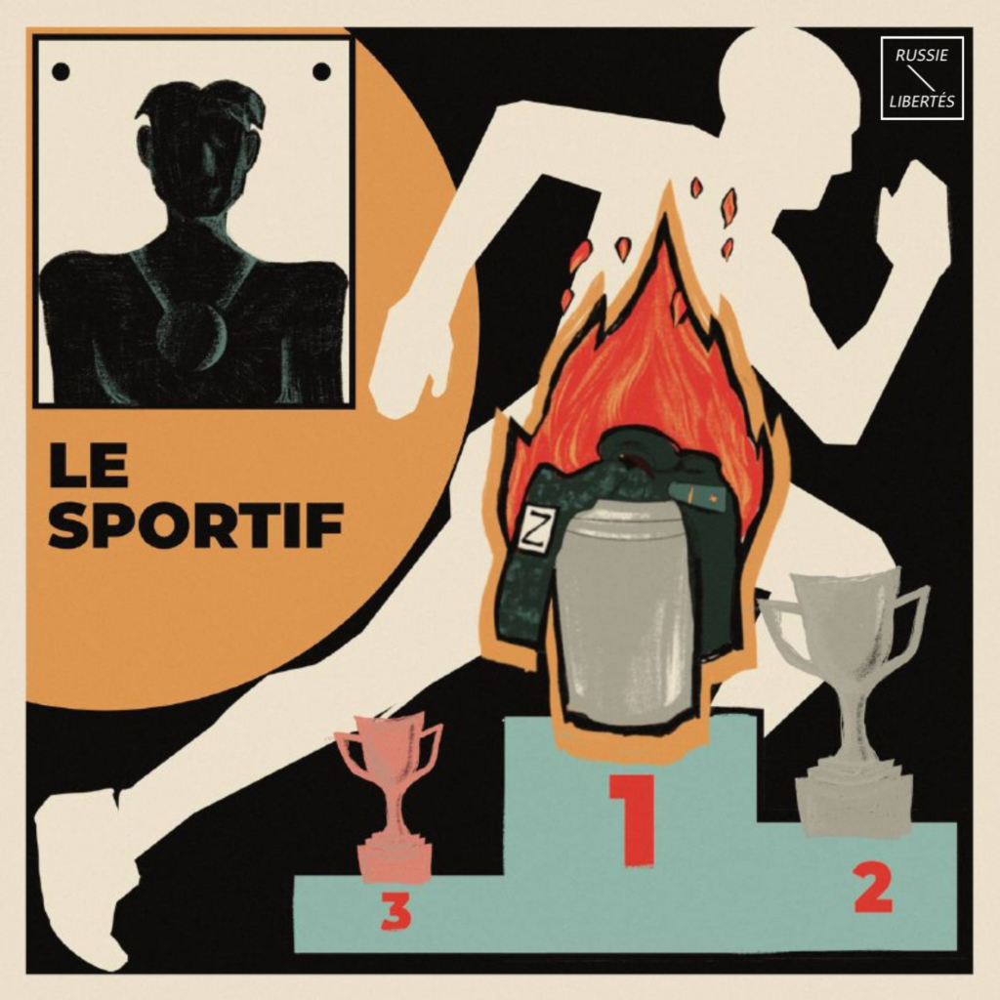
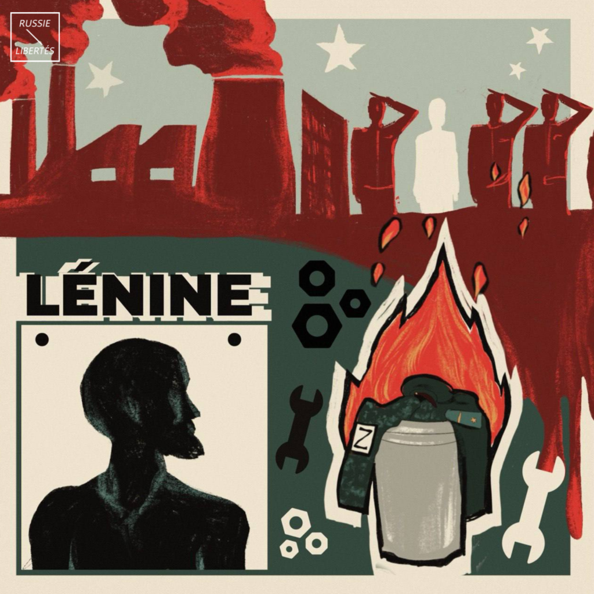
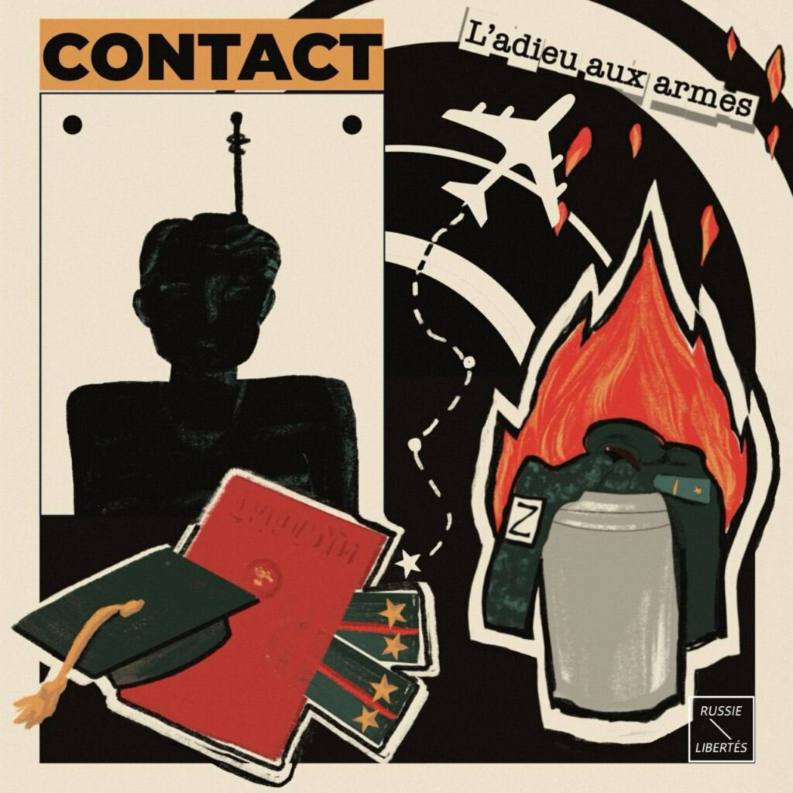

---
- [AIDER LES OBJECTEURS DE CONSCIENCE](https://www.helloasso.com/associations/russie-libertes/collectes/il-faut-sauver-le-deserteur-ryan)
---

Depuis le début de l’invasion de l’Ukraine déclenchée par Poutine, de nombreux citoyens russes refusent de participer à sa guerre criminelle.

Des officiers, des soldats, des civiles mobilisés de force deviennent déserteurs et fuient la Russie.

Ils ont choisi de renoncer à leurs carrières militaires et de mettre leurs vies en danger pour ne pas avoir du sang des Ukrainiens sur leurs mains.

Ils ont refusé d’exécuter des ordres criminels de Poutine et risquent maintenant d’être expulsés, torturés, emprisonnés ou envoyés au front de force.

Un groupe de déserteurs russes se trouvant actuellement au Kazakhstan a créé un projet « L’Adieu aux armes » qui accuse l’invasion de l’Ukraine et vise à encourager les militaires russes à refuser d’y participer et à déserter de l’armée.

Nous demandons à la France d’accueillir les hommes russes refusant de combattre en Ukraine et qui s’opposent ouvertement à cette guerre en véritables résistants.

Accueillir des déserteurs c’est aussi réduire les rangs de l’armée russe et l’affaiblir.

Nous devons faire tout pour empêcher Poutine de poursuivre sa guerre criminelle.

<video playsinline muted loop controls src="images/2024_04_фб.mp4">Projet « [L’Adieu aux armes](https://www.youtube.com/watch?v=q3r5zM3YnvE) »</video>

---
- [AIDER CES OBJECTEURS DE CONSCIENCE](https://www.helloasso.com/associations/russie-libertes/collectes/il-faut-sauver-le-deserteur-ryan)
---

**HISTOIRES DE DÉSERTEURS**

**Phare** – c’est son surnom de déserteur.

Il a 24 ans. Il est tatar et musulman. Il fut officier de l’armée russe.

« Je  voulais devenir officier depuis l’enfance, la carrière militaire me paraissait noble. Je suis entré à l’école militaire et après la fin des études, j’y ai pris le poste d’enseignant pour former de futurs officiers.

Petit à petit, je me suis intéressé aux enquêtes de la Fondation anti-corruption d’Alexeï Navalny. À cette époque, j'ai commencé déjà à penser que j'avais fait une erreur en reliant ma vie à l'armée russe. Le 24 février 2022, je n’avais plus de doute : mon pays a commencé une guerre criminelle - il a envahi le territoire d’un autre pays pour tuer des civils, détruire des villes, piller et violer. Je ne pouvais pas soutenir cela ».

Phare a refusé de participer à la guerre criminelle de Poutine, a quitté la Russie et s’est réfugié au Kazakhstan. Il a demandé l’asile au Kazakhstan qui, selon la pratique courante et les accords politiques avec la Russie, lui est refusé. En cas d’expulsion vers la Russie, il risque jusqu’à 15 ans de prison ou l’envoi forcé sur le front.

« Beaucoup de gens pensent que j’ai fui la Russie parce que je suis un lâche, mais cela n’a pas été une décision facile. Ma famille, mes amis, ma maison sont restés en Russie. Mais je crois que mes convictions sont plus importantes que le confort personnel. Quand je suis arrivée au Kazakhstan, j'ai dormi par terre et j’ai fait du travail que je ne pensais jamais faire. Je n’ai aucune idée de ce qui m’arrivera demain.

Si je serai expulsé vers la Russie, je serai prêt à aller en prison. Je suis parti non pas parce que j'avais peur d’être tué à la guerre, mais parce que je ne voulais pas participer à ce crime.

Si quelqu'un attaquait la Russie, je resterais et défendrais l'indépendance de mon pays. Je ne serais sûrement pas le seul à le faire - il y aurait des files d’attente devant les bureaux d’enrôlement militaire. Mais j’ai été l’officier au ministère de la Défense, non pas au ministère de l'Invasion ».

Phare se prononce publiquement contre la guerre en Ukraine dans divers médias.

« Il y a beaucoup de gens honnêtes parmi nous, les citoyens russes, mais certains ont connu un sort bien pire que le mien. Et si je garde le silence en étant au Kazakhstan, je ne serai pas en capacité de sauver les autres, ni de me sauver moi-même. J’ai donc décidé de me prononcer publiquement. Même si mes discours seront entendus que par 20-30 personnes en Russie, la chaîne continuera - chacune d'elles pourra ramener 20 autres personnes à la raison ».

Son surnom est Phare parce qu’il guide les autres dans l’obscurité.

**Mr Mercedes** – c’est son surnom de déserteur. Étant un fan de Stephen King, il emprunte ce surnom auprès d’un personnage du roman policier éponyme.

Il a 27 ans. Il est homosexuel. Il fut officier de l’armée russe.

En  2017, il obtient son diplôme universitaire en physique, mathématique et programmation informatique. Tout de suite après, il est conscrit au service militaire obligatoire pour être affecté à « l’unité scientifique » de l’armée russe avec le grade de lieutenant.

« J'ai travaillé avec des logiciels et des documents. Au début, ce travail me plaisait, mais j’ai très vite compris que les gens dans l'armée n'étaient pas très bien traités. Je ne pouvais pas accepter la direction politique du pays. J'ai été très déçu par le gouvernement russe et par ce qu'il faisait.

J’ai réalisé qu’il n’était plus possible pour moi de faire partie de l’armée russe. J'ai essayé de démissionner pour la première fois en mars 2021, cependant, ma demande n'a tout simplement pas été traitée. J’ai réessayé à nouveau en décembre 2021, mon rapport a été rejeté et j’ai été obligé de continuer mon service ».

Le 21 septembre 2022, la mobilisation partielle a été déclarée par Poutine. Le jour même, Mr Mercedes reçoit un SMS avec un ordre de se présenter au point de déploiement permanent pour l’envoi sur le front. Mr Mercedes n’obéit pas à cet ordre et décide de déserter. Il traverse la frontière avec le Kazakhstan.

« La désertion était la dernière chance de ne pas être impliqué dans une guerre criminelle, ni être emprisonné pour de nombreuses années. Pour quitter ce système, j’ai été obligé d’entreprendre des actions décisives et risquées ».

Une affaire pénale a été ouverte contre Mr Mercedes pour désertion. Il est actuellement recherché au niveau international. Il a reçu des menaces de la part de ses commandants.

« Ceux qui me cherchent savent parfaitement où me trouver. J'ai reçu des menaces. J’ai reçu également des propositions de revenir contre l’arrêt de poursuite pénale. J’ai aucune envie de revenir. Mais j’ai peur - je ne vais pas mentir. C'est effrayant en principe, car la plus grande peur humaine – c’est la peur devant l'inconnu. Ma vie aujourd’hui est complétement imprévisible, car je me trouve dépendant des autorités de ce pays qui m’est étranger : on peut m’arrêter et m’expulser vers la Russie, on peut me laisser tranquille et permettre de travailler légalement, on peut aussi me mettre dans une situation illégale et me forcer à me cacher. Je ne sais absolument pas ce qui se passera demain. Je suis incapable de planifier ma vie, j’ai du mal à comprendre comment vivre et je ne suis même pas sûr si je resterai en vie ou pas. J'ai peur. Je ne sais toujours pas ce qui m’attend ».

Mr Mercedes s’expose également à des poursuites pour son orientation sexuelle. Car selon la loi adoptée récemment par le régime de Poutine, la communauté LGBTQI+ est reconnue comme une « organisation extrémiste » en Russie.

En cas d’expulsion vers la Russie, Mr Mercedes risque donc jusqu’à 10 ans de prison pour participation à « l’organisation extrémiste LGBTQI+ » et jusqu’à 15 ans de prison pour désertion ou l’envoi forcé sur le front.

« J'espère qu'un des pays européens m’accordera une possibilité d’y vivre en toute sécurité. J'aimerais légaliser mes relations avec mon compagnon, fonder une famille, avoir des enfants et vivre normalement sans peur ».

Mr Mercedes est un personnage de fiction mais le cauchemar qu’il vit est une réalité.

---
- [AIDER CES OBJECTEURS DE CONSCIENCE](https://www.helloasso.com/associations/russie-libertes/collectes/il-faut-sauver-le-deserteur-ryan)
---

**Moby-Dick** – c’est son surnom de déserteur.

Il a 32 ans. Il est Sakha, membre de la minorité ethnique de Yakoutie. Et il fut mobilisé dans l’armée russe.

Sa  vie était simple et normale. Il travaillait en tant qu’ouvrier routier dans une petite ville de la République de Yakoutie en Russie. Son monde s’est écroulé en septembre 2022, car Moby-Dick a été soudainement mobilisé.

« J’ai entendu dire que la mobilisation avait commencé, mais je n’ai pas compris ce que cela signifiait. Mon responsable m’a convoqué en m’exigeant de lui fournir mon passeport et mon livret militaire. Je lui ai demandé de m’expliquer ce qui s'était passé. Il m'a dit que j'avais été licencié et mobilisé ».

Le lendemain, il a été envoyé à une base militaire se situant dans une autre région russe, en Bouriatie.

« On nous a mis comme des moutons dans des bus pour aller à l'aéroport, puis dans un avion. Personne ne savait exactement où on nous emmenait.

En arrivant à la base militaire, j’ai été choqué par ce que j’ai vu. Tout le monde était ivre, un chaos total. Les panneaux d’informations dans la base affichaient des photos de soldats ukrainiens morts avec l’inscription : « Ce sont des nazis - ils doivent être tués ». Apparemment, on a essayé de nous préparer ainsi à ce qui nous attendait à la guerre ».

Dès son affectation à l'unité militaire, il déclarait son refus de participer à la guerre criminelle de Poutine et a tenté à plusieurs reprises de remettre un rapport pour remplacer le service militaire par un service civil mais il a été rejeté. Les officiers l’humiliaient et le menaçaient. De plus, l’attitude des officiers russes envers Moby-Dick était ouvertement raciste - ils l’appelaient un « éleveur de rennes » en raison de son origine ethnique sibérienne.

« Énormément de citoyens de Russie, qui ont été mobilisés et envoyés à la guerre par Poutine, font parties des minorités ethniques. On a l’impression que le régime essaie d’éliminer certains groupes ethniques habitant en Russie. Cela ressemble à une génocide ».

Moby-Dick a donc décidé de s’enfuir par un trou dans la clôture de la base. Sa mère l’attendait à l’extérieur dans un taxi.

« Le chauffeur de taxi a tout de suite compris la situation. Il m’a dit qu’à cause de cette mobilisation « il ne reste plus d'hommes en Bouriatie » et qu'il me comprend. Il m’a conseillé de m'envoler immédiatement pour le Kazakhstan, ce que j’ai fait ».

Moby-Dick est devenu la première personne mobilisée contre laquelle une procédure pénale a été ouverte pour l’abandon non autorisé d'une unité militaire. En cas d’expulsion vers la Russie, il risque jusqu’à 15 ans de prison ou l’envoi forcé sur le front.

« Pour l’instant, je suis au Kazakhstan sans un emploi officiel, en faisant rien et en espérant qu’un autre pays m’accordera l'asile pour que je puisse retrouver une vie normale ».

Son surnom est Moby-Dick parce qu’il est en fuite permanente.

**Le Sportif** – c’est son surnom de déserteur.

Il a 33 ans. Il est sportif professionnel. Il fut officier de l’armée russe.

 Enfant, il n'était pas très bon à l'école, mais le sport l’intéressait vivement. Sa mère l'élevait seule dans un petit village, un endroit aussi dépourvu d'espoir que d'emplois. Elle l’a inscrit dans une école militaire, car cette formation était gratuite. Cela ressemblait à un ticket pour une vie meilleure.

« Comme on disait chez nous, l’armée va te nourrir, te loger, t’habiller. En plus, elle ferait de moi un vrai homme ».

Le Sportif exerçait formellement ses fonctions d’officier, car il passait tout son temps de service à participer à des compétitions sportives au nom de l'unité militaire. La course – c’est sa véritable passion.

« J'ai été formé dans une atmosphère qui ne me permettait pas de comprendre ce qui se passait dans mon pays. Quand je suis entré dans l’école militaire, je n’avais pas réalisé qu’on m’entraînait pour asservir un autre peuple ».

Dès le début de l’invasion en Ukraine, il évitait l’envoi sur la ligne de front, ignorant les instructions et les ordres des commandants sous divers prétextes.

« Le 24 février 2022, lorsque l’invasion à grande échelle de l’Ukraine a commencé, ma vie a basculé. À ce moment, j’ai immédiatement décidé que je ne participerais d’aucune manière à ce qui avait commencé. J’ai compris que c’était un point de non-retour qui allait changer la vie de tout le pays, et la mienne aussi ».

En octobre 2022, une affaire pénale a été ouverte contre le Sportif pour non-respect des ordres et pour l’abandon non autorisé de l'unité militaire. Son commandant l’a menacé en précisant qu’il n’avait que deux options : soit partir à la guerre, soit aller en prison.

« Ce que j'ai ressenti c'était le dégoût. On voulait me forcer à aller me battre contre le peuple libre d'Ukraine. Notre liberté nous est retirée jour après jour pendant un quart de siècle, mais Poutine a voulu voler celle des Ukrainiens en trois jours. Poutine voulait me mettre dans un sac mortuaire, mais c'est l’uniforme de son armée qui finira dans un sac poubelle ».

Le Sportif a quitté la Russie et s’est réfugié au Kazakhstan quelques jours avant la fin de son procès sans attendre la décision du tribunal. Il a déserté en faisant appel à l’ONG russe « Go by the Forest » aidant les hommes russes à éviter de participer à la guerre.

Sa situation en Kazakhstan reste instable. En cas d’expulsion vers la Russie, il risque jusqu’à 10 ans de prison ou l’envoi forcé sur le front. Néanmoins, le Sportif reste optimiste.

« La pire chose qui aurait pu arriver est arrivée. Maintenant, seules de bonnes choses arriveront. Parce que je ne laisserai plus personne décider de mon destin à ma place ».

Son surnom est le Sportif parce qu’il n’abandonne jamais.

**Lénine** – c’est son surnom de déserteur.

Il a 34 ans. Il était mécanicien à l’usine. Il fut mobilisé dans l’armée russe.

«  2022 – c’était une année choc. L’hégémonie de Poutine est soudainement devenue très similaire à celle du Troisième Reich. J’ai toujours cru que le peuple ukrainien était un peuple fraternel. J'ai été choqué quand l’armée russe est entrée en Ukraine. Je ne pouvais pas croire que mon pays ait emprunté ce chemin ».

En septembre 2022, il a été mobilisé et affecté à l'unité militaire pour suivre une formation.

« Le deuxième coup dur a été la mobilisation. À ce moment, ma vie a été détruite. J’ai été mobilisé tout de suite après l’annonce de la mobilisation, directement sur mon lieu de travail : des commissaires sont venus et ont emmené deux personnes, dont moi, alors que je ne suis pas du tout un militaire.

Les officiers ont essayé de me convaincre qu'il y avait des ennemis en Ukraine, des nazis. Mais je savais que c’était des gens comme nous qui travaillaient, vivaient tranquillement leurs vies.

Dans l'unité militaire, j'avais le sentiment d'être dans un autre monde. Tout était formel - entraînement militaire, photographies pour la propagande, il n'y avait pas assez de munitions, certains casques et gilets pare-balles étaient transpercés portant des traces de sang. 75% des mobilisés étaient ivres et cherchaient à s'oublier. Ceux qui ne buvaient pas cherchaient des moyens de s'échapper ».

En octobre 2022, il a abandonné l’unité militaire. Lénine s’est d’abord caché sur le territoire russe pendant environ 5 mois.

Au printemps 2023, il a contacté l’ONG @gobytheforest aidant les hommes russes à éviter de participer à la guerre criminelle.

« Étant recherché à l’international, j'ai réussi à traverser la frontière de Russie vers un pays frontalier. L’essentiel est de ne pas avoir peur. Je conseille à tous ceux qui comprennent ce qui se passe de s’en fuir vers la liberté ».

En cas d’expulsion vers la Russie, Lénine risque jusqu’à 10 ans de prison ou l’envoi forcé sur le front.

Son surnom est Lénine parce qu'il inspire les gens à se révolter contre l'injustice.

**Contact** – c’est son surnom de déserteur.

Il a 26 ans. Il ne faisait jamais confiance aux militaires. Il fut officier de l’armée russe.

« La  carrière militaire n’était pas mon choix. J’avais toujours peur de l’armée. Mais on dit qu’il faut affronter nos peurs. Mes parents ont insisté que j’entre dans l’école militaire. Ma famille n’est pas riche et n’avait pas assez d’argent pour payer mes études. Alors que dans l’armée on te nourrit, on t’habille et on te loge. Dès les premiers jours, j’ai réalisé que ce n’était pas pour moi : une vie routinière et l’irrespect total des droits humains ».

Dès son arrivée dans l'unité militaire, il a tenté de démissionner du service militaire en déposant à plusieurs reprises des rapports au commandement.

« Il s’agit d’un processus difficile et long qui peut durer plusieurs années. On a commencé à me faire du chantage pour m’empêcher de démissionner ».

En janvier 2022, il a été envoyé en Crimée pour des manœuvres militaires. Un mois plus tard, la guerre a éclaté.

« Il n’y avait pas d’ordre explicite. On nous a dit qu’il s’agissait d’un simple redéploiement. Après avoir traversé la frontière ukrainienne, j’ai demandé au commandant du bataillon : « Est-ce que nous venons d’attaquer l’Ukraine ? ». Il m'a répondu qu'il s'agissait d'une opération spéciale qui serait finie dans 10 jours. Trois jours plus tard, il a été tué.

J'étais choqué - pour moi, la guerre avec l'Ukraine était quelque chose d'impensable. J'ai de la famille en Ukraine. Je n’ai jamais cru qu’il y ait des nazis là-bas. Poutine force les Russes à combattre l’armée ukrainienne qui protège son pays, son peuple, son état.

Fin avril 2022, j’ai enfin eu accès à Internet. J'ai ouvert Twitter et j’ai appris ce qui s’est passé à Boutcha et Irpin. J'étais horrifié : il y a des règles de guerre, les civils ne doivent pas souffrir. Il était clair : cette guerre est criminelle et j’ai décidé de m’en tirer le plus vite possible ».

Contact a assuré des fonctions de communication pendant quelques mois sur le front. En août 2022, Contact a convaincu le commandement d’approuver son congé et a quitté la zone de combat.

« Dès que j'ai pu quitter le front, j'ai rédigé encore un rapport pour démissionner de l'armée. Pendant le traitement de ma demande, la mobilisation a été annoncée et la démission est devenue impossible pour les militaires russes. J'ai reçu l'ordre de retourner au front le 22 septembre. Le 21 septembre, j'ai quitté la Russie. Je ne pouvais pas revenir sur le front pour des raisons morales. Ma famille ne m’a pas soutenu, on m’a dit que j’étais un traître. J’ai donc cessé mes contacts avec eux ».

Une affaire pénale a été ouverte contre Contact en Russie pour abandon non-autorisé de l’unité militaire. En cas d’expulsion vers la Russie, il risque jusqu’à 15 ans de prison ou l’envoi forcé sur le front.

« Ma vie actuelle dans un pays étranger sans aucune perspective est bien meilleure que la guerre. Ma conscience est tranquille : je ne tuerai personne. De plus, j'essaie d’aider les autres gars à fuir de l’armée russe. Après avoir failli mourir plusieurs fois, je suis juste heureux d'être en vie ».

Contact a initié le projet anti-guerre « L’Adieu aux armes » qui accuse l’invasion en Ukraine et vise à encourager les militaires russes à refuser d’y participer et à déserter de l’armée.

Le manifeste de l’organisation dit que la guerre déclenchée par le Kremlin n’est nécessaire que pour poursuivre le pillage de la Russie par Poutine et préserver son pouvoir.

Contact participe également au projet « Point de non-retour », qui fournit de l’aide juridique et l’assistance à la recherche de travail et de logement pour les déserteurs.

« On essaie d’organiser des couloirs humanitaires vers des pays tiers pour ceux qui se trouvent dans la même situation que moi. Beaucoup d’entre eux pourraient témoigner devant le tribunal international sur les crimes militaires russes en Ukraine. Moins il y aura de gens participant à cette guerre, mieux ce sera pour l’Ukraine, le monde entier et la Russie.

Je dis à tous les hommes russes : ne signez pas de contrat militaire – c’est une menace à votre vie, santé, liberté. Ne participez pas à la guerre – ce n’est pas votre guerre ».

Son surnom est Contact parce qu’il incarne le lien vers une vie digne pour ceux qui ne veulent pas participer à la guerre criminelle en Ukraine.

---
- [AIDER CES OBJECTEURS DE CONSCIENCE](https://www.helloasso.com/associations/russie-libertes/collectes/il-faut-sauver-le-deserteur-ryan)
---
