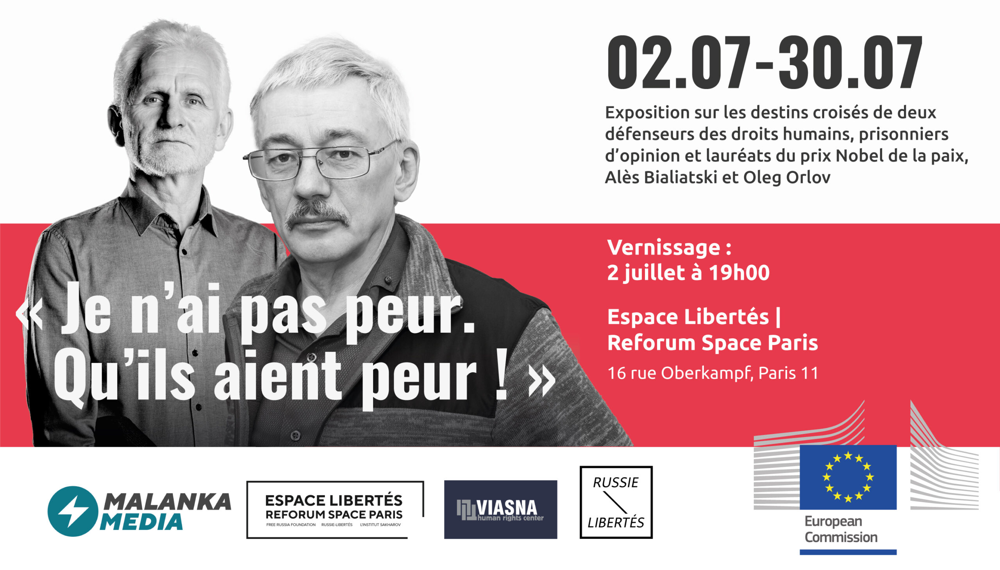

**Quand** : du 2 au 30 juillet

**Où** : Espace Libertés | Reforum Space Paris, 16 rue Oberkampf Paris 11

---

__Malanka - Média__ , le média indépendant bélarusse, le Centre pour les droits de l’homme __Viasna__ , l’association __Russie-Libertés__ , l’ __Espace Libertés__ | __Reforum Space Paris__ avec le soutien de la __Commission européenne__ organisent **l’exposition** sur la vie croisée de deux éminents défenseurs de droits humains, prisonniers d’opinion et lauréats du Prix Nobel de la Paix, **Alès Bialiatski et Oleg Orlov** .

**Alès Bialiatski** est un militant de droits humains bélarusse, fondateur et dirigeant du Centre de défense de droits humains __Viasna__ , condamné en 2023 à 10 ans de prison pour ses activités militantes. Il est l'un des plus importants défenseurs des droits humains au Bélarus. Son engagement vise à défendre les libertés civiles et à lutter pour la démocratie dans un pays confronté à une dictature depuis 1994.

Ami de longue date d’Ales Bialiatski, **Oleg Orlov** est une figure tout aussi éminente des droits humains en Russie : il est l'un des fondateurs du Centre de défense des droits humains __Mémorial__ et lauréat du prix Nobel de la Paix en 2022. Il a récemment été condamné à 2 ans et demi de prison pour ses déclarations contre la guerre en Ukraine.

---

**Programme de l'exposition :**

**2 juillet à 19h00**

__Ouverture de l’exposition,__ lors de laquelle interviendront :

* **Geneviève Garrigos** , conseillère de Paris, ancienne présidente d'Amnesty International France
* **Sacha Koulaeva** , défenseuse des droits de l'homme, une collaboratrice de longue date d’Ales Bialiatski et d'Oleg Orlov
* **Alice Syrakvash** , présidente de l'association "Communauté des Belarusses à Paris" et représentante de l'Ambassade du peuple bélarusse en France
* **Natalia Pinchuk** , épouse du prisonnier politique, fondateur et président du Centre des droits de l'homme "Viasna" et lauréat du prix Nobel de la paix, Ales Bialiatski (enregistrement de l'intervention sous réserve)

Projection du film sur la vie d’Alès Bialiatski : **« Règles de vie d'Alès Bialiatski »** . __Réalisé par Yuri Butko et Alexandrina Glagolieva. Lituanie, 2023 (29 minutes).__

La soirée sera suivie d'un cocktail.

---
- [S'inscrire au vernissage](https://docs.google.com/forms/d/1N_D9TtjfquyUAexONjXhKTBlcv7dwNv1g72bys_D_58/edit)
---
 
**3 juillet à 19h00**

Projection du film de Manon Loizeau **« Biélorussie, une dictature ordinaire »** . France, 2018.

__Discussion avec l'auteure sur le travail du film au Bélarus et sur la vie dans ce pays, appelé « la dernière dictature d'Europe », qui, d'une part, se réfère à Moscou et, d'autre part, s'oppose depuis de nombreuses années au rouleau compresseur de l'État et rêve du Printemps  bélarusse.__

---
- [S'inscrire](https://docs.google.com/forms/d/1rjcy1MLpOdy5_Ti32jJ9rnJwLvSXr2RELNE0PqxnDV4/edit)
---

**5 juillet à 19h00**

Projection du film d'Olga Kravets **« Il commence à faire nuit »** . Russie-France, 2016 (52 min).

__Une discussion avec l'auteure sur la répression politique en Russie, sur les familles, et les transfigurations de leurs vies, dans laquelle l'un des membres de la famille est un « ennemi de l'État ».__

Lecture des lettres des prisonniers politiques  bélarusse et russes.

---
- [S'inscrire](https://docs.google.com/forms/d/1jg_m-f1m_9ViZPQwEdJsUl8A60FHGEMIorTj4JYHKtg/edit)
---

A l’approche des Jeux Olympiques 2024 de Paris, qui verront défiler les athlètes de ces deux pays sous bannière neutre, nous souhaitons avec cette exposition attirer l’attention sur l’existence d’une société civile complètement bâillonnée, mais qui, malgré tous les efforts pour la faire taire, continue à se battre pour les droits humains et la liberté d’expression.
