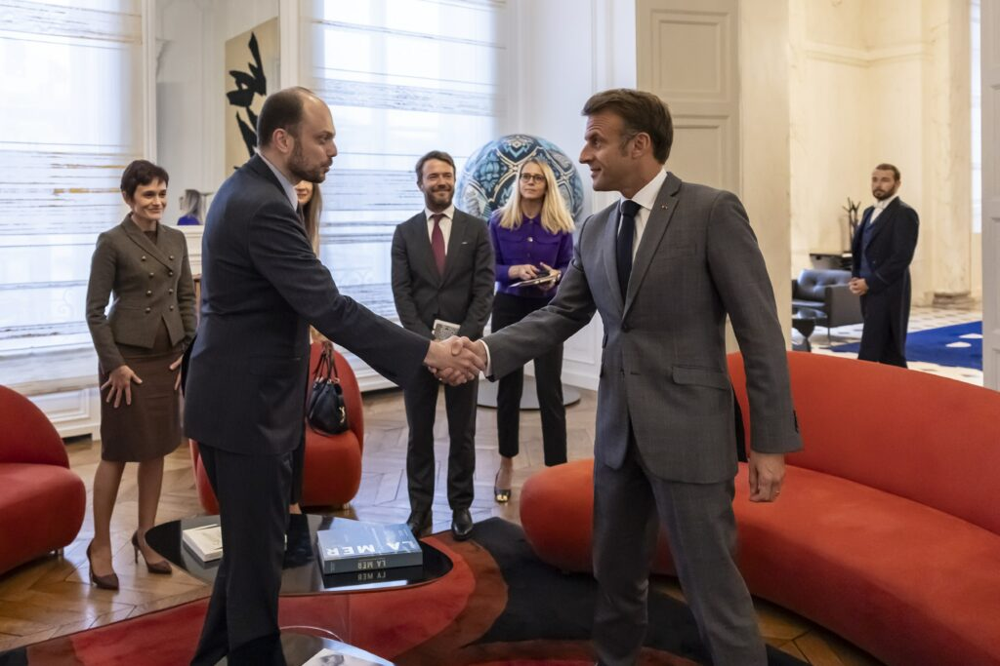
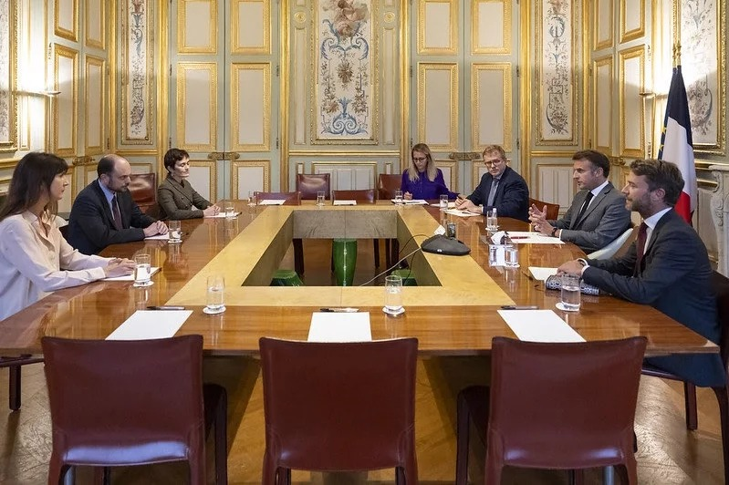
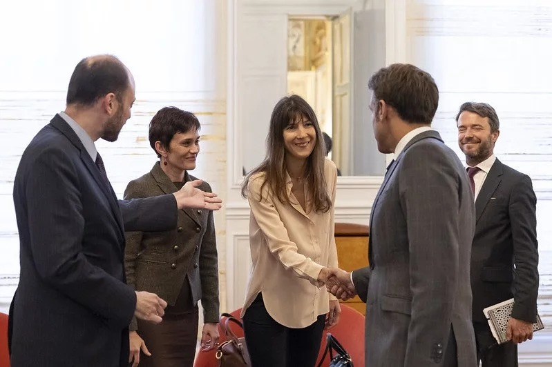

Ce lundi 9 septembre, s’est tenue une rencontre avec le Président de la République autour de Vladimir Kara-Mourza, opposant russe récemment libéré des geôles de Poutine.

Nous étions honorés de prendre part à cette rencontre qui a pu avoir lieu à notre initiative et qui nous a permis d’échanger sur le soutien que la France pourrait apporter aux prisonniers politiques et à la société civile russe.

Nous remercions M. le Président Emmanuel Macron de cette confiance en la société civile russe. Ensemble, nous pourrons accélérer la résistance contre la guerre et mener à bien la transformation de la Russie en un pays pacifique et démocratique.

---
- 

- 

---
