Ensemble avec Free Russia Foundation et l’Espace Libertés | Reforum Space Paris, nous avons eu l’honneur et le plaisir d’accueillir à Paris le grand opposant politique russe, journaliste et historien, Vladimir Kara-Mourza.

Il s’agissait de sa première rencontre avec le public parisien depuis sa récente libération des geôles de Poutine où, condamné à 25 ans pour « haute trahison », il craignait de mourir.

Une  minute de silence en mémoire à Alexeï Navalny et à toutes les victimes ukrainiennes du régime poutinien a eu lieu dans la salle comble du théâtre Les Enfants du Paradis.

Lors de cet échange chaleureux et très émouvant, Vladimir Kara-Mourza a abordé des sujets importants sur la situation actuelle en Russie.

Voici quelques citations :

« Poutine est illégitime. Il est un assassin, un usurpateur, un dictateur et un criminel ».

« Le pire cauchemar pour un prisonnier politique est d’être oublié. Je vous prie de continuer à parler d’eux, à les soutenir, à attirer l’attention sur cette catastrophe avec les prisonniers politiques en Russie et en Bélarus. Il faut dire leurs noms, il faut montrer leurs visages, il faut raconter leurs histoires concrètes. Ce sont des vies humaines qui sont en train d’être détruites par ce régime d’assassins ».

« Si le mal n’est pas reconnu, ni puni, ni jugé, il revient. La purification morale de la société russe est indispensable. Il nous faut une justice de transition : des lustrations, des tribunaux, l’ouverture des archives. La société russe doit se rendre compte des crimes qui ont été commis en son nom ».

Nous remercions Vladimir Kara-Murza pour cette rencontre inoubliable à Paris et pour sa lutte inébranlable contre le régime criminel de Poutine.

Photos par Denis Galitsyn et Nikita Mouraviev

---
- 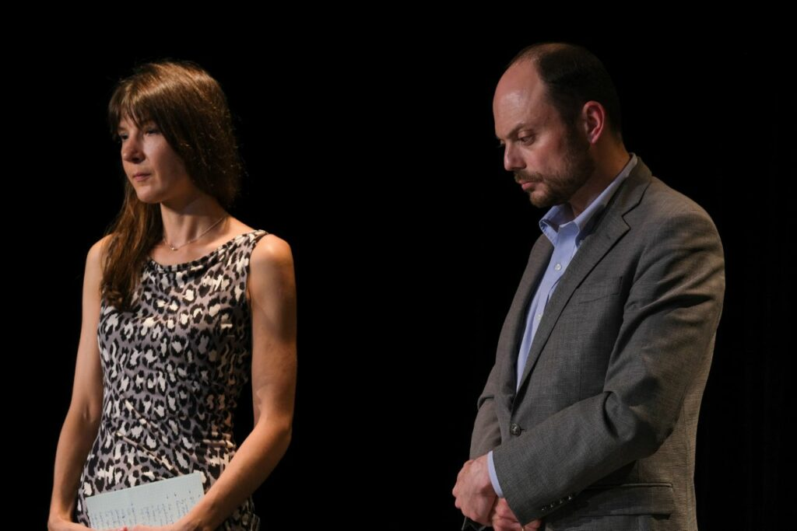

- 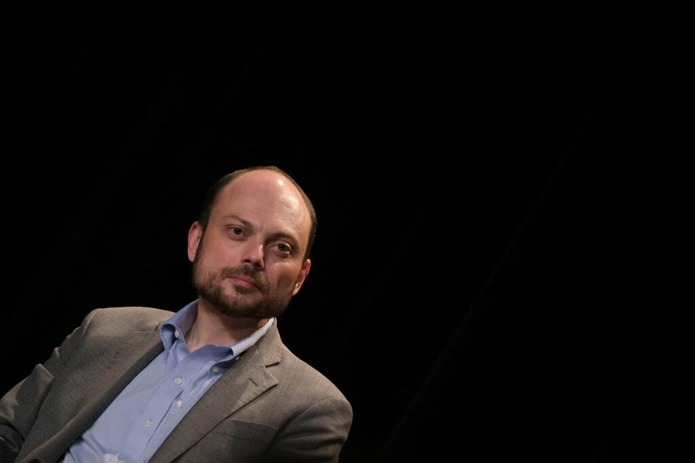

- 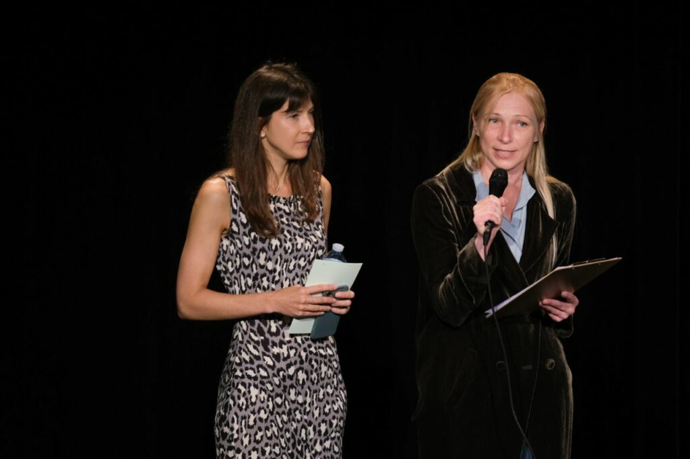

- 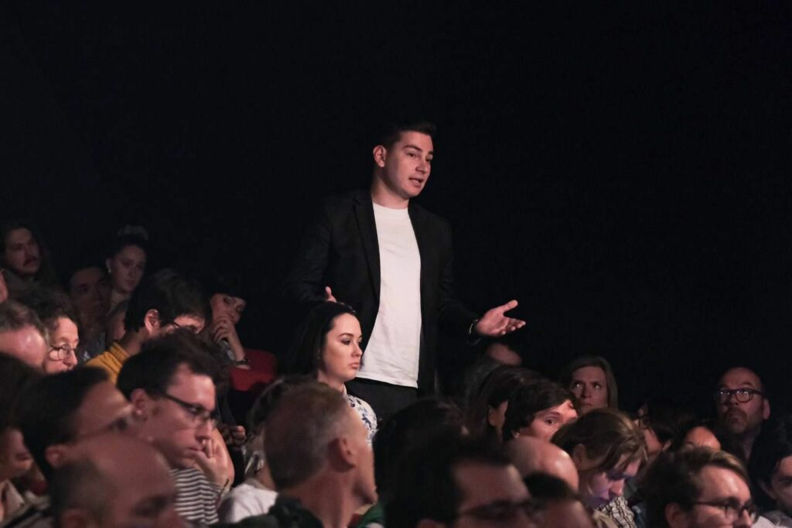

- 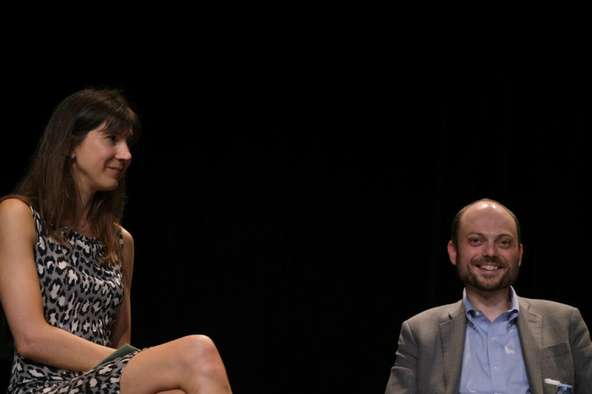

- 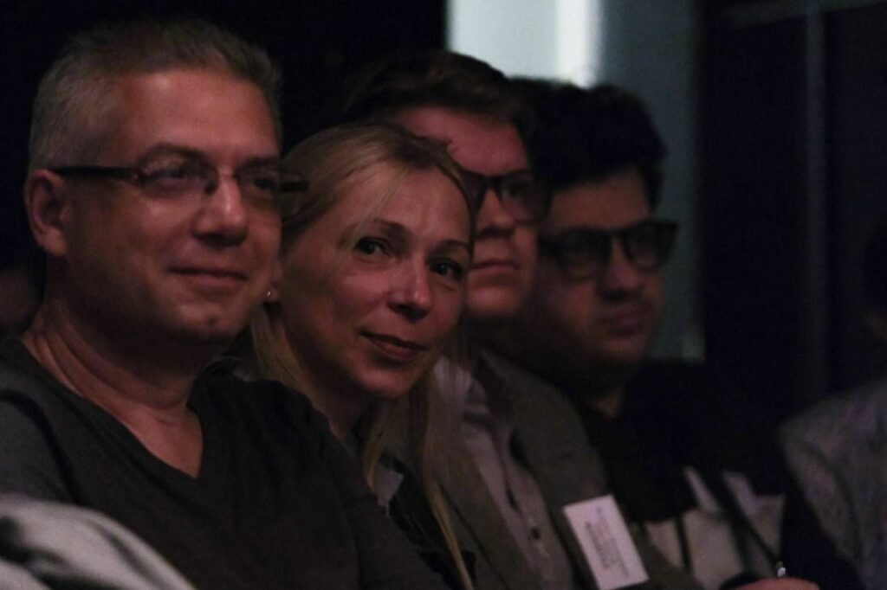

- 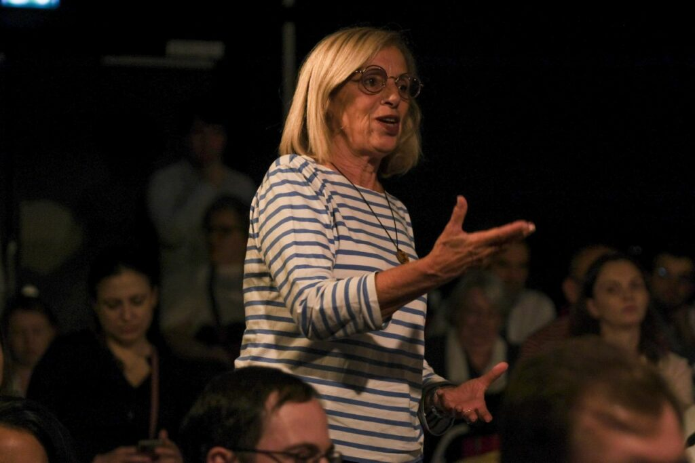

- 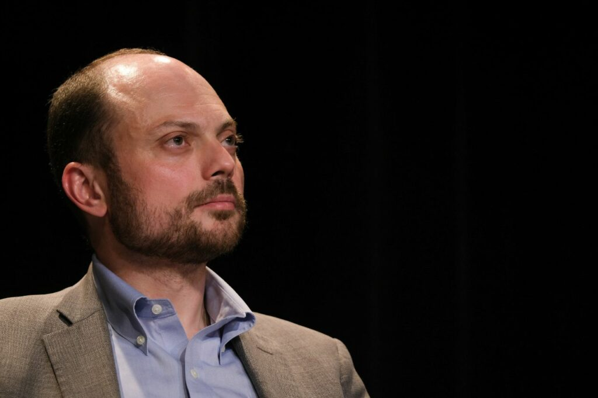

- 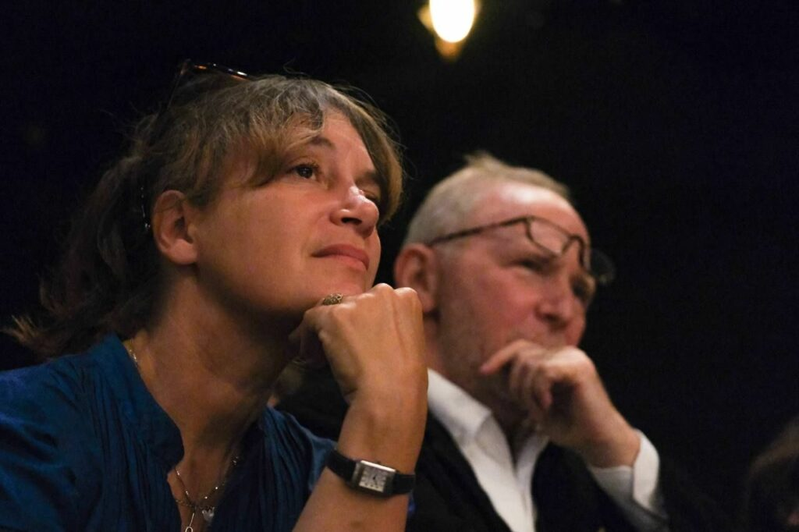

---

---
- 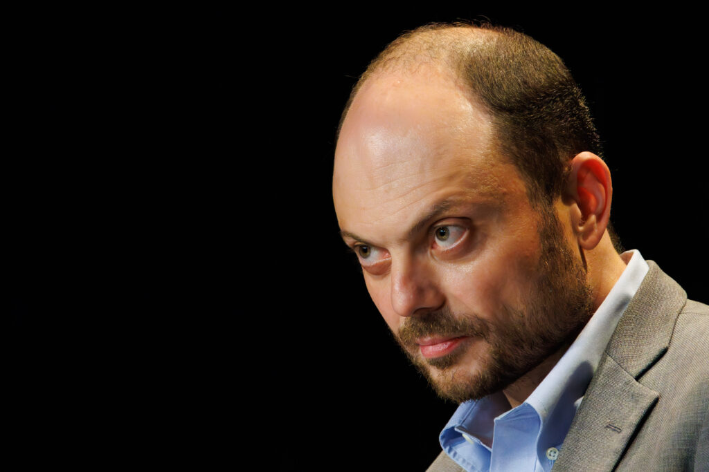

- 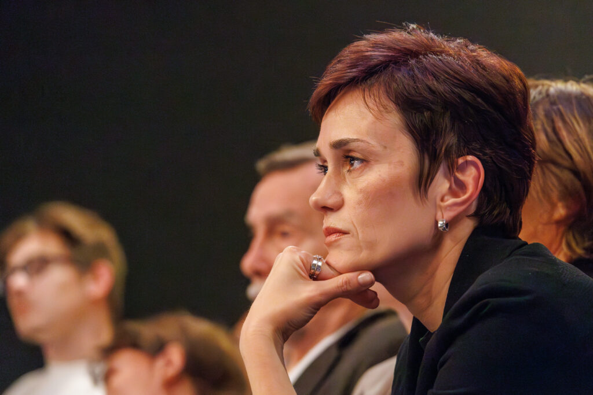

- 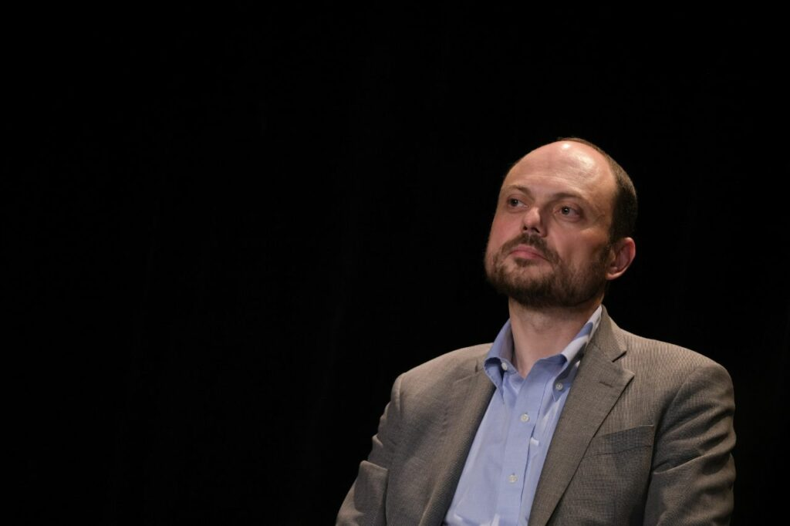

---

---
- 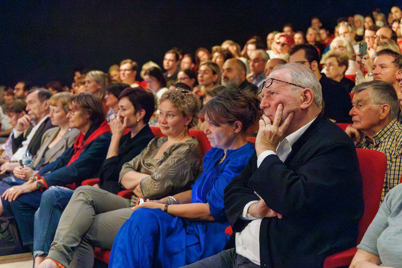

- 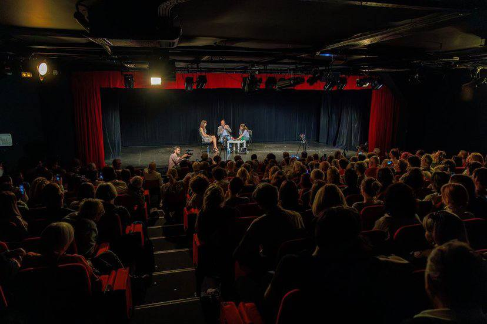

---

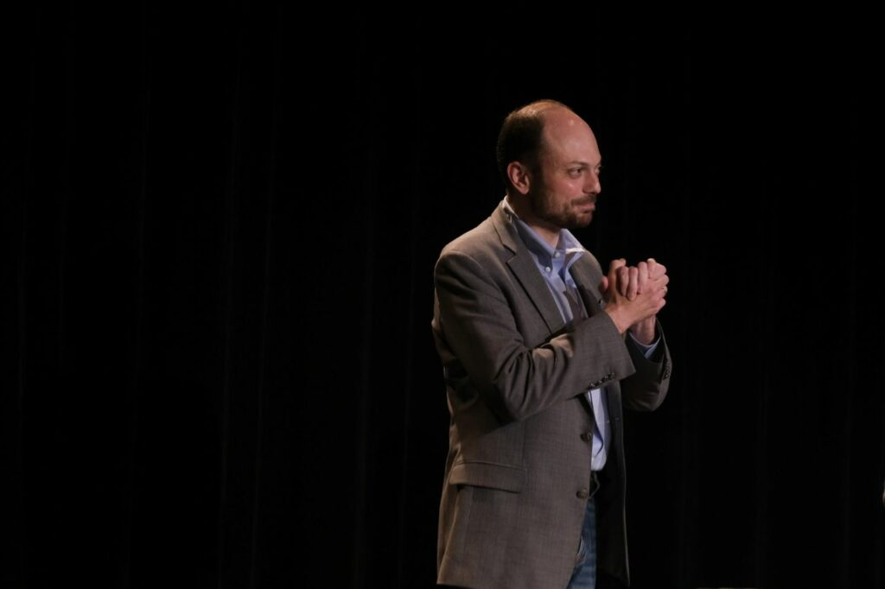
