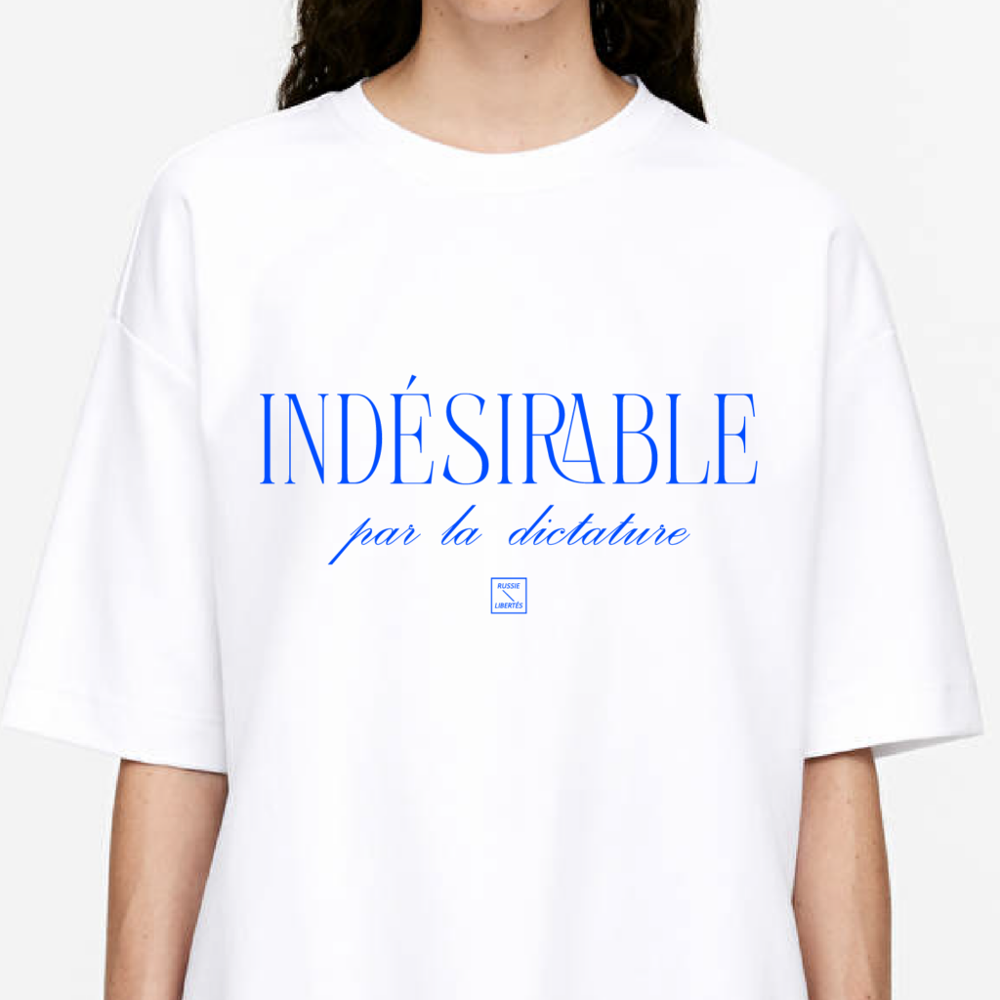
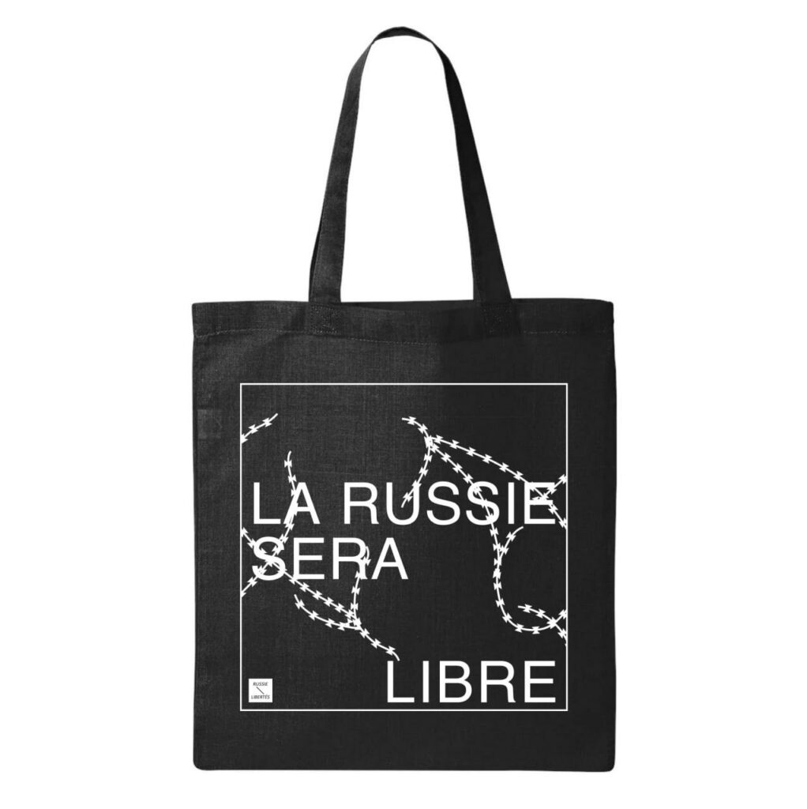
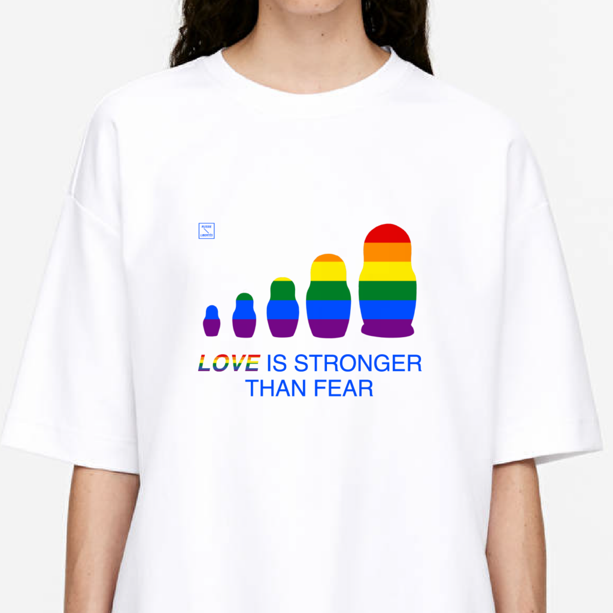
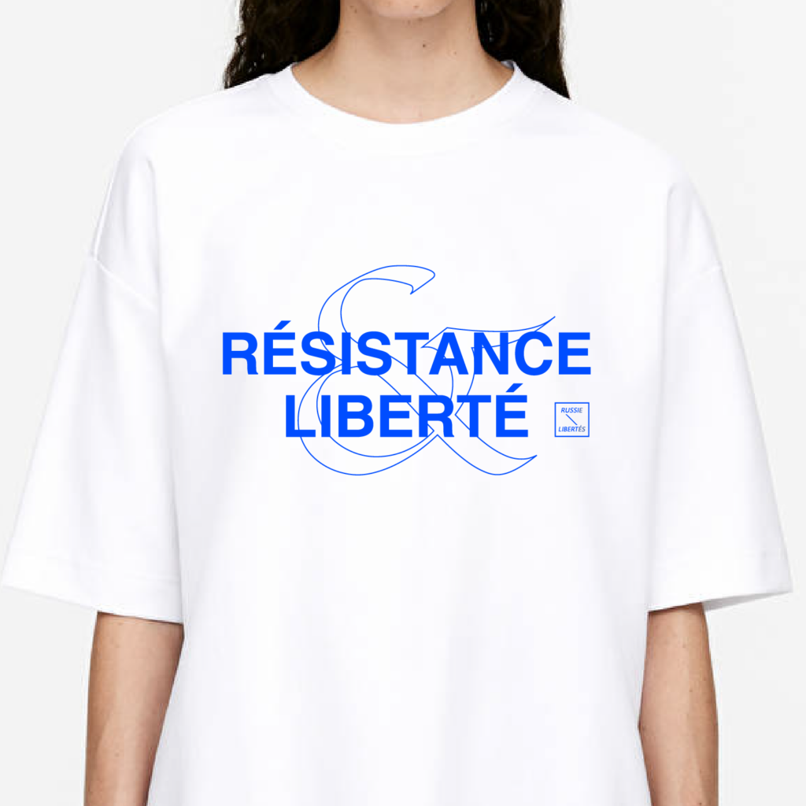

Nous avons le plaisir de vous inviter au Forum annuel de Russie-Libertés, qui se tiendra les 19 et 20 octobre à Paris.

Le Forum de notre association vise à attirer l'attention du public français et européen sur la nécessité de prendre des mesures supplémentaires pour soutenir la société civile russe et lutter contre la guerre d’invasion menée par le Kremlin en Ukraine. Le programme du forum comprend des discussions sur la situation des droits humains en Russie, de la résistance anti-guerre et démocratique, ainsi que sur le danger du poutinisme pour le monde entier.

Les participants au forum pourront également assister à un programme culturel dédié à l'art et aux projets anti-guerre.

Le forum se tient avec le soutien de la __Mairie de Paris__ , de __l' [Institut Français](https://www.institutfrancais.com/fr)__ , d' __[Amnesty International France](https://www.amnesty.fr/) et de [Free Russia Foundation](https://www.4freerussia.org/)__ , et en partenariat avec __[Mémorial France](https://memorial-france.org/) , l’ [Institut Sakharov](https://www.sakharov.fr/) , [Reporters Sans Frontières](https://rsf.org/fr) , Espace Libertés / Reforum Space Paris, la [Plateforme des initiatives citoyennes et anti-guerre](https://platforma.international/) , [Rusos Libres Espana](https://rusoslibres.eu/) , Voice of Free Russia et [Free Russians Global](https://freerussians.global/eng) .__

Lieu : Mairie de Paris Centre, 2 rue Eugène Spuller, 75003, Paris

Les conférences se tiendront en langues russe et française.

---
- [S'inscrire au Forum](https://my.weezevent.com/forum-russie-libertes-2024)
---

**PROGRAMME**

**Jour 1 - 19/10/2023**

---

 
 
13h-15h 

 

 
 
 
### COMPLET ! Table ronde 1 : La société civile et l'opposition russe - 2,5 ans depuis le début de la guerre   

 
**Mots d’ouverture** : 

 **Russie-Libertés et collectif international russe** 

 **Natalia Pouzyreff** , députée à l’Assemblée Nationale 

 

 Discussion avec des représentants de la société civile et de l'opposition russe. Comment 

 continuent-ils leur travail, y compris en Russie, quels projets réalisent-ils et comment résistent- 

 ils au régime, à la propagande et travaillent avec la société. Comment voient-ils l'avenir de leurs 

 mouvements et les perspectives de démocratisation de la Russie. 

 

 Intervenants : **Anastasia Bourakova** , fondatrice de l’ONG Kovcheg, **Maxime Reznik** , ancien député de l'assemblée législative de Saint-Pétersbourg, membre du Comité anti-guerre de Russie, **Lev Ponomarev** , dissident et défenseur des droits humains, **Lana Pylaeva** , militante de la région de Komi, **Dimitri Nizovtsev** , journaliste à la chaîne Youtube Politique Populaire 

 

 Modération : **Elena Volochine,** reporter, réalisatrice et auteure de __Propagande. L’arme de guerre de Vladimir Poutine__
 
15h30-16h 

 

 
 
 
### COMPLET ! Discours

 
**Ilia Iachine** , opposant, ancien prisonnier politique  et citoyen d'honneur de la ville de Paris 
 

 
16h30-18h 

 

 
 
 
### Discussion : **Save children from putinism**

 
Les crimes du régime contre les enfants ukrainiens déportés et l'impact du poutinisme sur les 

 générations futures de la Russie. L'endoctrinement et la militarisation des enfants. 

 

 Intervenants : **Oleg Kozlovski** , spécialiste de la Russie à Amnesty International, **Emmanuel Daoud** , avocat pénaliste traitant le dossier des enfants ukrainiens déportés auprès de la CPI, **Aleksandra Arkhipova** , anthropologue sociale, **Vera Yastrebova** , militante ukrainienne pour les droits humains, avocate, conseillère auprès de la commission parlementaire de la Verkhovna Rada d'Ukraine 

 

 Modération : **Zalina Steve** , secrétaire générale de Russie-Libertés
 
18h-19h 

 

 
 
 
### Discussion : Les personnes LGBTQ+ victimes du régime russe

 
Comment la communauté LGBTQI+ est persécutée et comment la soutenir ? 

 

 Intervenants : **Evi Chaïka** , fondatrice d’EQUAL PostOst, **Ian Dvorkin** e, fondateur de l’ONG Center T, **Jean-Marc Berthon** , ambassadeur pour les Droits des personnes LGBTQ+ auprès du Ministère de l’Europe et des Affaires Étrangères 

 

 Modération : **Sébastien Tüller** , journaliste, Responsable LGBTI+ pour Amnesty International France
 
19h30-20h 

 

 
 
 
### Projection d'un projet documentaire

 
Présentation du projet audiovisuel féministe et anti-guerre __Et Dieu… créa la Femme en résistance__ par **Margarita Rybina**

---

**Jour 2 - 20/10/2023**

---

 
 
12h00-18h00 

 

 Salle des mariages
 
 
 
### Projection de plusieurs vidéos

 
Vidéos réalisées au sein du projet **« L’Adieu aux armes »** créé par des déserteurs russes et vidéo du projet " **Save children from putinism** " de Free Russians Global
 
13h30-15h 

 

 

 
 
 
### Table ronde 2 : L'ingérence du régime russe en Europe et la montée des forces d'extrême droite

 
Désinformation, ingérence politique de la Russie, son intérêt dans la montée des forces d'extrême droite en France et son soutien à certains partis français et européens. 

 

 Intervenants : **Rudy Reichstadt** , politologue, écrivain, fondateur et directeur du site 

 Conspiracy Watch, expert associé à la Fondation Jean-Jaurès, **Tristan Mendès France** , essayiste, 

 chroniqueur, réalisateur français, observateur de l'extrême, **Antoine Bernard** , directeur de 

 plaidoyer de Reporters Sans Frontières, **David Chavalarias** , directeur de recherche au CNRS et au Centre d'analyse 

 et de mathématique sociales de l’EHESS, **Constance Le Grip** , députée à l'Assemblée nationale, rapporteur de la commission d'enquête sur les interventions extérieures 

 

 Modération : **Cécile Vaissié** , professeure des universités en études russes et soviétiques
 
15h15-17h00 

 

 

 
 
 
### Table ronde 3 : Convergence des luttes contre les régimes violant les droits humains

 
La nécessité d'une coopération entre les sociétés civiles de différents pays face aux dictatures et aux régimes autoritaires. Diversité et convergence des formes de résistance des défenseurs des droits humains et militants en Russie, en Ukraine, en Iran, en Chine et en Bélarus. L'activisme féministe pour la paix et les droits humains. Les moyens de renforcer le soutien mutuel pour atteindre des objectifs communs. 

 

 Intervenants : **Anastasiya Bulybenka,** militante bélarusse et ancienne prisonnière politique, **Dilnur Reyhan** , militante Ouïghour, **Chirinne Ardakani** , avocate d’origine iranienne, **Sergey Lagodinsky** , député européen 

 

 Modération : **Sasha Koulaeva** , défenseure des droits humains et enseignante à Sciences Po
 
17h-17h45 

 

 
 
 
### Lecture théâtralisée

 
Lecture d’un extrait de « Russie, mon pays bien-aimé », d’Elena Kostioutchenko par **Julia Loboda**
 
17h45-18h00 

 
 
 
### Discours de clôture

 
**Isabelle Rome** , Ambassadrice pour les droits de l’Homme auprès du Ministère de l’Europe et des Affaires Étrangères

---

---
- [S'inscrire au Forum](https://my.weezevent.com/forum-russie-libertes-2024)
---

Dans le cadre du Forum Russie-Libertés, nous lançons une collecte de dons __Save children from putinism__ . Cette initiative vise à soutenir des projets pour protéger les enfants victimes du régime de Poutine.

Les bénéfices de la vente de nos T-shirts et sacs iront au profit de la collecte !

---
- 

- 

- 

- 

---

## Официальное коммюнике по поводу обеспечения безопасности участников Форума / Communiqué officiel sur la sécurité des participants du forum

 | **Организаторы форума "la Russie contre la guerre en Ukraine en 2024" обеспокоены возможными угрозами, включая отравление, участников мероприятия. Эта проблема стала актуальной после заявлений ряда активистов, подтвержденных независимыми журналистскими расследованиями за последние месяцы, о попытках их отправления, в том** **числе совершенных в ходе международных конференций, как наш форум.** | **Les organisateurs du forum "la Russie contre la guerre en Ukraine en 2024" sont préoccupés par les possibles menaces, y compris l'empoisonnement, des participants à l'événement. Ce problème est devenu pertinent après les déclarations de certains activistes, confirmées par des enquêtes journalistiques indépendantes au cours des derniers mois, concernant leurs tentatives de départ, y compris lors de conférences internationales, comme notre forum.** | **Организаторы принимают все необходимые меры для обеспечения безопасности участников мероприятия. Мы призываем всех участников следовать правилам безопасности, которые будут представлены в документе "Памятка участникам и спикерам", и сотрудничать с нами, чтобы сделать риск чрезвычайно малым.** | **Les organisateurs prennent toutes les mesures nécessaires pour assurer la sécurité des participants à l'événement. Nous appelons tous les participants à suivre les règles de sécurité qui seront présentées dans le document "Mémo aux participants et aux intervenants", et à collaborer avec nous pour minimiser les risques.** | 
 | ---- | ---- | ---- | ---- | 
 | **Организаторы форума "la Russie contre la guerre en Ukraine en 2024" обеспокоены возможными угрозами, включая отравление, участников мероприятия. Эта проблема стала актуальной после заявлений ряда активистов, подтвержденных независимыми журналистскими расследованиями за последние месяцы, о попытках их отправления, в том** **числе совершенных в ходе международных конференций, как наш форум.** | **Les organisateurs du forum "la Russie contre la guerre en Ukraine en 2024" sont préoccupés par les possibles menaces, y compris l'empoisonnement, des participants à l'événement. Ce problème est devenu pertinent après les déclarations de certains activistes, confirmées par des enquêtes journalistiques indépendantes au cours des derniers mois, concernant leurs tentatives de départ, y compris lors de conférences internationales, comme notre forum.** | **Организаторы принимают все необходимые меры для обеспечения безопасности участников мероприятия. Мы призываем всех участников следовать правилам безопасности, которые будут представлены в документе "Памятка участникам и спикерам", и сотрудничать с нами, чтобы сделать риск чрезвычайно малым.** | **Les organisateurs prennent toutes les mesures nécessaires pour assurer la sécurité des participants à l'événement. Nous appelons tous les participants à suivre les règles de sécurité qui seront présentées dans le document "Mémo aux participants et aux intervenants", et à collaborer avec nous pour minimiser les risques.** | 

