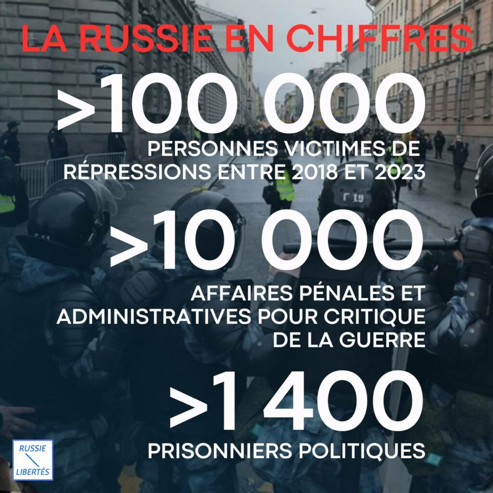
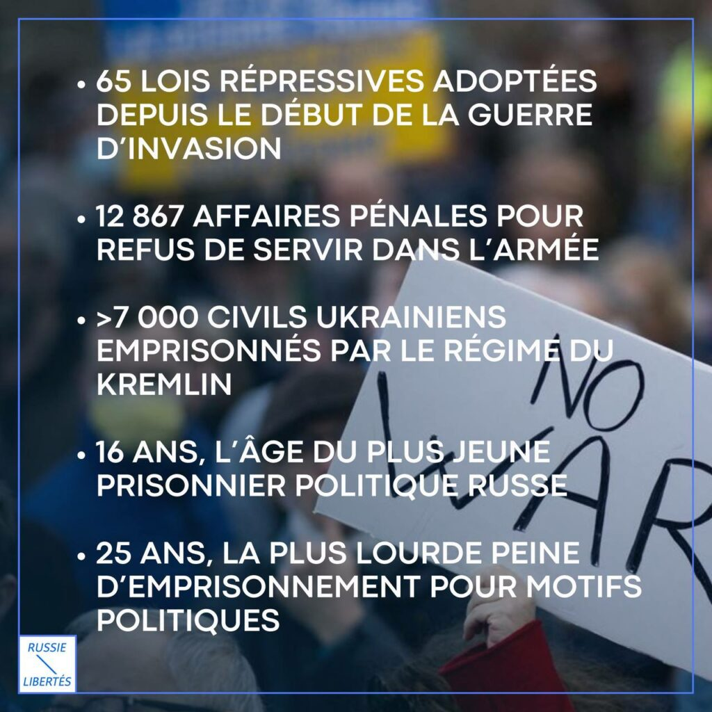
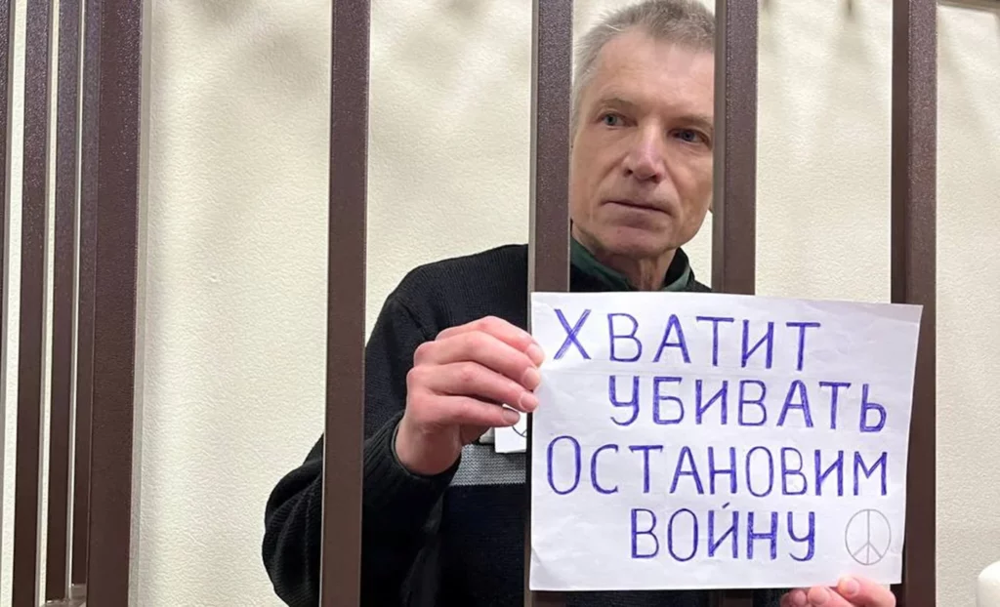
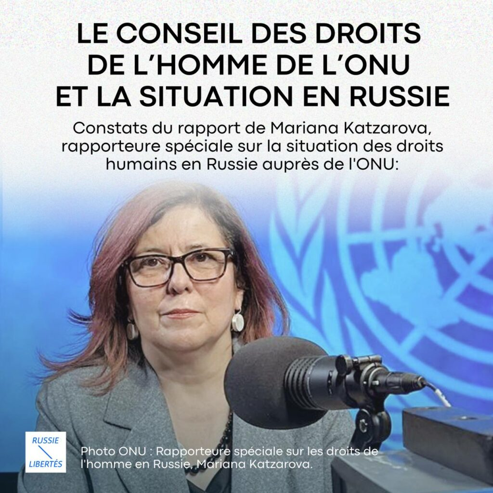

La Russie est devenue une dictature de guerre. Les répressions ont atteint un tel niveau qu'exprimer son opposition au régime, même de manière minime, est devenu un acte de résistance. Chaque mot, chaque geste peut vous mener directement en prison pour de longues années.

Qu’il s’agisse d’un piquet solitaire, d’un graffiti, d’une affiche ou d’une action de soutien juridique aux prisonniers politiques, aux civils ukrainiens emprisonnés, ou aux déserteurs russes, tout est minutieusement surveillé par la machine répressive du Kremlin. Pour la Journée internationale des droits de l’Homme, on a recueilli des données récentes sur les répressions du régime de Poutine. 

 

 Le média Proekt estime que 116 000 personnes ont été victimes de répressions en Russie entre 2018 et 2023.

Selon OVD-Info, la Russie compte aujourd’hui 1 407 prisonniers politiques. Derrière les barreaux, ces prisonniers subissent des traitements particulièrement durs, inhumains, dégradants et humiliants. Privés d’accès aux soins médicaux et souvent maintenus en isolement total, ils continuent pourtant, malgré ces conditions insoutenables, à élever la voix contre la guerre et le régime.

Parmi eux se trouve Alexeï Gorinov, qui a courageusement dénoncé la guerre d'invasion menée par la Russie en Ukraine. Déjà condamné en 2022 à 7 ans de prison pour « diffusion de fausses informations sur la guerre », il a récemment été condamné à 3 années supplémentaires pour « apologie du terrorisme », en raison de conversations tenues avec des codétenus à l’hôpital de la prison.

Voici ses mots, prononcés lors de sa dernière déclaration devant le tribunal militaire de Moscou, le 29 novembre 2024 :

« Ma culpabilité réside dans le fait qu’en tant que citoyen de mon pays, j’ai permis cette guerre, je n’ai pas réussi à l’arrêter. Et je demande à ce que cela soit pris en compte dans le verdict. Mais je voudrais que ma culpabilité et ma responsabilité soient également partagées avec les organisateurs, les participants, les partisans de la guerre, ainsi qu’avec ceux qui persécutent ceux qui prônent la paix.

Je continue de vivre avec l’espoir qu’un jour cela se réalisera. En attendant, je demande pardon au peuple ukrainien et à mes concitoyens qui ont souffert à cause de la guerre ».

### **Le Conseil des droits de l’Homme de l’ONU et la situation en Russie**

En octobre dernier, lors du Conseil des droits de l’Homme de l’ONU, la Rapporteure spéciale sur la situation des droits humains en Russie, Mariana Katzarova, a présenté un rapport accablant sur l’état des droits de l’Homme dans la Fédération de Russie.

Nous en publions les principaux constats :

* **Une accélération de la répression** : La dégradation des droits humains en Russie, déjà en cours depuis 20 ans, s’est aggravée de manière dramatique depuis le début de la guerre contre l’Ukraine. Toute forme d’action civique ou d’opposition politique est désormais quasiment impossible.
* **Législations répressives** : Des lois condamnant toute critique de la guerre, comme la soi-disant « discréditation de l’armée », et des catégories floues telles que « agents de l’étranger », « organisations indésirables » ou « éléments terroristes » sont utilisées pour poursuivre des milliers de personnes. Ces lois reposent sur des définitions vagues et des interprétations arbitraires, aboutissant à des procès à huis clos et à des peines sévères.
* **Prisonniers utilisés comme monnaie d’échange** : La libération ponctuelle de certains prisonniers, bien que bienvenue, révèle une méthode cynique des autorités : fabriquer des accusations pour prendre des otages en vue d’organiser des échanges.
* **Un système de répression organisé** : La violation des droits humains est désormais institutionnalisée, soutenue par des lois servant à éliminer la société civile, réduire au silence les voix dissidentes et annihiler l’opposition politique.
* **Un climat d’impunité** : L’absence d’institutions indépendantes et l’impunité des auteurs de répressions renforcent un État de non-droit.
* **Criminalisation des opinions dissidentes** : Les critiques de la guerre et les positions divergentes sont systématiquement réprimées par des arrestations arbitraires, des violences et des détentions abusives. Des milliers d’Ukrainiens, civils et militaires, sont également détenus en Russie dans des conditions souvent inhumaines.
* **Persécutions massives** : Les défenseurs des droits humains, journalistes et figures politiques sont la cible d’arrestations massives, avec des conditions de détention aggravées, des cas de torture, des isolements prolongés et même des décès en détention.
* **Une stratégie de contrôle total** : La rapporteure souligne que ces violations font partie d’une stratégie délibérée visant à contrôler tous les aspects de la vie publique et privée et à étouffer toute critique de la politique agressive du Kremlin, y compris ses guerres.
* **Poutine au pouvoir jusqu’en 2030** : La modification constitutionnelle de 2020, permettant à Vladimir Poutine de briguer un cinquième mandat, ainsi que la censure des médias, les arrestations d’opposants et les restrictions des libertés civiles, ont consolidé son régime jusqu’en 2030, voire au-delà.
* **Vulnérabilité accrue des minorités** : Les discriminations fondées sur le genre, l’orientation sexuelle, la religion ou l’origine ethnique sont en hausse. La situation est particulièrement grave dans le Caucase du Nord, où les minorités subissent une répression accrue.
* **Attaques contre les défenseurs des droits humains** : Les avocats spécialisés en droits humains font face à des pressions, des poursuites judiciaires et des menaces croissantes.
* **Silence sur la mort d’Alexeï Navalny** : L’absence d’enquête indépendante sur la mort en prison d’Alexeï Navalny, arrêté arbitrairement et soumis à des conditions équivalant à de la torture, est particulièrement préoccupante.
* **Escalade en Ukraine** : La guerre s’intensifie, notamment avec les « opérations anti-terroristes » déclarées en août dernier après une incursion ukrainienne dans la région de Koursk. Ces opérations donnent des pouvoirs excessifs aux forces de sécurité, rappelant les abus commis lors des guerres en Tchétchénie.

### **Recommandations du rapport**

Face à ces constats, la rapporteure appelle :

1.**Les autorités russes** à :    * Coopérer avec les instances de l’ONU et engager des réformes fondamentales.   * Mettre fin aux poursuites abusives et libérer tous les prisonniers politiques, notamment Alexeï Gorinov, Igor Baryshnikov, Evgenia Berkovich et bien d’autres.   * Abroger les lois répressives, telles que celles sur les « agents de l’étranger » et les « organisations indésirables », ainsi que les restrictions sur Internet.   * Réviser les législations sur le contre-terrorisme et l’extrémisme pour éliminer les abus.   * Garantir les droits et la sécurité des objecteurs de conscience, des femmes, des minorités ethniques, et des personnes LGBTQ+, tout en luttant contre les crimes de haine et les discours xénophobes.
1.**La communauté internationale** à :    * Soutenir les recommandations du rapport.   * Adopter des mesures concrètes pour protéger les dissidents russes et les défenseurs des droits humains, notamment par des dispositifs d’asile et de protection renforcés.

### **Un rapport sans la coopération de la Russie**

Enfin, il est important de noter que ce rapport a été élaboré sans aucune collaboration de la Russie, en violation de ses engagements internationaux.

**Sources :**

[https://reliefweb.int/report/russian-federation/situation-human-rights-russian-federation-report-special-rapporteur-situation-human-rights-russian-federation-ahrc5759-advance-edited-versionunofficial-russian-version-enru](https://reliefweb.int/report/russian-federation/situation-human-rights-russian-federation-report-special-rapporteur-situation-human-rights-russian-federation-ahrc5759-advance-edited-versionunofficial-russian-version-enru)

[https://www.proekt.media/guide/repressii-v-rossii/](https://www.proekt.media/guide/repressii-v-rossii/) 

 [https://zona.media/article/2024/11/19/war](https://zona.media/article/2024/11/19/war) 

 [https://antiwar.ovd.info](https://antiwar.ovd.info/) 

 [https://ovd.info/politpressing](https://ovd.info/politpressing) 

 [https://dept.one/story/samye-yunye-politzaklyuchennye/](https://dept.one/story/samye-yunye-politzaklyuchennye/)
