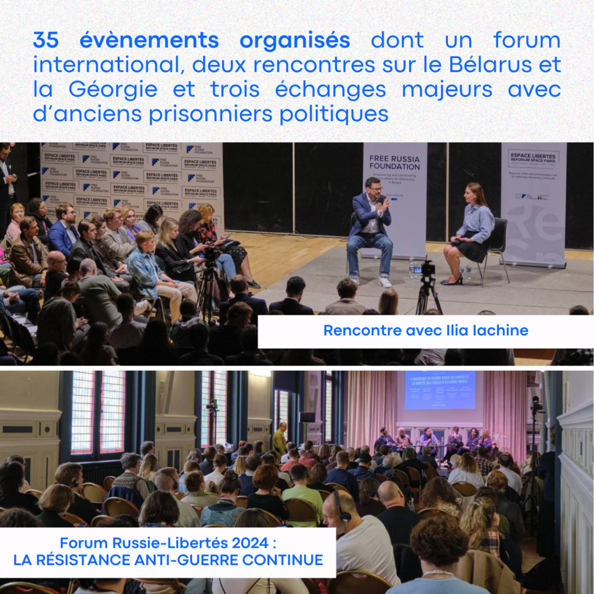
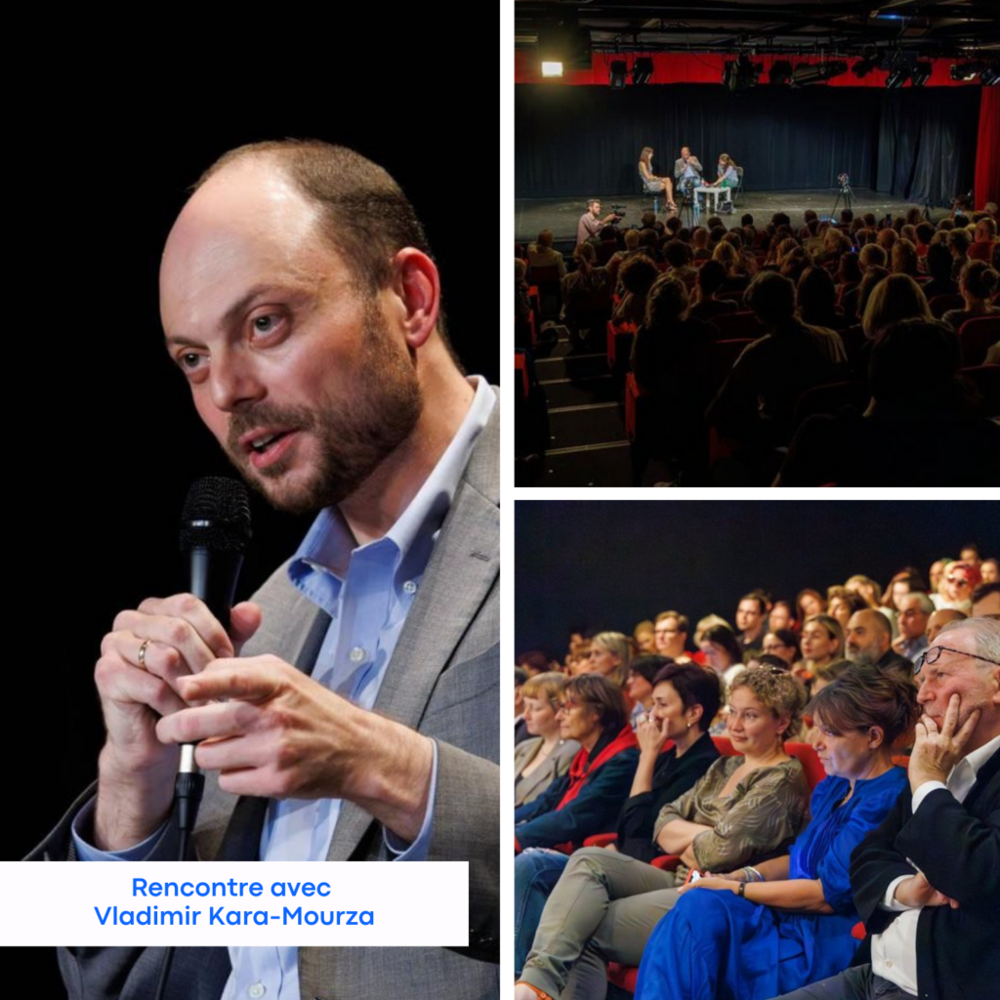
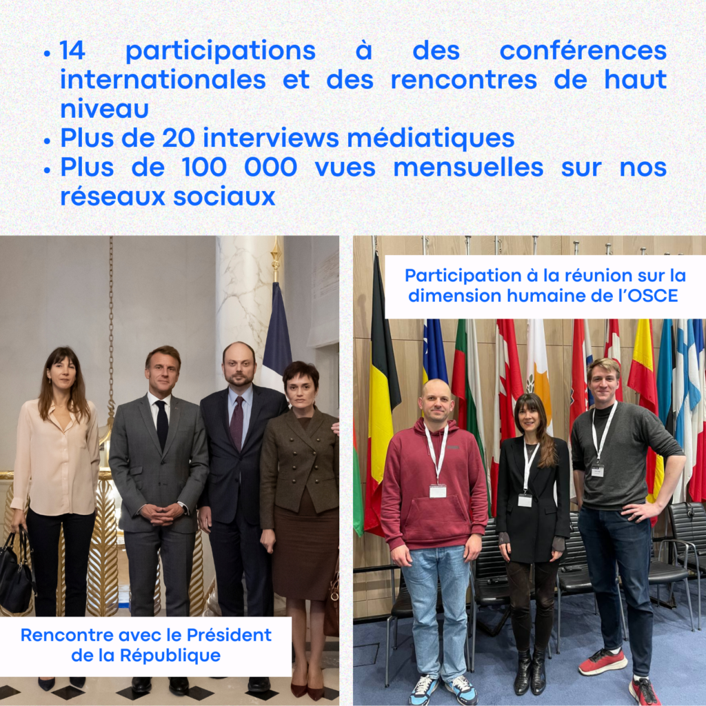
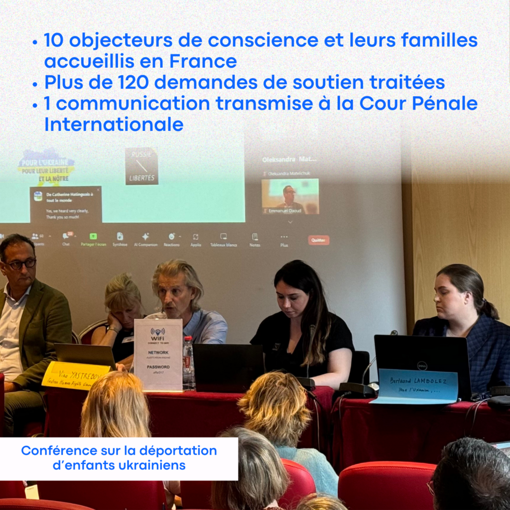
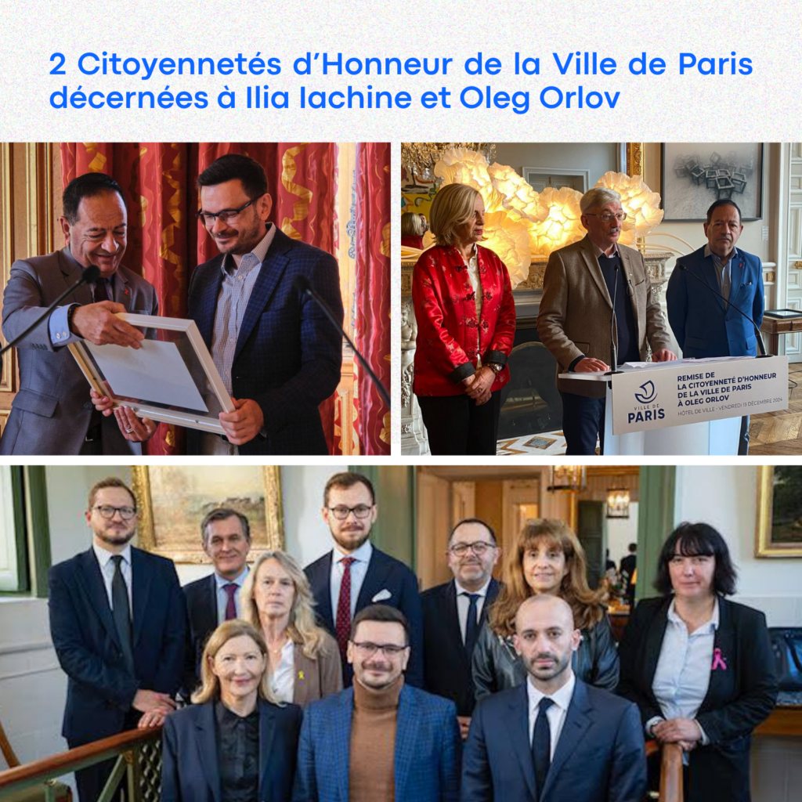
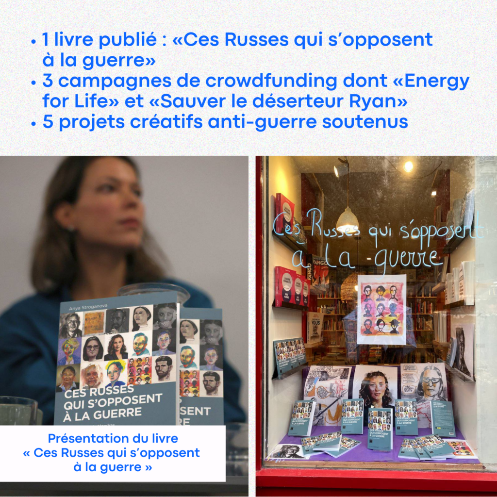
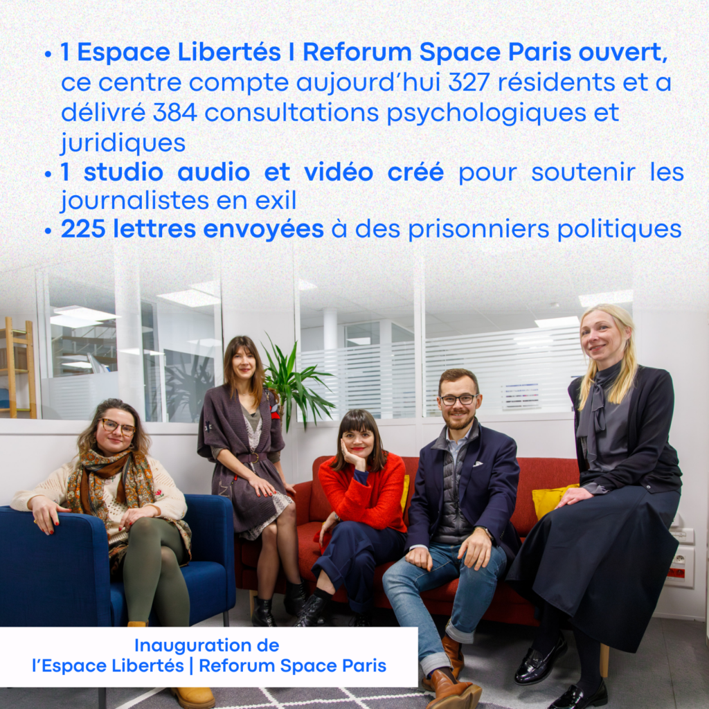
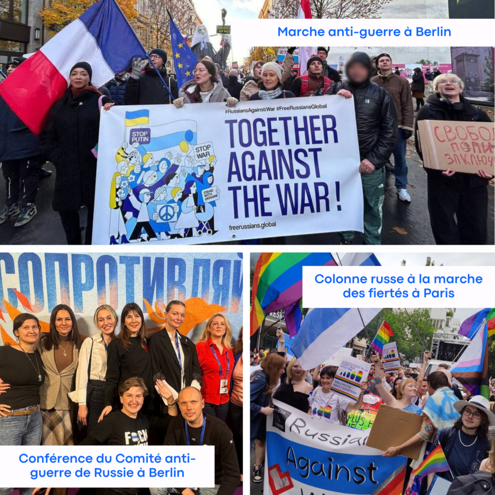
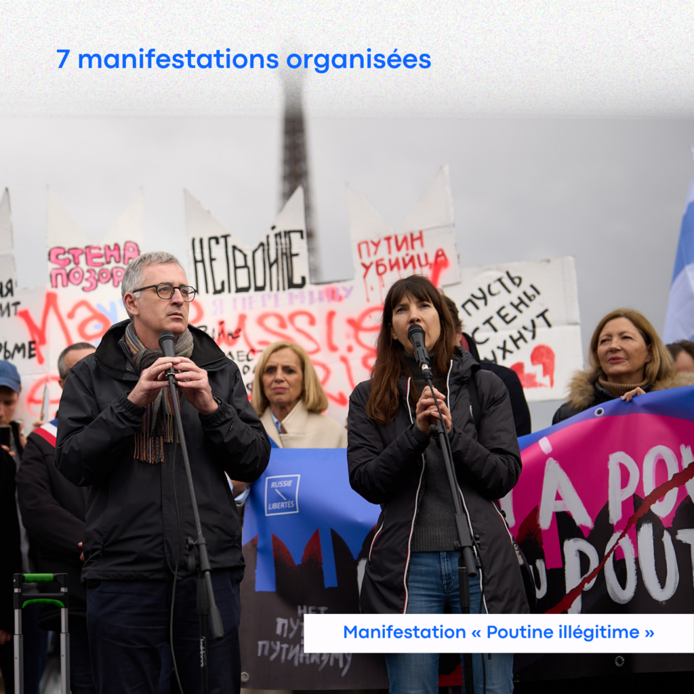
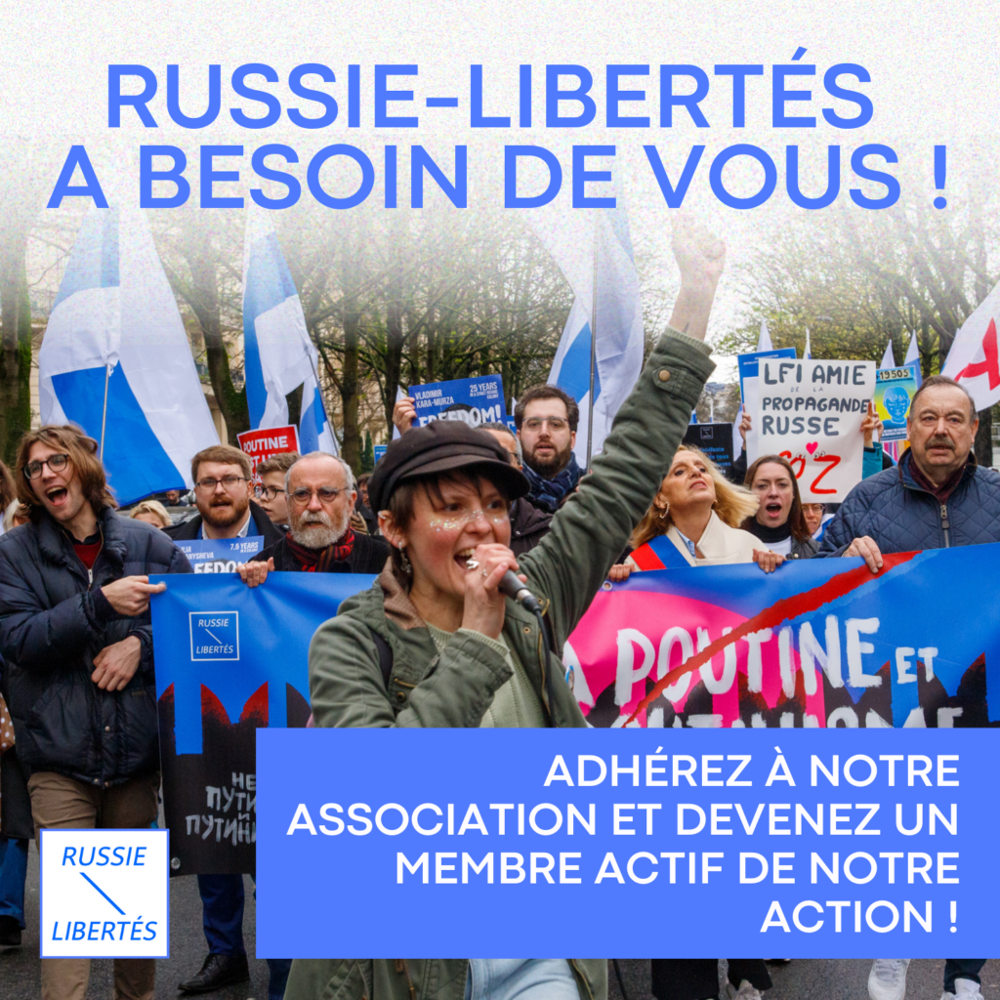

**Chers amis,**

En ce début d’année, nous souhaitons exprimer notre profonde gratitude pour votre soutien indéfectible. Grâce à vous, 2024 a été une année marquée par des défis relevés avec courage et des espoirs renouvelés pour la société civile russe et la défense des droits humains, en Russie et au-delà.

---
- 

- 

- 

---

### **Nos accomplissements en 2024**

Ensemble, nous avons réalisé des avancées significatives. Voici quelques chiffres qui témoignent de notre impact :

* **35 événements organisés** , dont un forum international, deux rencontres sur le Bélarus et la Géorgie, et trois échanges majeurs avec d’anciens prisonniers politiques (Vladimir Kara-Mourza, Ilia Iachine, Aleksandra Skotchilenko).
* **2 Citoyennetés d’Honneur** de la Ville de Paris décernées à Ilia Iachine et Oleg Orlov.
* **Plus de 20 interviews médiatiques** pour sensibiliser l’opinion publique en France et à l’international.
* **14 participations à des conférences internationales et des rencontres de haut niveau** .
* **Plus de 100 000 vues mensuelles** sur nos réseaux sociaux, amplifiant la voix de la résistance russe.
* **1 livre publié** : __Ces Russes qui s’opposent à la guerre__ .
* **1 Espace Libertés I Reforum Space Paris ouvert** , en collaboration avec Free Russia Foundation, qui compte aujourd’hui 327 résidents et a délivré 384 consultations psychologiques et juridiques.
* **1 studio audio et vidéo créé** avec Reporters Sans Frontières pour soutenir les journalistes en exil.
* **225 lettres envoyées** à des prisonniers politiques, témoignant de notre solidarité.
* **3 campagnes de crowdfunding** , dont « Energy for Life » pour financer des générateurs électriques destinés aux écoles et hôpitaux en Ukraine.
* **5 projets créatifs anti-guerre soutenus** .
* **7 manifestations organisées** , dont une grande marche contre les « non-élections » russes et une manifestation internationale en soutien aux prisonniers politiques, rassemblant 40 villes à travers le monde.
* **10 objecteurs de conscience et leurs familles accueillis en sécurité en France** .
* **Plus de** **120 demandes de soutien traitées** (en partenariat avec l’Institut Sakharov) pour des visas humanitaires et des titres de séjour.
* **1 communication transmise à la Cour Pénale Internationale** , demandant 35 mandats d’arrêt pour la déportation illégale d’enfants ukrainiens vers la Russie.

---
- 

- 

- 

---

### **Nos objectifs pour 2025**

L’année à venir sera cruciale pour Russie-Libertés. Face aux défis croissants, notre engagement reste inébranlable. Nos priorités incluent :

1.Poursuivre notre soutien à l’Ukraine et aux victimes de la guerre.
1.Élargir les services de l’Espace Libertés I Reforum Space Paris, en renforçant l’accompagnement juridique et psychologique.
1.Organiser des événements ambitieux, incluant débats, formations, expositions, et un grand forum en fin d’année.
1.Intensifier les collaborations internationales pour soutenir les initiatives de solidarité notamment en soutien aux prisonniers politiques.
1.Fournir des outils et ressources aux journalistes et membres de la société civile russe en exil.
1.Développer des campagnes de sensibilisation pour donner une voix plus forte à la société civile russe.

---
- 

- 

- 

---

### **Rejoignez-nous et agissez !**

En 2025, chaque geste compte. Ensemble, nous pouvons aller encore plus loin. Si vous souhaitez contribuer activement à notre mission, rejoignez notre équipe et devenez une voix de la liberté et de la résistance.

Nous recherchons des bénévoles pour les rôles suivants :

* Coordinateur des membres de l’association.
* Coordinateur des bénévoles.
* Manager de projets.
* Traducteurs et rédacteurs.
* Spécialistes des réseaux sociaux (SMM).

**Écrivez-nous à :** contact@russie-libertes.org 

 Devenez une force du changement et portez, avec nous, l’espoir d’un avenir meilleur.

Avec toute notre gratitude et notre détermination, 

 **L’équipe de Russie-Libertés**
