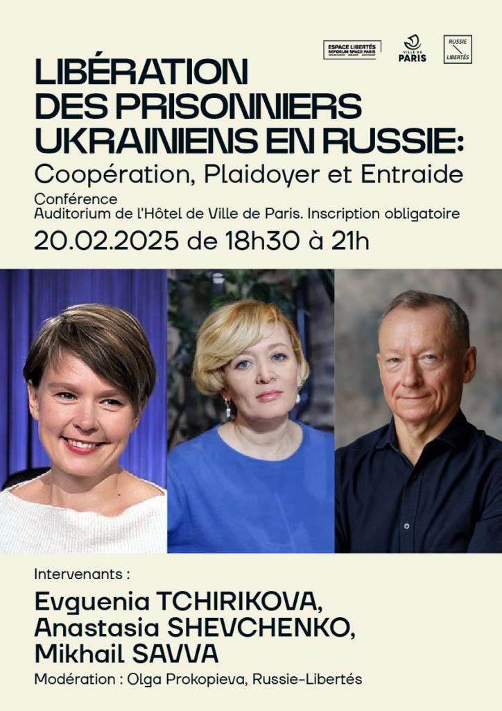

20 février 2025 Exposition / Projection / Rencontre 

 "Libération des prisonniers ukrainiens en Russie: coopération, plaidoyer et entraide."

Il y a trois ans, le monde entier a été bouleversé par l'invasion à grande échelle de l'Ukraine lancée par Vladimir Poutine. Cette guerre a déjà coûté la vie à des centaines de milliers de personnes et continue de dévaster l'Ukraine chaque jour. 

 **Des milliers de civils ukrainiens sont portés disparus** , en particulier dans les territoires occupés où règne une atmosphère de terreur. De plus, **le régime de Poutine détient des milliers de militaires ukrainiens dans des conditions de torture** , en violation totale du droit international.

**Les défenseurs des droits humains russes et ukrainiens travaillent ensemble pour les sauver.** Un appel commun **People First!** a notamment été lancé par le Center for Civil Liberties et le Memorial Human Rights Defense Center qui vise à anticiper les futures négociations de paix concernant la guerre de la Russie contre l'Ukraine et appelle à prioriser la libération inconditionnelle de tous les civils ukrainiens détenus par l'État russe, de tous les prisonniers de guerre détenus par les deux camps, de tous les prisonniers politiques russes emprisonnés pour avoir manifesté contre la guerre, et le retour des enfants ukrainiens transférés de force en Russie.

**Nous vous convions à un événement autour du sujet des prisonniers ukrainiens et de la coopération internationale pour leur libération.**

---
- [**INSCRIPTION**](https://www.helloasso.com/associations/russie-libertes/evenements/liberation-des-prisonniers-ukrainiens-en-russie-cooperation-plaidoyer-entraide)
---

**Programme de l'événement** 

 

 - 17h ouverture de l'exposition photos consacrée aux prisonniers de guerre ukrainiens 

 - 18h30 projection du documentaire "Les prisonniers" - reportage sur les prisonniers civils ukrainiens 

 - 19h conférence avec la participation de **Evguenia Tchirikova** , coordinatrice de projets médias d' "Activatica" ; **Anastasia Shevchenko** , directrice de la fondation caritative « À travers le mur » et **Mikhail Savva** , expert du "Centre pour les Libertés Civiles" (organisation ukrainienne lauréat du Prix Nobel de la paix 2022), par Zoom. Ainsi que le témoignage de **Stas Doutov** , militaire ukrainien du régiment Azov, ancien prisonnier de guerre, libéré lors d'un échange en octobre 2024.

**__Evguenia Chirikova__** est une militante écologiste et politique russe. Elle était une des leaders dans la défense des droits civiques et de la démocratie en Russie. Depuis, le début de l'invasion, Evguenia soutient l'Ukraine et oeuvre pour la libération des ukrainiens arbitrairement détenus en Russie. Elle a produit le documentaire "Les prisonniers". 

 

 **__Anastasia Shevchenko__** est une militante russe et ancienne prisonnière d'opinion, connue pour son engagement au sein du mouvement politique d'opposition "Russie ouverte". Dès les premiers jours de l'invasion massive de l'Ukraine, Anastasia s'engage auprès d'autres leaders de l'opposition russe au sein du Comité Anti-guerre de Russie. Très impliquée dans le soutien aux prisonniers de guerre ukrainiens, elle fonde en 2025 la fondation "A travers le mur". 

 

 **__Mikhail Savva__** est un expert en analyse des motivations politiques derrière les poursuites judiciaires et en évaluation de projets sociaux. Il est docteur en sciences politiques, professeur, et a été prisonnier politique en Russie avant de s'exiler en Ukraine en 2015, où il a obtenu l'asile politique. Il est aujourd'hui expert du Centre pour les Libertés Civiles.

Modération : **__Olga Prokopieva__** , Russie-Libertés

Lieu : **Auditorium de l'Hôtel de Ville de Paris** 

 Date : **20 février 2025, à 17h00** 

 __Inscription obligatoire. Nombre de place limités. Une pièce d'identité vous sera demandée à l'entrée.__

---
- [**INSCRIPTION**](https://www.helloasso.com/associations/russie-libertes/evenements/liberation-des-prisonniers-ukrainiens-en-russie-cooperation-plaidoyer-entraide)
---
