16.02.2025

Il y a un an qu’Alexeï Navalny était cruellement assassiné par le régime poutinien dans la colonie pénitentiaire de Kharp, au nord du cercle Arctique. Plus qu'un leader de l'opposition russe, Alexeï Navalny incarnait l’espoir d’un avenir démocratique pour la Russie. Avec sa disparition, cet espoir s’est affaibli, mais son combat perdure, car nous le faisons vivre !

Navalny nous exhortait à ne jamais baisser les bras : « Je n’ai pas peur et vous n’ayez pas peur! Ensemble, nous sommes une force puissante ! » Il était le moteur pour des millions de Russes, qui suivaient ses enquêtes anti-corruption, dont il était le grand spécialiste, et qui descendaient par centaines de milliers dans les rues de Russie à son appel.

Même depuis la prison et les conditions inhumaines de détention dans lesquelles il se trouvait, il n’hésitait pas à critiquer Poutine, son régime dictatorial, les crimes de guerre et les sévices infligés au peuple ukrainien.

Le 16 février, plus d'une centaine de personnes se sont réunies devant le mémorial en hommage à Alexeï Navalny, organisé pour l'occasion place du Trocadéro à Paris. **Olga Mikhailova** , ancienne avocate d'Alexeï Navalny ; **Sergei Guriev** , économiste russe ; **Guennadiy Goudkov** , opposant ; **Serguei Parkhomenko** , journaliste en exil, et d'autres personnalités russes et françaises ont répondu à l'appel. Nous remercions particulièrement pour leur soutien les élus de Paris : **Geneviève Garrigos, François Szpiner, François Bechieau et Julie Boillot** , ainsi que la **ville de Paris** qui a désigné une allée du 16ème arrondissement qui sera prochainement nommée en l'honneur d'Alexeï Navalny.

Ce même jour, des actions en sa mémoire ont été organisées partout dans le monde, y compris en Russie, où, malgré les risques, des milliers de Russes sont venus se recueillir sur sa tombe ou ont organisé des mémoriaux sporadiques. Plusieurs dizaines de militants ont été arrêtés et placés en garde à vue en Russie, et les mémoriaux ont été immédiatement détruits par les autorités. À Moscou, rassemblés en masse, les gens ont scandé « La Russie sera libre ! » .

Rappelons qu’aujourd’hui en Russie, toute personne qui sort dans la rue pour s’opposer au régime est fichée, traquée et risque la prison. En 2024, près de 3 000 personnes ont fait l’objet de persécutions pour des raisons politiques. Parmi eux, les trois avocats d’Alexeï Navalny : **Vadim Kobzev, Alexeï Liptser et Igor Sergounine** , condamnés pour le simple exercice de leur profession à plusieurs années d'emprisonnement. De nombreuses personnes liées à la Fondation anti-corruption, fondée par Alexeï Navalny et désignée par le régime comme « organisation extrémiste », sont aujourd’hui poursuivies.

Nous exigeons la libération des avocats d’Alexeï Navalny et de tous les prisonniers politiques en Russie.

En Russie ou depuis l'exil, tant que nous existerons, nous porterons haut et fort ses revendications pour une société juste, pour la liberté, pour une Russie démocratique !

La Russie sera libre ! Les héros ne meurent jamais !

__Merci à Denis Galitsyn et Nikita Mouraviev pour les photos__

---
- 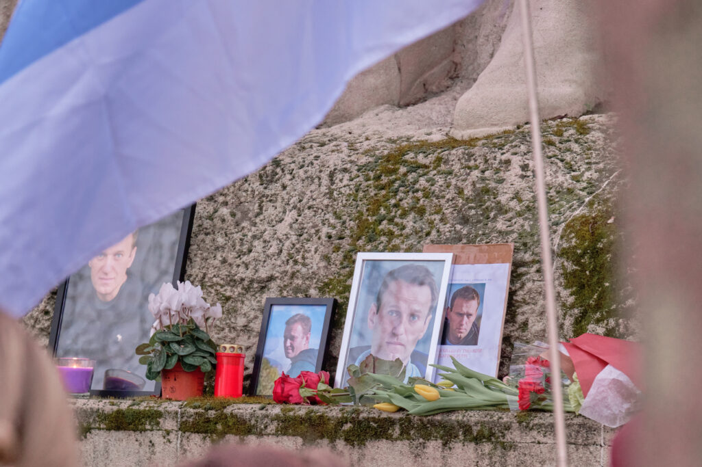

- 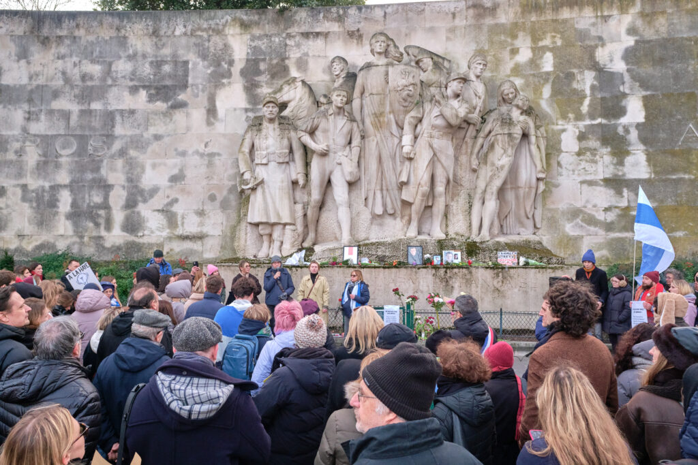

- 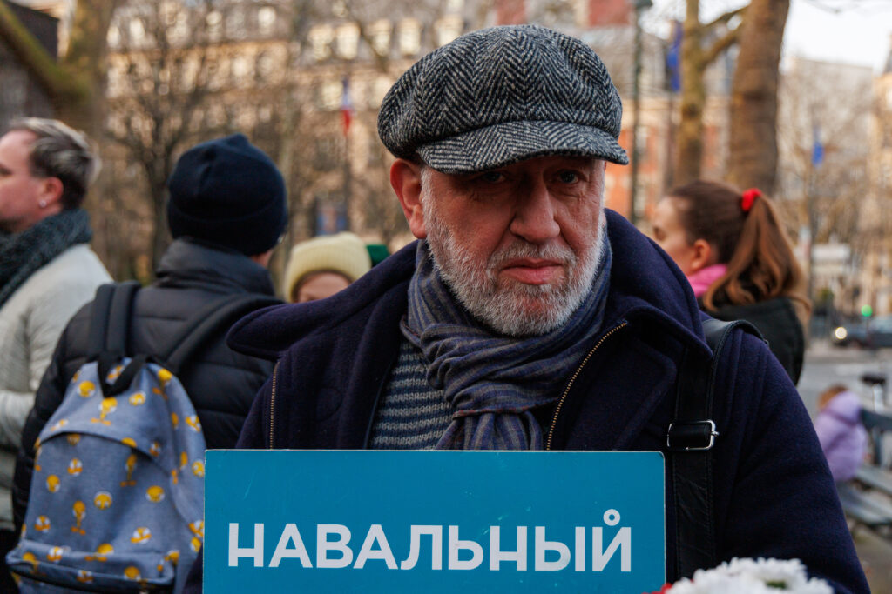

- 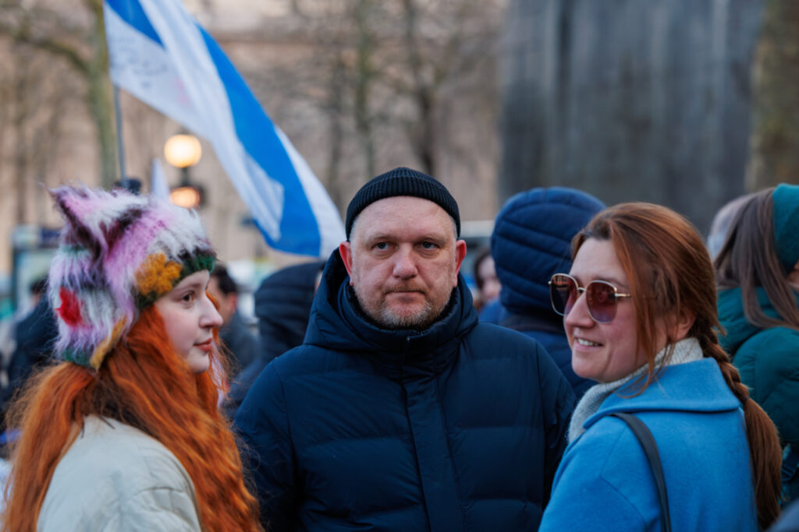

- 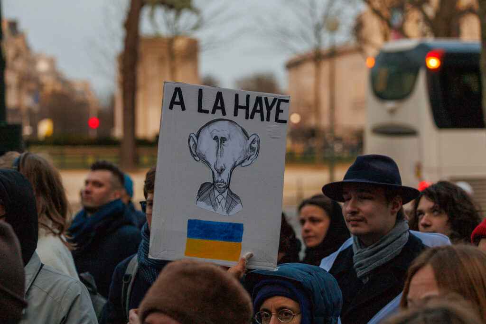

- 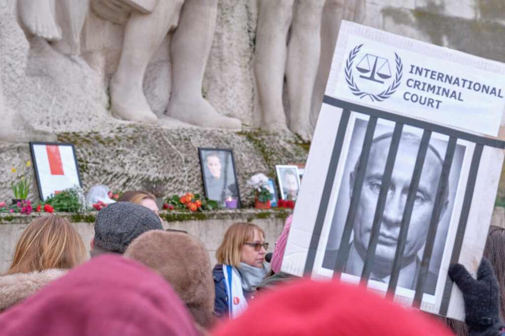

- 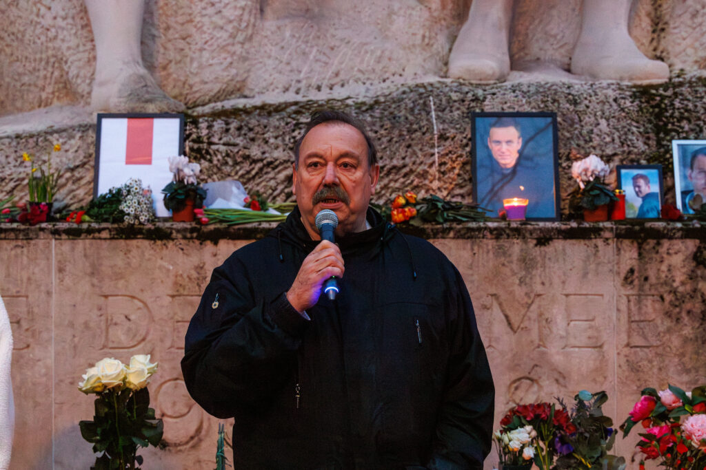

- 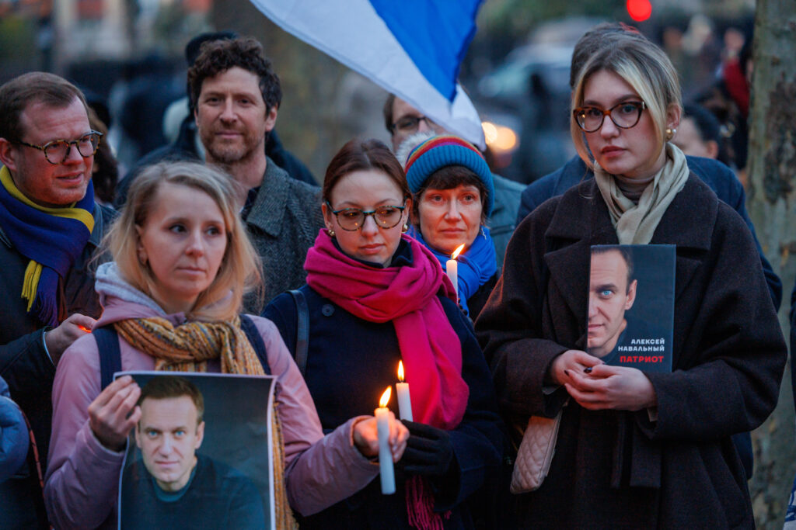

- 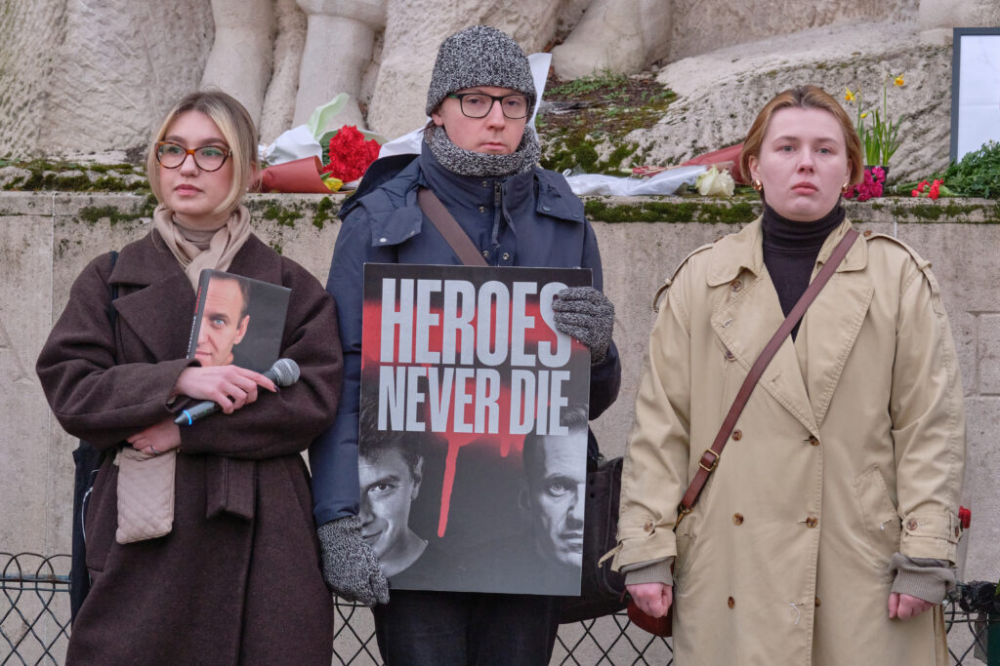

- 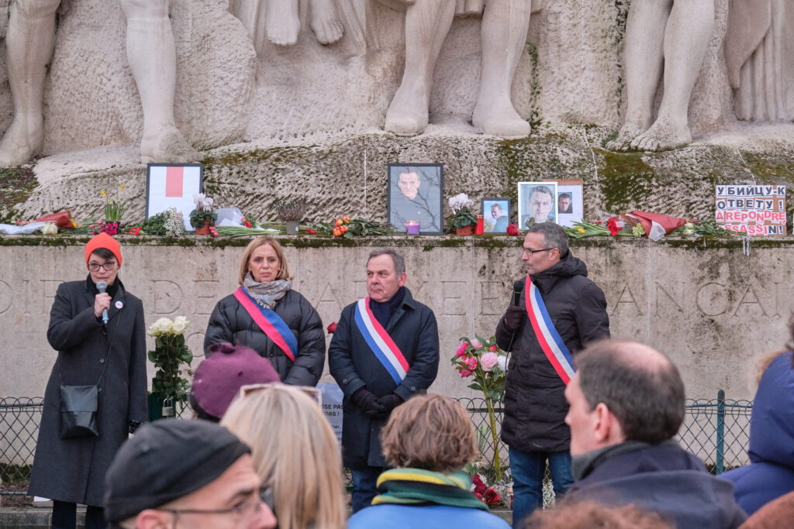

- 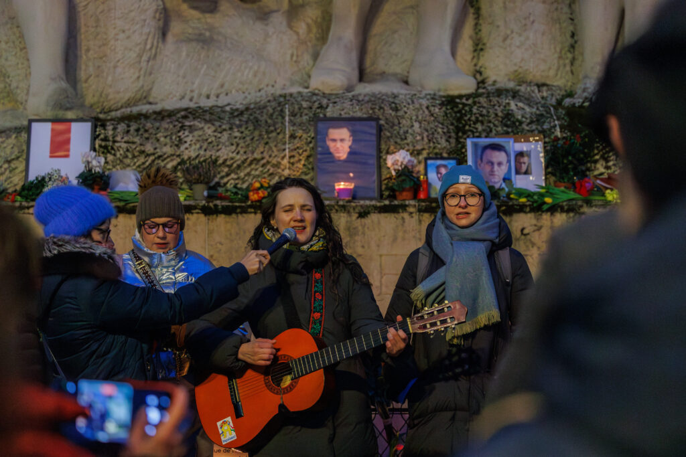

- 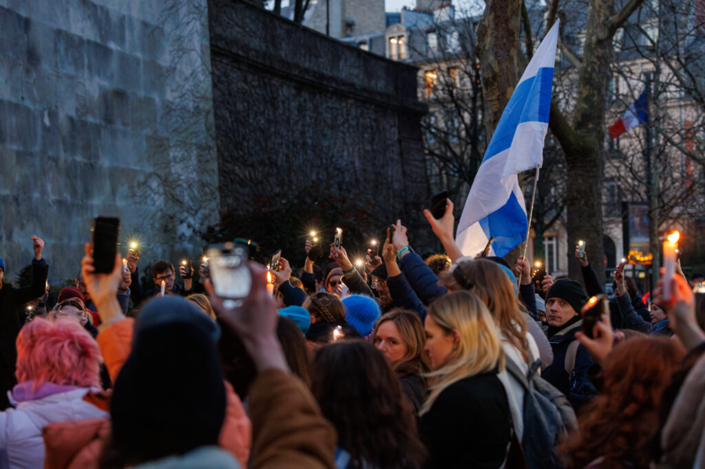

- 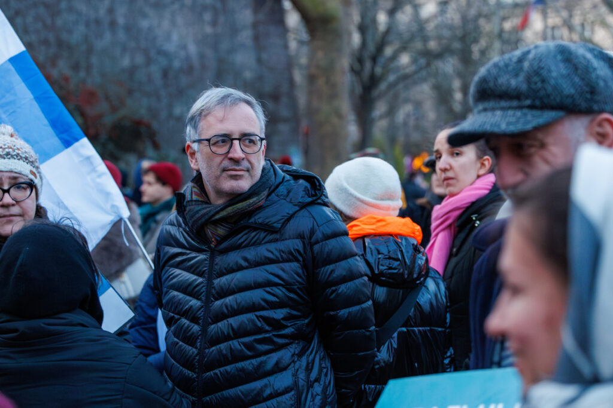

- 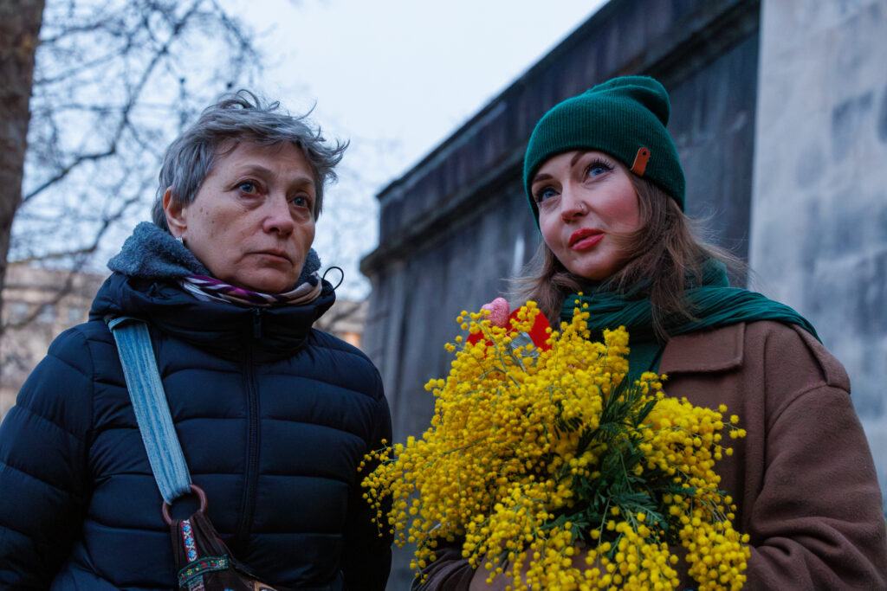

- 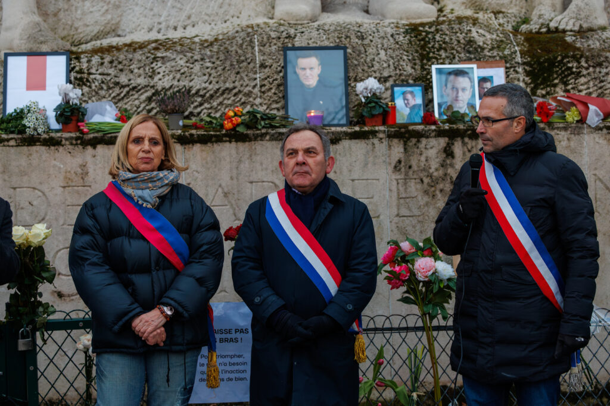

---
