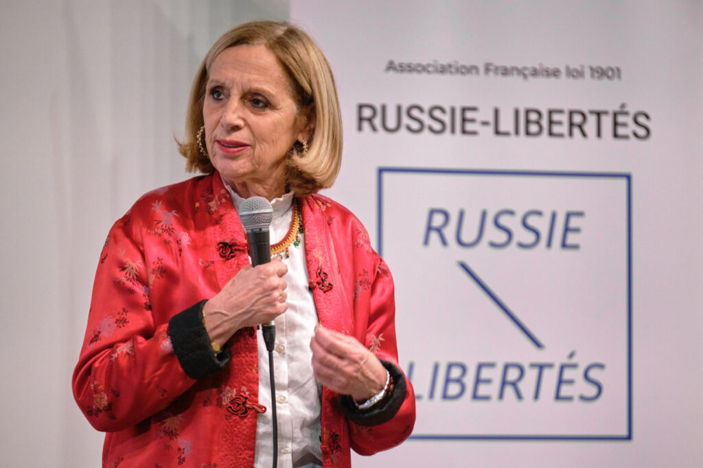
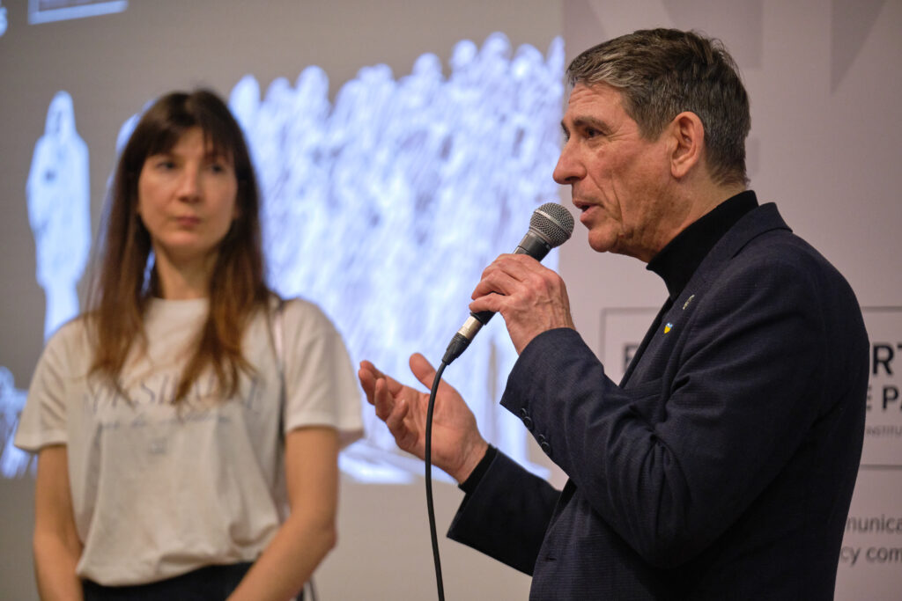
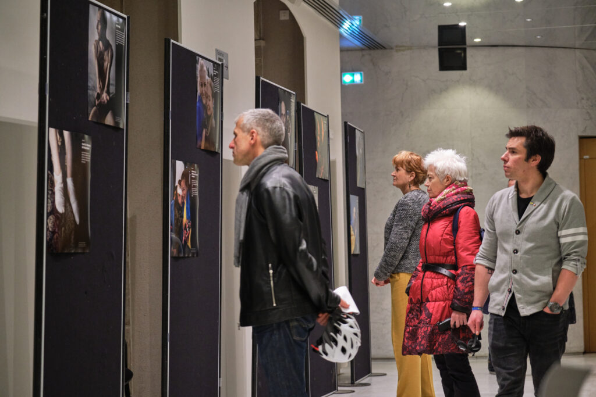
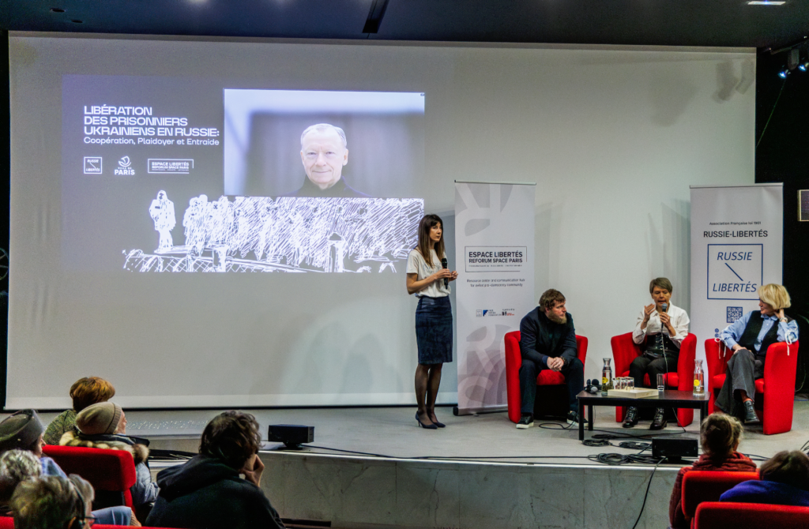
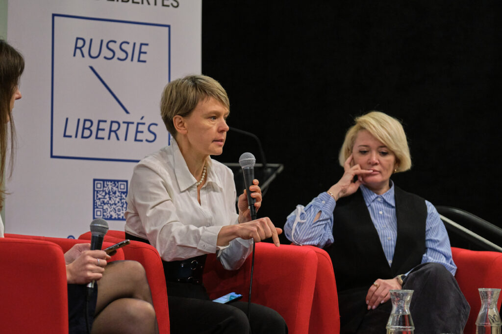
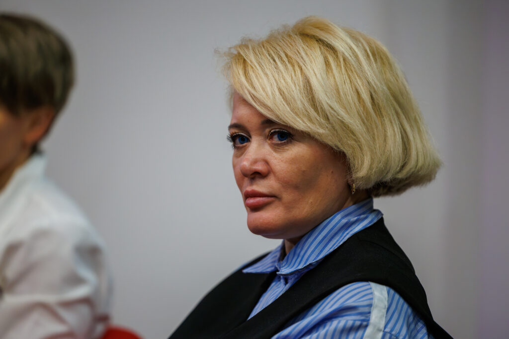
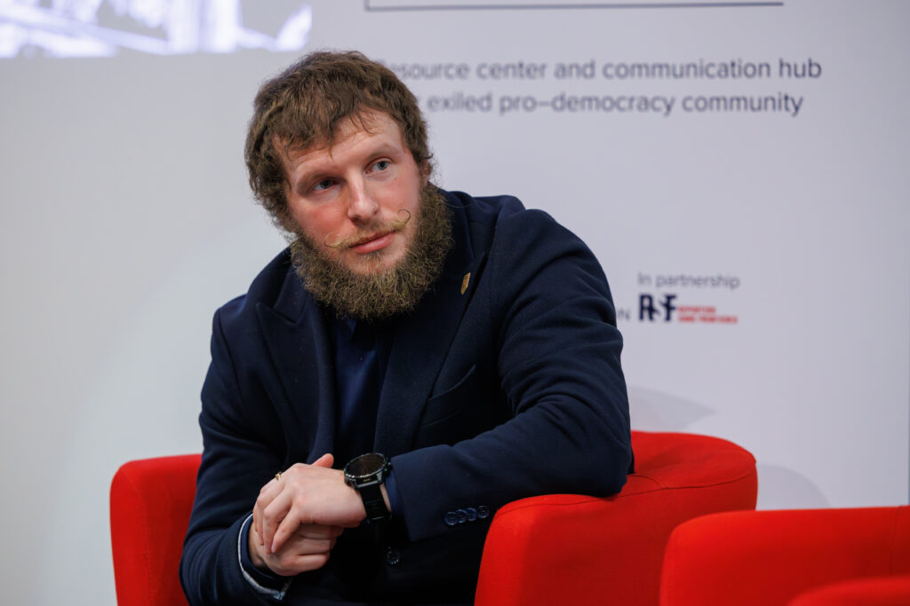

Trois ans après le début de l’invasion à grande échelle de l’Ukraine, la question des prisonniers de guerre et des civils détenus illégalement demeure une préoccupation majeure.

Actuellement, au moins **7 000 civils ukrainiens** sont détenus illégalement dans les prisons russes après avoir été enlevés en zone occupée. Le nombre d’Ukrainiens emprisonnés illégalement dans des centres de torture sur les territoires russes ou occupés reste inconnu.

Russie-Libertés a souhaité attirer l'attention de la communauté internationale sur cet aspect encore trop peu connu de la guerre en Ukraine et a organisé un événement dédié, le 20 février 2025, à l'Hôtel de Ville de Paris.

---
- 

- 

---

Ouvert par **Geneviève Garrigos** , conseillère de la ville de Paris, et **Jean-Pierre Pasternak** , président de l'Union des Ukrainiens de France, la soirée a démarré par la découverte de l'exposition photo __"Les prisonniers de guerre"__ fournie par le Centre de Coordination à Kiev pour la Libération des Prisonniers de Guerre. Les clichés témoignent de l'atroce réalité des conditions de détention de ces prisonniers ukrainiens.

La soirée s'est poursuivie avec la projection du documentaire **"Les prisonniers"** d’Evguenia Tchirikova, qui a documenté la situation des détenus civils ukrainiens. Elle a recueilli des témoignages sur les enlèvements et, avec son projet **Activatica** , mène des enquêtes pour retrouver les disparus.

**[Regarder le film](https://www.youtube.com/watch?v=tiMy3bD2aU0)** 

 **[sous-titré en français](https://www.youtube.com/watch?v=tiMy3bD2aU0)**

Une table ronde a ensuite réuni **Evguenia Tchirikova** , coordinatrice de projets médias d’“Activatica” ; **Anastasia Shevchenko** , directrice de la fondation caritative « À travers le mur » et **Mikhail Savva** , expert du “Centre pour les Libertés Civiles”, qui ont présenté des données sur les conditions de détention et les obstacles à leur libération. **Stas Doutov** , militaire du régiment Azov, ancien prisonnier de guerre, a partagé son expérience des geôles russes.

**Mikhail Savva** , représentant du **Centre pour les Libertés Civiles** , organisation ukrainienne lauréate du prix Nobel de la paix 2022, a déclaré qu’il est essentiel que les défenseurs des droits humains russes et ukrainiens collaborent pour documenter les crimes et fassent pression ensemble sur la communauté internationale.

> « Selon l’ONU, 90 % des prisonniers ukrainiens en Russie sont torturés. Ce n’est pas un chiffre abstrait, c’est une réalité documentée... Les enfants ukrainiens enlevés et envoyés en Russie font partie de cette même politique criminelle : effacer une nation en brisant ses générations futures.» Mikhail Savva

> « Les autorités russes mentent. Elles nient l’existence de prisonniers civils ukrainiens alors que nous avons des preuves accablantes... La communauté internationale doit agir. Ce n’est pas seulement une guerre contre l’Ukraine, c’est une attaque contre les droits humains fondamentaux.  » Evguenia Tchirikova

> « Chaque prisonnier ukrainien en Russie est une victime de la terreur d’État. Leur seule "faute" est d’exister et de ne pas se soumettre. » Anastasia Shevchenko

> « En Ukraine, on distingue les Russes qui sont simplement contre Poutine et ceux qui aident les Ukrainiens. Ce sont les avocats russes, les défenseurs des droits de l'homme et les bénévoles qui envoient des colis et écrivent des lettres. Je fais clairement la distinction entre ces deux catégories. Il y a des gens qui aident, que ce soit en Europe ou en Russie. Nous travaillons avec eux et les apprécions. Parfois, nous évacuons ceux qui prennent des risques, car nous savons qu'ils peuvent être arrêtés le lendemain. C'est un risque énorme, et je suis heureux que le nombre de ces personnes ne diminue pas.» a conclu Mikhail Savva.

Un appel a également été lancé envers les français à utiliser les dispositions relatives à la **compétence universelle** afin de permettre aux juridictions françaises de poursuivre et juger les auteurs des crimes de guerre russes en Ukraine.

> « Il existe déjà des exemples positifs en Europe. Par exemple, en Finlande, un néonazi russe est jugé pour avoir commis des crimes en Ukraine. La Lituanie travaille également très activement en utilisant la juridiction universelle, y compris dans des affaires bélarusses, pour les crimes commis lors des répression des manifestations au Bélarusse. Il existe des exemples et des méthodes. Il est maintenant nécessaire de les organiser techniquement. » Mikhail Savva

Enfin, les participants ont lancé l'appel commun de la campagne **[People First!](https://people1st.online/fr/)** initiée par le **Centre pour les Libertés Civiles** et le **Centre de Défense des Droits Humains "Mémorial"** qui vise, dans le cadre d'éventuelles négociations de paix, à prioriser la libération inconditionnelle de tous les civils ukrainiens détenus par l’État russe, de tous les prisonniers de guerre détenus par les deux camps, de tous les prisonniers politiques russes emprisonnés pour avoir manifesté contre la guerre, et le retour des enfants ukrainiens transférés de force en Russie.

Nous remercions chaleureusement tous les participants, intervenants et spectateurs qui ont contribué à faire de cet événement un moment de réflexion et d’engagement. Un remerciement particulier à **la Mairie de Paris** pour son soutien précieux, qui a permis d’organiser cette rencontre et de donner une visibilité essentielle à cette cause.

Remerciements également au [Comité Antiguerre de Russie](https://antiwarcommittee.info/en/committee/) , à l' **Espace Libertés |  Reforum Space Paris** et à l'ensemble de l' **équipe de Russie-Libertés** .

__Photos par Denis Galitsyn et Nikita Mouraviev__
