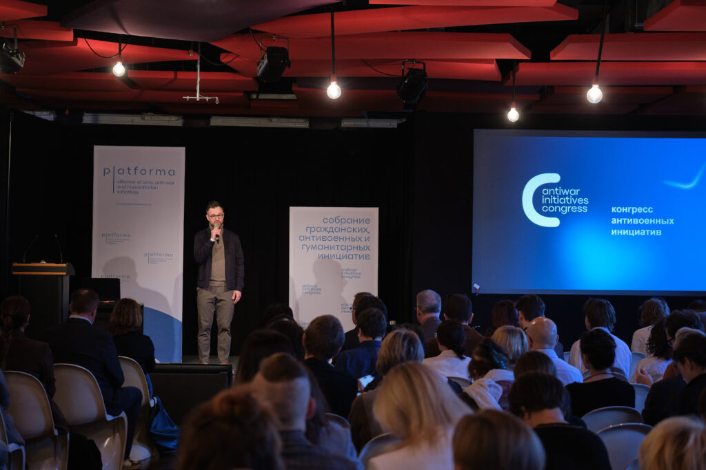
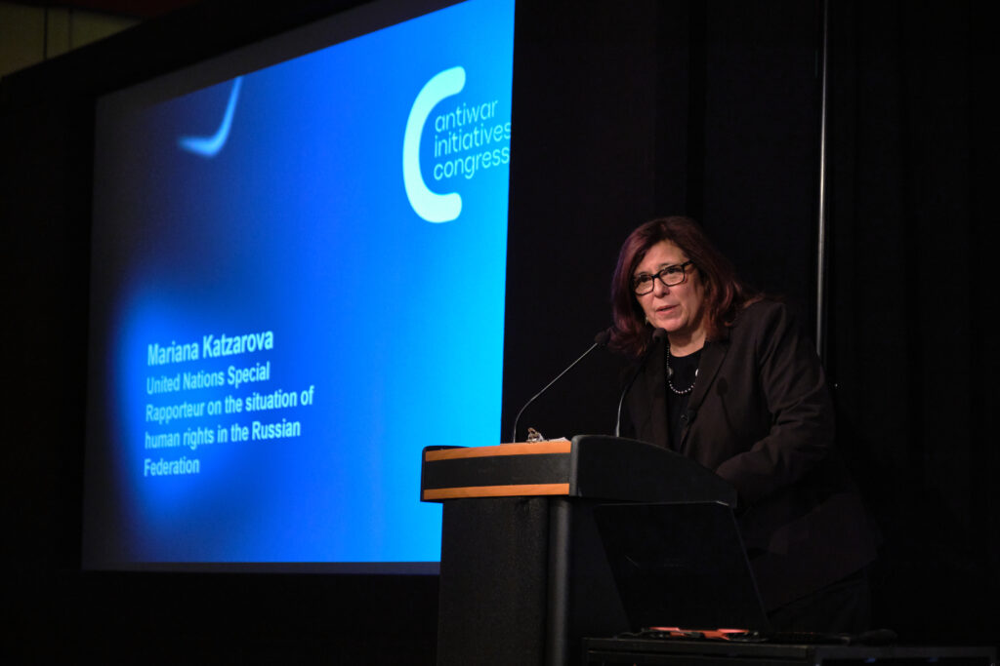
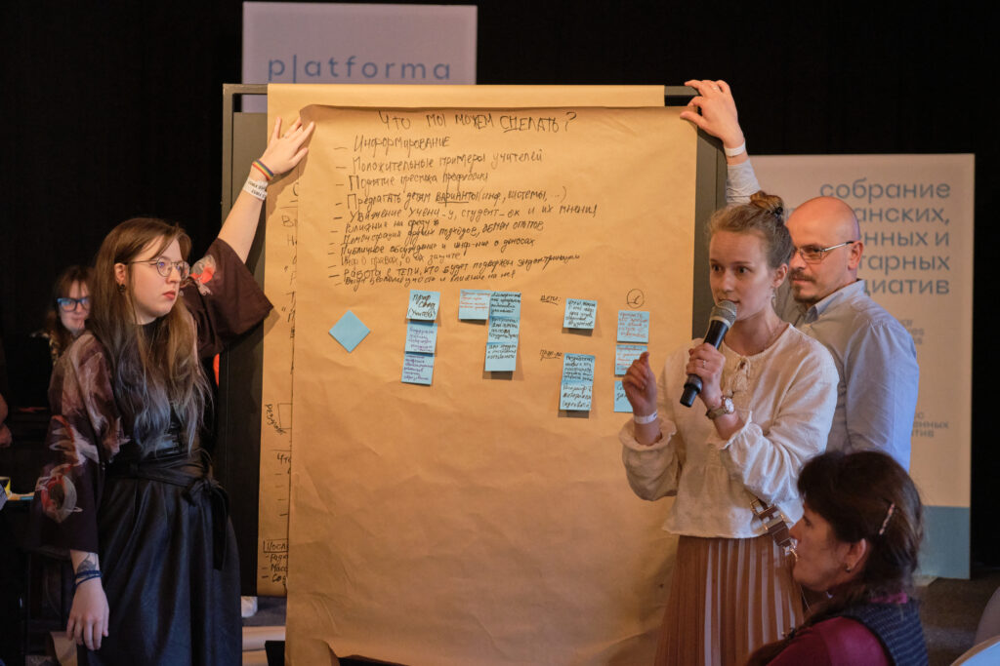
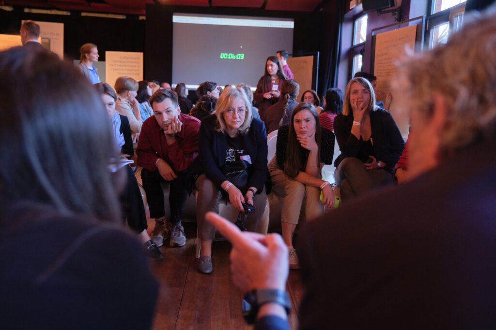
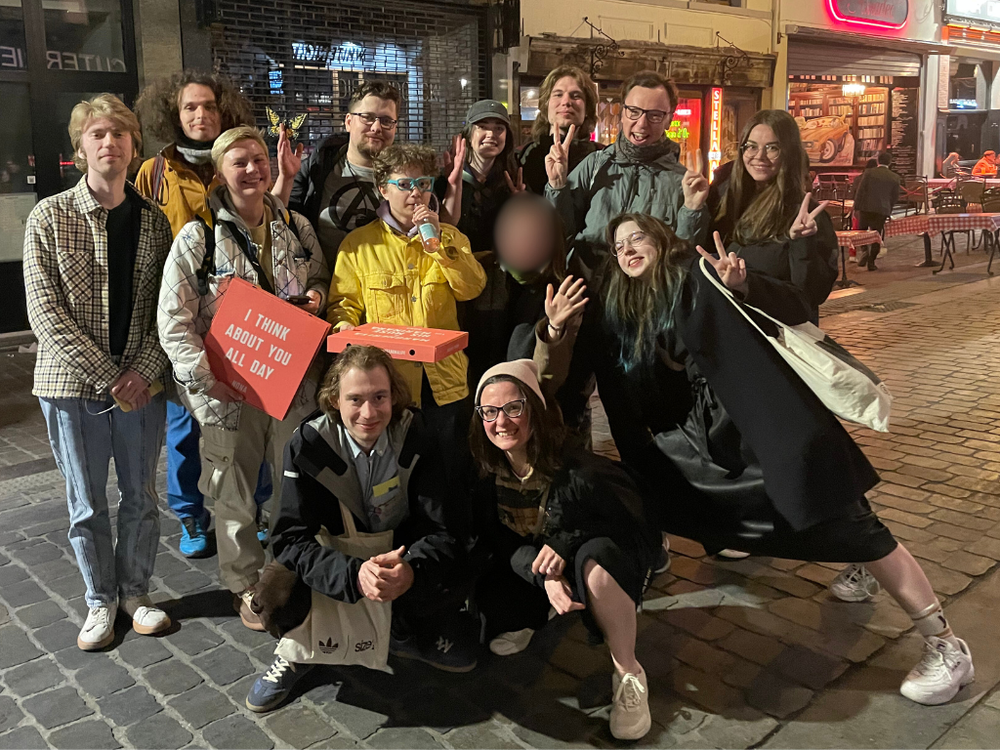

Les 8 et 9 avril 2025 s’est tenu à Bruxelles le **3ème Congrès des initiatives civiques et anti-guerre russes organisé par la Plateforme** – une alliance réunissant plus de 100 organisations partout dans le monde – avec le soutien de l’ **Union Européenne** et du **Ministère Allemand des Affaires étrangères** .

Russie-Libertés, membre de la Plateforme, a eu la joie de coorganiser cet événement majeur, qui a réuni plus de **300 participant·e·s venu·e·s de Russie, de l’UE, du Caucase du Sud, d’Asie centrale, d’Ukraine et des États-Unis** . Militant-e-s, défenseurs des droits humains, personnalités publiques et politiques russes et européennes, représentants de ministères et institutions publiques de toute l'Europe.

Pour nous, ce n’était pas simplement une participation à une conférence – c’est la continuation de notre mission : défendre les droits, soutenir celles et ceux qui refusent de participer à la guerre, et renforcer la solidarité internationale face à la répression, à la militarisation et à la montée de l’autoritarisme.

---
- 

- 

---

Parmi les sessions clés du Congrès figuraient :

**PEOPLE FIRST — Les vies humaines avant tout** 

 L'une des sessions majeures du Congrès fut consacrée à la campagne internationale People First, visant à libérer les dizaines de milliers de personnes prises en otage par la guerre — prisonniers de guerre ukrainiens, les otages civils, enfants enlevés, et prisonnier·ère·s politiques en Russie. 

 Nous soutenons cette campagne depuis ses débuts, car nous croyons fermement que l’approche humanitaire doit être au cœur de toute négociation de paix. 

 Cette session a constitué une étape vers la création d’une coalition transnationale pour un plaidoyer international. Et chacun·e peut s’y engager, dès aujourd’hui : [https://people1st.online](https://people1st.online/)

**Désertion — un acte de résistance** 

 Une autre session clé a porté sur le soutien aux objecteurs de conscience et aux déserteurs russes. 

 Russie-Libertés, aux côtés des initiatives Get Lost, InTransit, Connection e.V., Citoyen.Armée.Droit, Mères de soldats et d'autres, a partagé des témoignages de personnes ayant refusé de participer à la guerre. 

 Nos exemples ont mis en lumière comment les menaces, l’insécurité juridique et la violence transforment le service militaire en une forme de captivité. Nous avons souligné l’urgence de créer des voies légales et sûres d’évacuation pour ces personnes, y compris la reconnaissance de la désertion comme acte militant de résistance et, par conséquent, motif valable pour l'obtention de visas humanitaires de l’UE.

**Rhétorique anti-genre : une arme partagée par les régimes autoritaires** 

 Une session a réuni des initiatives féministes et LGBTQI+ autour de la montée de la rhétorique anti-genre en Russie et en Europe. 

 Les discussions ont porté non seulement sur la répression, mais aussi sur les stratégies de résistance : maintien d’espaces sûrs, soutien aux jeunes trans, entraide horizontale sous différentes formes.

**La société civile face à la normalisation de l’autoritarisme** 

 La session de clôture du congrès fut consacrée à la montée mondiale de l’autoritarisme et la recherche de nouvelles stratégies de résistance. 

 Nous avons défendu l’idée que l’expérience du mouvement anti-guerre russe – fondée sur la solidarité et la survie en conditions répressives – peut enrichir le discours démocratique européen.

**Des sessions de travail en groupe ont également rythmé les 2 jours du congrès** : brainstorming sur les stratégies dans un climat géopolitique en rapide mutation, sur les modèles économiques de survie des initiatives de la société civile, sur les voies d'attraire en justice les responsables des crimes de guerre et sur les scénarios du futur pour la Russie.

---
- 

- 

---

Pourquoi c’est important ? 

 **Ce Congrès a montré que : 

 1. La société civile russe ne s’est pas éteinte – elle s’est transformée, 

 2. Les initiatives civiques anti-guerre continuent à s’organiser, collaborer entre elles et se réinventer, 

 3. L’Europe entend et soutient les voix de la résistance.**

Nous avons également eu le plaisir d’accueillir **15 jeunes militants venus de France et d’autres pays** , pour lesquels un programme spécial de cinq jours a été organisé afin de leur permettre de découvrir les institutions européennes, de rencontrer des acteurs clés de la société civile et de renforcer les liens transnationaux autour des valeurs communes de solidarité, de paix et de démocratie.

**Russie-Libertés** est fier d’avoir contribué à créer un espace où les personnes sont replacées au centre de la politique. 

 

 Nous poursuivrons notre engagement en faveur des prisonnier·ère·s politiques, des déserteurs, des initiatives féministes et non-violentes, et en soutien à tous ceux qui souffrent de la guerre et du régime poutinien — en France, en Russie et au-delà.

**En savoir plus :**

---
- [ARTICLE DANS LE MONDE](https://www.lemonde.fr/international/article/2025/04/11/people-first-un-appel-pour-liberer-les-prisonniers-en-russie_6594323_3210.html)
---

---
- [REPORTAGE SUR FRANCE INTER](https://www.radiofrance.fr/franceinter/podcasts/le-reportage-d-un-jour-dans-le-monde/reportage-du-mercredi-16-avril-2025-4471558)
---
