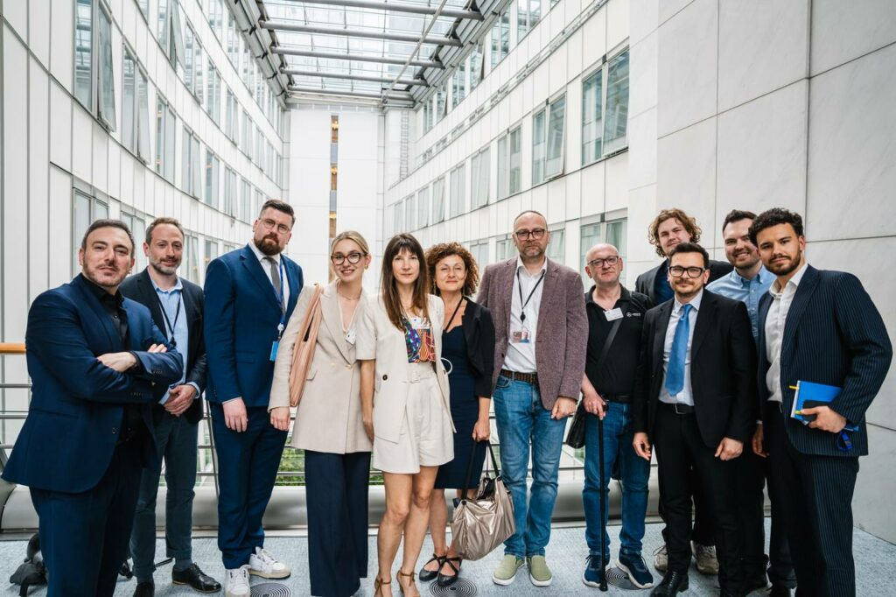
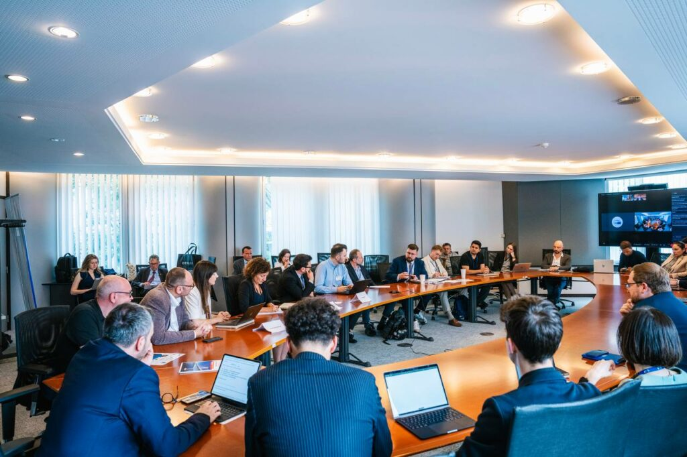
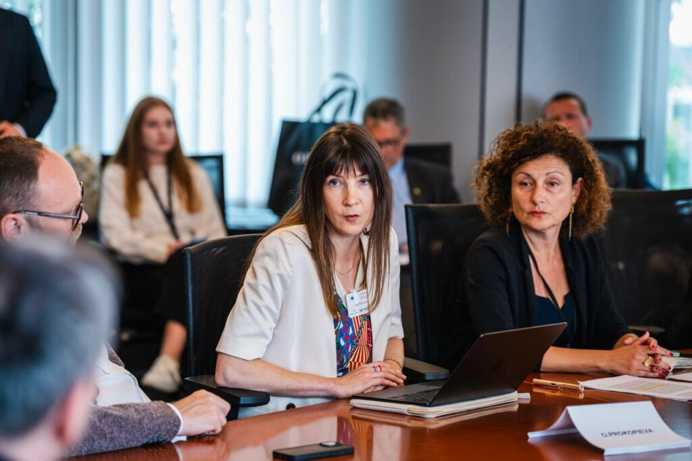

**__“Construisons des ponts, pas des murs !”__ , Kevin Lick, ancien prisonnier politique russe.**

 Le 3 juin 2025, le Parlement européen à Bruxelles a accueilli une discussion cruciale sur les défis auxquels sont confrontés les Russes anti-guerre et les personnes LGBTQI fuyant les persécutions politiques et la guerre. Initiée par les députés européens **Sergey Lagodinsky et Andrei Kovatchev** , ainsi que par l'ancien prisonnier politique **Ilya Yashine** , l'événement a mis en lumière les difficultés rencontrées par les demandeurs d'asile russes dans l'UE.

Des rapports ont été présentés par **Ilya Nuzov** , responsable du **bureau Europe de l'Est et Asie centrale à la Fédération internationale pour les droits humains** , sur les répressions en Russie, estimant qu'entre **3 000 et 5 200 personnes sont privées de liberté** pour des raisons politiques. **Olga Prokopieva, directrice de Russie-Libertés** , a expliqué les difficultés rencontrées par les militants anti-guerre et LGBTQI russes cherchant **une protection internationale dans l'UE** . **Sara Prestianni, directrice du plaidoyer à Euromed Rights** , a souligné les dangers de la réforme du Pacte pour la migration et l'asile, exhortant les députés européens à prioriser la protection et l'intégration dans les politiques de l'UE.

Les intervenants ont souligné la nécessité pour l'UE de soutenir les réfugiés, notant que **seulement 2 % des demandeurs d'asile dans l'UE sont russes** . La discussion a appelé à une volonté politique unifiée pour aider les Russes anti-guerre, qui partagent les valeurs européennes et sont des alliés dans la lutte pour la démocratie et les droits humains.

#### **Problèmes spécifiques rencontrés par les ressortissants russes fuyant les répressions pour motifs politiques :**

* **Fermeture des frontières** : Certains pays comme la Finlande et les États baltes ont presque complètement fermé leurs frontières aux Russes, ce qui est contraire à la Charte des droits fondamentaux de l'UE.
* **Conditions de détention** : Les conditions de détention, particulièrement pour les personnes LGBTQI+, sont inadéquates et exacerbent leur vulnérabilité.
* **Situation en Croatie** : La Croatie est un des points d'entrée principal pour les Russes fuyant les répressions (notamment pour ceux qui ne correspondent pas aux critères des visas humanitaires), mais elle rejette systématiquement les demandes d'asile. En 2023, seulement 23 des 8 507 demandeurs d'asile russes ont été acceptés (moins de 1%).

#### **Violations des droits humains en Croatie**

* **Traitements inhumains** : Placement dans des centres de détention pour migrants semblables à des prisons, interrogatoires forcés, et pressions psychologiques.
* **Renonciation forcée à l'asile** : Les demandeurs sont forcés de signer des documents renonçant à leur demande d'asile sous la menace ou l'intimidation.
* **Manque de garanties procédurales** : Les pratiques en Croatie sont incompatibles avec les normes internationales des droits humains et de la protection des réfugiés.

#### **Problèmes avec le Règlement de Dublin**

* **Transfert des demandeurs d'asile** : Les demandeurs d'asile sont souvent transférés vers le premier pays de l'UE où ils ont été enregistrés, même si ce pays ne peut garantir leur sécurité et leur dignité.
* **Exception humanitaire** : Chaque État membre peut décider de ne pas transférer les demandeurs d'asile sous le Règlement de Dublin pour des raisons humanitaires.
* Certains pays (Pays Baltes, Croatie, Finlande) cultivent un sentiment de méfiance envers les Russes s'opposant à la guerre en Ukraine, ce qui biaise le jugement de leurs demandes d'asile, révélant une défaillance systémique des systèmes d'asile.
* Il est crucial d' **assouplir le Règlement de Dublin** pour des cas spécifiques d'activistes russes, de déserteurs et de journalistes entrant par certains pays de l'UE comme la Croatie et les États baltes.

#### **Déportations**

* **Dangers des déportations** : Les demandeurs d'asile qui s'opposent à la guerre et au régime russe sont souvent en danger de répression transnationale et deviennent des cibles faciles pour le Kremlin s'ils sont déportés en Russie ou vers des pays de l’Europe sympathisants avec le régime poutinien.
* **Pays dangereux** : L'Arménie et le Kazakhstan, accessibles pour les Russes ne détenant pas de passeports internationaux, sont particulièrement dangereux pour les activistes politiques et les déserteurs russes.
* Il est crucial de créer **des mécanismes de protection légalement accessibles** pour les objecteurs de conscience et les déserteurs de l'armée russe idéologiquement et publiquement opposés à la guerre en Ukraine.

#### **Chiffres clés** de 2023

* **Demandeurs d'asile** : Sur un total de plus d'1 million de demandeurs d'asile dans l'UE, seulement environ 19 000 étaient russes (moins de 2%).    Les déserteurs et objecteurs de conscience russes représentent seulement 0,6 % du nombre total de demandeurs d'asile dans l'UE.
* **Taux de protection** :  Le taux global de protection dans l'UE est de 52,78 %, mais pour les Russes, ce taux est beaucoup plus bas : 16,3 % (3 075 personnes) - 19 % en France, 6 % en Allemagne, 40 % en Espagne.

Il est important de ne pas perdre contact avec ceux qui s'opposent au régime, car ces personnes construiront la Russie de demain, une Russie qui ne menacera pas l'Europe et deviendra un jour un voisin démocratique et pacifique.

“Certains pays de l'UE expliquent leur politique vis-à-vis des ressortissants russes par la menace pour leur sécurité nationale. Mais si vous avez peur des provocateurs et des agents du Kremlin, renforcez les contrôles ! Mais ne fermez pas complètement les portes aux militants anti-guerre russes. Construire des murs est contre-productif, car cela aide Poutine à maintenir le peuple russe en otage, renforce l'armée russe et n'aide pas la résistance ukrainienne.”

**Intervention d'Olga Prokopieva, directrice de Russie-Libertés (ENG) :**

__Dear Members of the European Parliament, thank you for the opportunity to address you today and for your interest in the Russian asylum seekers. I am the director of Russie-Libertés, an organization based in France that supports Russian civil society, Ukrainian resistance and all those forced to flee repression by the Kremlin. We are member of several networks of Russian anti-war movements all around the world and human rights organizations helping Russians to flee persecutions.__

__Firstly, I would like to thank the European countries that continue to grant refugee status to Russians as well as issue various types of visas. Your support is crucial for those fleeing repression and war.__

__However, systemic issues seem to exist in some EU countries regarding asylum procedures and the reception of refugees from Russia and could be considered as violations of the European human rights charter.__

__Today, there are three major categories of Russians applying for asylum: LGBTQI+ individuals, those fleeing the army and all the other kinds of political repression due to an anti war or anti regime position. Each of these categories faces specific obstacles and problems.__

__I would like to highlight several issues and points for improvement:__

* __One of the major problems is that some countries, particularly those bordering Russia such as Finland and the Baltic states, have almost completely closed their borders to Russians. This approach is contrary to the principles of the EU Charter of Fundamental Rights, which prohibits any discrimination based on nationality. Beyond being contrary to EU values, this deliberate policy by these countries only increases migratory pressure on other EU countries. It also encourages illegal means of entry and subsistence for Russians in need of international protection. The number of applicants does not decrease, but control and pressure shift from one country to another. This opens the door to uncontrolled networks that also benefit Kremlin agents and spies.__

__So, it seems to me that it is in the EU's interest to have controlled immigration and forbidden entrance to almost all Russians is definitely not a solution.__

* __Then, many issues are reported on the Detention Conditions of Vulnerable Groups : indeed, There have been numerous reports of inadequate detention conditions particularly of LGBTQI+ people. These groups are often placed in environments that do not consider their specific needs, exacerbating their vulnerability and distress.__

__Transgender individuals are housed far from medical centers where they need hormonal therapy and in dormitories with other refugees whose culture may not be tolerant of transgender people. However, they do not have the possibility to hide their gender identity and face violence. Cases of suicide have even been reported. A 17-year-old transgender Russian woman died in April at a refugee camp in the Netherlands.__

* __Then, I would like to draw attention to the particularly concerning situation in Croatia, which remains one of the primary entry points for Russians fleeing repressions. This is especially relevant for Russian conscientious objectors and deserters, who have very limited protection options in Europe compared to other asylum seekers.__

__Refusing to fight for an aggressor nation and not wanting to commit war crimes, they actively oppose this unjust war, putting their lives and those of their loved ones at risk. It is important do remind that in Russia, deserters face severe persecution, including up to 15 years in prison or being sent to torture camps before being deployed to the most dangerous front-line assault units. Already 50 000 criminal cases are opened on those who abandoned military units.__

__Some of these men opposed ideologically to the war want to join safe EU countries but they don't have the possibility to ask for humanitarian visas or other types of visas still existing for Russians. Croatia is one of the few legal entry points into the EU via the border with Bosnia.__

__However, Croatia systematically rejects asylum applications from Russian deserters. Out of 8,507 Russian asylum seekers in Croatia in 2023, only 23 were approved, an unprecedented and extremely low approval rate (less than 1%) compared to other EU countries (Data provided by inTransit; Source : https://asylumineurope.org/reports/country/croatia/statistics/). This forces many into illegal migration routes within the EU.__

__Deserters are often perceived not as legitimate asylum seekers but as potential criminals or hostile agents.__

__The reported cases highlight that Croatia does not provide a safe environment for these individuals, violating fundamental principles of the Geneva Convention and the EU Charter of Fundamental Rights. During the processing of their cases, asylum seekers in Croatia are placed in prison-like detention centers with conditions described as worse than those in Russian prisons. The Croatian Security Service (SOA) blocks the examination of deserters' applications, subjecting them to threats of forced deportation and pressures to abandon their asylum claims.__

__Cases, such as those of Ruslan Abassov and Vladislav Arinichev, confirm systemic violations of asylum seekers' rights. Both were recognized as political prisoners by the human rights organization "Memorial" and faced unjust threat of deportation and imprisonment despite their legitimate claims for protection.__

__The testimonies collected by our colleagues from the german organization inTransit reveal practices incompatible with international standards of human rights and refugee protection. Among these practices:__

* __Inhumane and humiliating treatments: Detention in migratory prisons, forceful interrogations, and psychological pressure exerted by local authorities.__
* __Forced renunciation of asylum: in several cases, deserters were forced to sign documents renouncing their asylum application under threat or intimidation.__
* __Lack of procedural guarantees.__

__This situation raises questions about Croatia's compliance with its European and international obligations.__

__When these men are unable to have protection in Croatia, they try to ask asylum in other EU countries but are transferred back to Croatia. Indeed, the Dublin Regulation allows the transfer of asylum seekers to the first EU country where they were registered.__

__If you can’t change Croatian policy regarding Russian asylum seekers at least, each member state with a more humane policy towards immigrants can freely decide to not transfer under Dublin regulation. Indeed, this regulation includes a humanitarian exception when the country in question is unable to guarantee the safety and dignity of the asylum seeker.__

* __The Dublin issue is not limited to Croatia. There are also Dublin issues in the case of journalists, for example: Some independent Russian journalists residing in the Baltic countries found themselves without work following the cessation of American funding, and their residence permits are not being renewed. These journalists cannot apply for asylum elsewhere, in countries more favorable to their situation, due to the Dublin Regulation.__

__We have observed in these countries a sense of distrust towards Russians opposing the war in Ukraine that biases the judgment of their asylum applications, revealing a systemic failure of asylum systems similar to that observed in Croatia.__

* __It is crucial to ease the Dublin Regulation for specific cases of Russian activists, deserters and journalists entering through some EU countries such as Croatia and Baltic States. This regulation is too strict and needs to be relaxed regarding countries where there is a systemic failure of asylum systems towards Russians.__

* __Lastly, I would like to address the issue of deportations of Russian asylum seekers who oppose the war and the regime.__

__It should be noted that asylum seekers are often willing to publicize their identity and give interviews in international media in the hope that it will help obtain refugee status, which puts them in danger of transnational repression and if they are ultimately deported to Russia they become an easy target for the Kremlin. Deportations still occur in some EU countries for instance Cyprus and the Netherlands. But also France in cases of Russians from Chechnya.__

__Sometimes, deportation happens to countries such as Armenia and Kazakhstan.__

__But Staying in Armenia and Kazakhstan is particularly dangerous for Russian political activists and deserters. Cases of kidnappings have occurred due to the presence of Russian military bases in these countries. Deserters under Russian search warrants are often arrested by local authorities. Neither Armenia nor Kazakhstan grants refugee status. Deserters live in constant fear and hide.__

__So, to summarize, we ask to avoid deportation of asylum seekers to countries where they risk being persecuted, even if it ‘s not Russia. And of course not deporting directly to Russia.__

* __In conclusion, I would like to provide some key figures:__

__In 2023, the total number of asylum seekers in the European Union was just over 1 million people, of whom only about 19,000 were Russians, it’s less than 2% of the total. The overall protection rate in the EU is 52.78%, but for Russians, this rate is much lower: 16,3% (3 075 people) - 19% in France, 6% in Germany, 40% in Spain.__

__Russian deserters and conscientious objectors represent only 0.6% of the total number of asylum seekers in the EU. (Data provided by our data analyst, Kirill Parubets. Source : https://ec.europa.eu/eurostat/data/database)__

__A small number for the EU but a significant potential to weaken the Russian army!__

__Deserting the Russian army is often a political act, an act of opposition to the war that also influences the Kremlin's military capabilities. Legally accessible protection mechanisms should be created for conscientious objectors and deserters from the Russian army.__

__More generally, closing the door to almost all Russians, as some EU countries do, is counterproductive, as it helps Putin keep the Russian people hostage, strengthen the Russian army and doesn’t help Ukrainian resistance.__

__Some EU countries explain their policy by the threat for national security. But If you are afraid of provocateurs and Kremlin agents - Strengthen the checks! Rely on anti-war organizations like ours, which have already implemented a strict verification system. But do not completely close the doors to Russian anti-war activists.__

__Russia will not disappear and will remain your neighbor. We have lost our country now, but we hope and believe in the future democratization of Russia, and we must not lose contact with those opposing the regime because these people will build tomorrow's Russia, a Russia that will not threaten Europe and will one day become a peaceful neighbor.__

__Thank you for your attention.__

__(Report based on data and information gathered together with colleagues from the Human rights anti-war coalition and the Consuls project of the Antiwar committee.)__

---
- 

- 

- 

---

* __photos by MEP Sebastian Tynkkynen's office__
