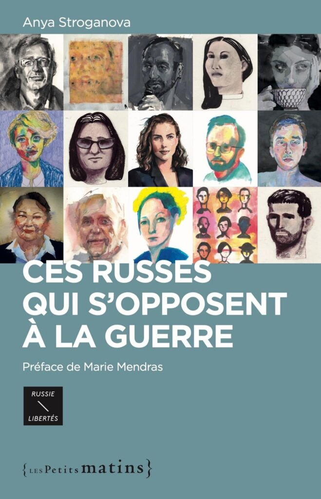
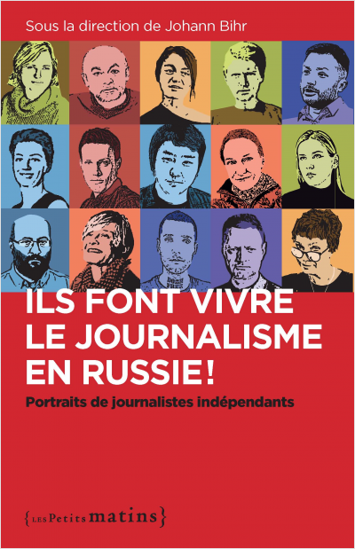
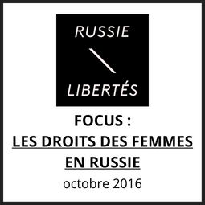
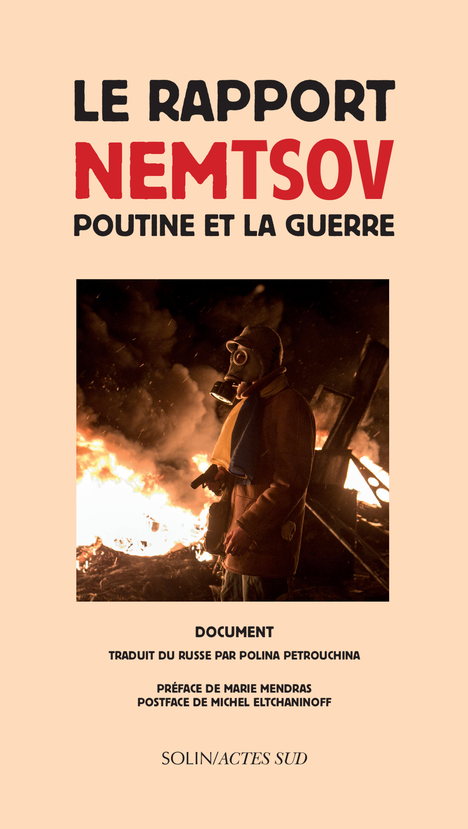
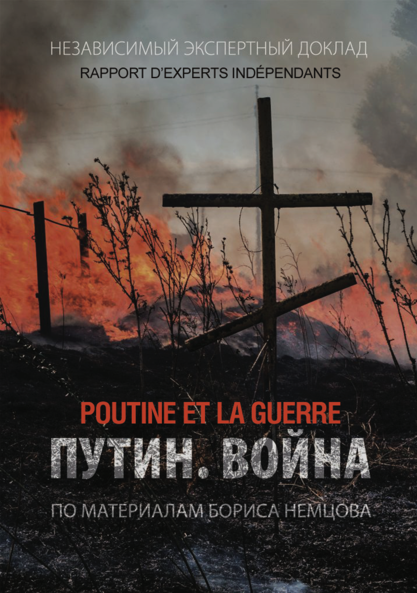
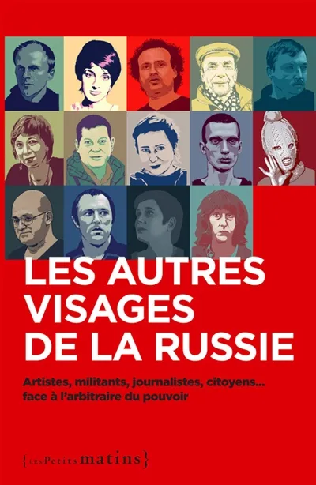
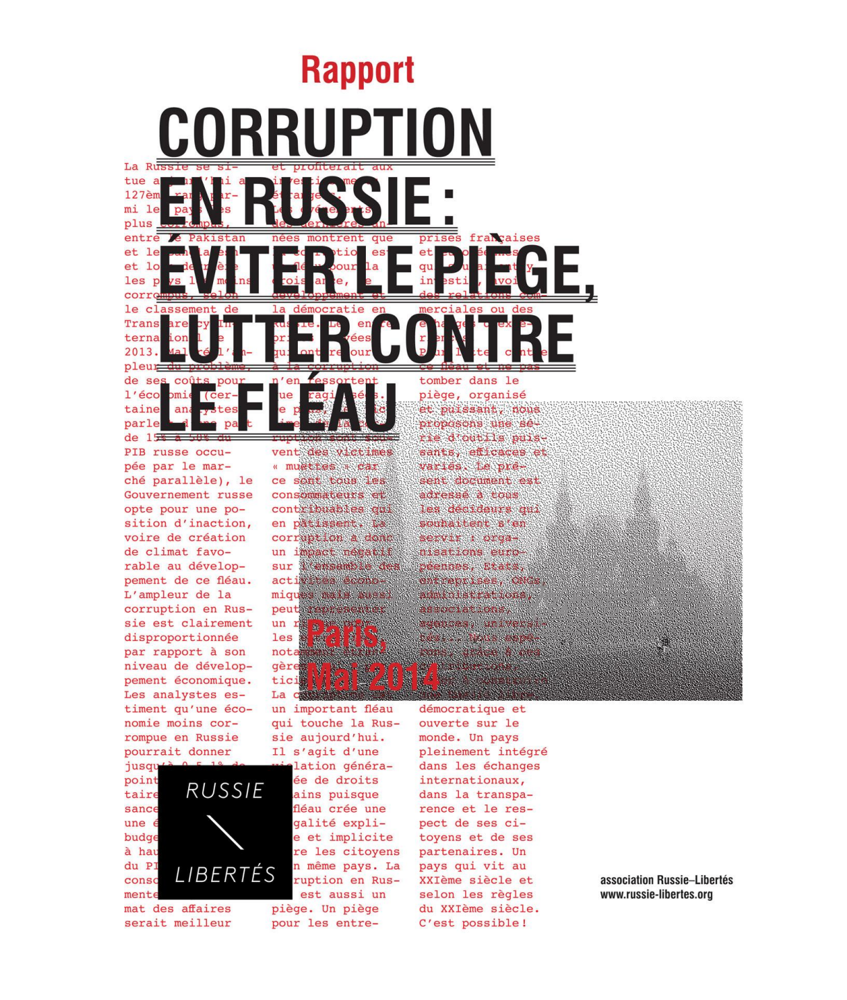

**Livre "Ces Russes qui s'opposent à la guerre"** (septembre 2024)

chez Editions Les Petits Matins: [https://www.lespetitsmatins.fr/collections/essais/333-ces-russes-qui-s-opposent-a-la-guerre.html](https://www.lespetitsmatins.fr/collections/essais/333-ces-russes-qui-s-opposent-a-la-guerre.html)

Vous y découvrirez quinze portraits de militants russes et de leurs mouvements qui, chaque jour, agissent pour que cesse la guerre en Ukraine et que la Russie devienne un État démocratique et pacifique. Leurs modes d’action sont variés : aide aux déserteurs, campagnes d’affichage clandestin, soutien aux réfugiés ukrainiens, création de médias pour contrer la propagande poutinienne. Ce livre, qui met en lumière quinze personnalités remarquables, est un hommage à ces femmes et ces hommes engagés. Dirigé par la journaliste Anya Stroganova, ce travail collectif de cinq autrices et auteurs est illustré par des dessins spécialement réalisés par des artistes en exil. Il est aussi un hommage posthume à Alexeï Navalny, dont le combat pour les droits et les libertés demeure une source d'inspiration pour tant de Russes qui nourrissent l'espoir de changements

* * *

**Livre "Ils font vivre le journalisme en Russie !"** (octobre 2021)

Ce partenariat entre Amnesty International France, Reporters sans frontières, Russie-Libertés, la revue _Esprit_ et l'association les Nouveaux Dissidents vise à rendre compte du combat pour la liberté de la presse en Russie à travers les portraits de quinze personnalités qui bravent le danger pour faire vivre, aujourd’hui, le journalisme indépendant en Russie. L'ouvrage est disponible en librairie et sur le site de l’éditeur : [https://www.lespetitsmatins.fr/collections/essais/260-ils-font-vivre-le-journalisme-en-russie-.html](https://www.lespetitsmatins.fr/collections/essais/260-ils-font-vivre-le-journalisme-en-russie-.html)

* * *

**Focus : Les droits des femmes en Russie** (octobre 2016)

Russie-Libertés présente un état des lieux de la place des femmes dans la société russe et, plus spécifiquement, de leurs droits face aux discriminations et violences conjugales. [Télécharger ici.](http://russie-libertes.org/wp-content/uploads/2021/01/Focus-Droits-Femmes-Russie.pdf)

* * *

**Livre « Le rapport Nemtsov, Poutine et la guerre »** (février 2016)

Russie-Libertés est partenaire du [livre « Le rapport Nemtsov, Poutine et la guerre ».](https://www.actes-sud.fr/node/53404)

* * *

**Publication de la traduction française du rapport « Poutine. La guerre »** (2015)

La traduction française du rapport « Poutine. La guerre » a été réalisée grâce à une coopération de plusieurs associations et de traducteurs indépendants, avec l’accord d’Ilya Yashin. [Pour télécharger la version française du rapport en PDF cliquez ici.](http://russie-libertes.org/wp-content/uploads/2021/01/Putin_La_Guerre_68p.pdf)

* * *

**Livre « Les autres visages de la Russie »** (avril 2015)

En partenariat avec Mediapart et l’éditeur Les Petits Matins, Amnesty International France, la Fédération internationale des ligues des droits de l’homme (FIDH), l’Action des chrétiens pour l’abolition de la torture (ACAT), Russie-Libertés, Reporters sans frontières et Inter-LGBT font tour à tour surgir ces autres visages de la Russie. Le livre « Les autres visages de la Russie » est disponible en librairie et sur le site de l’éditeur : [http://www.lespetitsmatins.fr/collections/les-autres-visages-de-la-russie-artistes-militants-journalistes-citoyens-face-a-larbitraire-du-pouvoir/](http://www.lespetitsmatins.fr/collections/les-autres-visages-de-la-russie-artistes-militants-journalistes-citoyens-face-a-larbitraire-du-pouvoir/)

* * *

**Rapport : « Corruption en Russie : éviter le piège, lutter contre le fléau »** (2014)

Analyser et comprendre la corruption en Russie, ce fléau qui ronge toute la société russe, pour éviter le piège et mettre en place des outils pour la combattre, tel est l’objectif du rapport de l’association « Russie-Libertés ». [Version en français ici](http://russie-libertes.org/wp-content/uploads/2021/01/rapport_corruption-en-russie-final1.pdf). [English version here](http://russie-libertes.org/wp-content/uploads/2021/01/report_corruption_englishversion_final.pdf).
