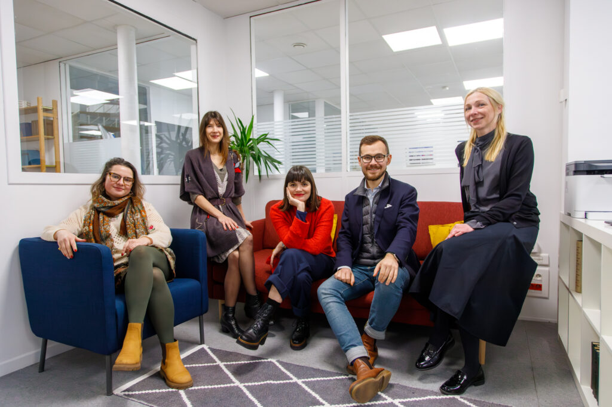
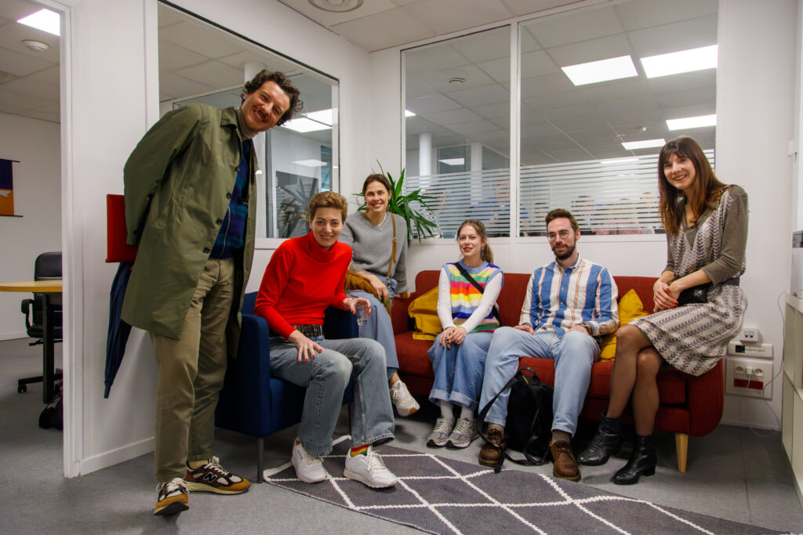

L'Espace Libertés | Reforum Space Paris est un centre de ressources et un espace communautaire situé au cœur de Paris. Fondé par l'association Russie-Libertés en collaboration avec la Free Russia Foundation, il se veut un refuge sûr pour les activistes, journalistes, artistes et chercheurs russophones ayant fui la Russie en raison de la guerre et des répressions politiques.

Plus qu’un simple lieu, c’est un carrefour de solidarité et d’engagement. Nous offrons un cadre de travail professionnel en exil, incluant un soutien juridique et psychologique, des événements culturels, ainsi qu’un espace de coworking et un studio de création.

Espace Libertés est une communauté vivante où chacun peut poursuivre son action citoyenne et créative en toute sécurité.

**À propos du centre**

L'Espace Libertés est né d'une urgence : répondre à l'exil massif des voix indépendantes de la société civile russe.

Aujourd'hui, le centre fédère plus de 500 résidents permanents et accueille quotidiennement de nouveaux visiteurs et bénévoles. Notre programmation est riche et engagée : conférences, débats, projections de films, expositions, rencontres avec des défenseurs des droits de l'homme et soirées de soutien aux prisonniers politiques.

Nous fonctionnons comme une plateforme ouverte de dialogue et une infrastructure indispensable au maintien d'une société civile en exil.

**Aide Juridique**

Nous accompagnons les personnes confrontées aux persécutions en Russie ou aux complexités administratives de l'exil. Nos experts et partenaires proposent des consultations individuelles sur les thématiques suivantes :

- Procédures de demande d'asile.

- Obtention et renouvellement des titres de séjour (dont l'APS).

- Protection sociale et droits fondamentaux.

- Création d'associations et statut d'auto-entrepreneur.

- Droit d'auteur pour les artistes et journalistes.

**Soutien Psychologique**

Parce que l'exil forcé s'accompagne souvent de traumatismes, d'anxiété et d'épuisement, la santé mentale est au cœur de notre mission. L'Espace Libertés propose :

- Consultations individuelles avec des psychologues et psychanalystes.

- Groupes de parole et sessions de soutien thérapeutique.

Notre objectif est d'aider chacun à surmonter les séquelles de la répression et à retrouver les ressources nécessaires pour se reconstruire.

**Coworking & Studio**

Nous mettons à disposition de nos résidents des outils professionnels pour maintenir leur activité :

- Espace de coworking pour le travail quotidien et les réunions de projet.

- Studio équipé pour l'enregistrement de podcasts, de vidéos et de projets multimédias.

- Soutien technique et logistique pour les médias indépendants en exil.

En collaborant avec de nombreux médias russes indépendants, nous soutenons la production d'une information libre face à la propagande.

**Cours de français (FLE)**

La langue est la première clé de la liberté. Nous proposons des cours de français gratuits pour tous les niveaux, de A1 à C1. Encadrés par des professeurs professionnels, ces cours visent une intégration réelle : être capable de s'exprimer auprès de l'administration, de travailler et de s'épanouir pleinement dans la société française.

Pour toute question relative à l’Espace Libertés | Reforum Space, écrire à espaceL@russie-libertes.org

Instagram : https://www.instagram.com/espace.libertes

Telegram : https://t.me/EspaceLibertes_ReforumSpace

